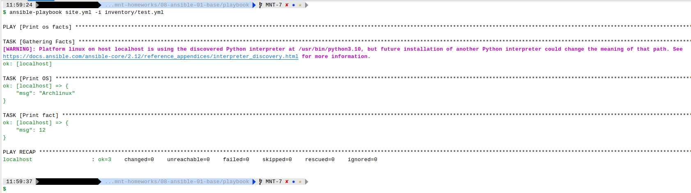
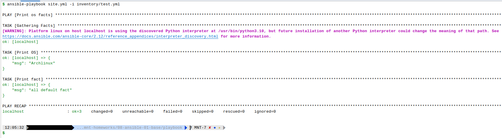
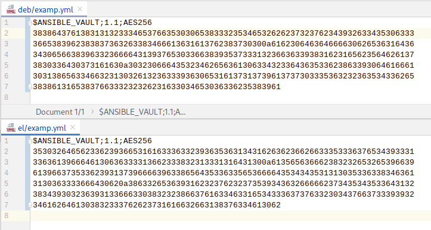

# Домашнее задание к занятию "08.01 Введение в Ansible"

## Подготовка к выполнению
1. Установите ansible версии 2.10 или выше.
2. Создайте свой собственный публичный репозиторий на github с произвольным именем.
3. Скачайте [playbook](./playbook/) из репозитория с домашним заданием и перенесите его в свой репозиторий.

## Основная часть
**1. Попробуйте запустить playbook на окружении из `test.yml`, зафиксируйте какое значение имеет факт `some_fact` для указанного хоста при выполнении playbook'a.**

Запускаем командой `ansible-playbook -i inventory/test.yml site.yml `, что означает запуск на хостах из `test.yml`
(там единственный хост - `localhost`) задач из `site.yml`:



Значение `some_fact`, равное 12, было получено из файла [group_vars/all/exampl.yml](./playbook/group_vars/all/examp.yml)
потому что в файле [inventory/test.yml](./playbook/inventory/test.yml) указана группа `inside`, но для группы с таким
именем отсутствует набор переменных `group_vars` поэтому и было использовано значение по умолчанию из папки
[group_vars/all](./playbook/group_vars/all/examp.yml).

**2. Найдите файл с переменными (group_vars) в котором задаётся найденное в первом пункте значение и поменяйте его на 'all default fact'.**

При выполнении команды `ansible-playbook site.yml -i inventory/test.yml` соответственно, поменялось и выводимое значение:



**3. Воспользуйтесь подготовленным (используется `docker`) или создайте собственное окружение для проведения дальнейших испытаний.**

Создадим [docker-compose.yml](docker-compose.yml). Запускать командой `docker-compose up -d`.

Как результат, имеем два запущенных контейнера - `Ubuntu 20.04` и `Centos 7`, каждый из которых имеет предустановленный Python версии 3:


**4. Проведите запуск playbook на окружении из `prod.yml`. Зафиксируйте полученные значения `some_fact` для каждого из `managed host`.**

Запускаем командой  `ansible-playbook -i inventory/prod.yml site.yml` и получаем:


Как видим, для `Centos 7` переменная "ansible_distribution" возвращает значение "CentOS", a для `Ubuntu 20.04` - значение
"Ubuntu".
Переменная же "some_fact" в свою очередь для `Centos 7` вернет "el", a для `Ubuntu 20.04` - "deb".

Это происходит потому, что хост `centos` указанный в `inventory`-файле [prod.yml](./playbook/inventory/prod.yml),
принадлежит группе `el`, а для нее значение `group_vars`, указанное, соответственно, в файле [el/examp.yml](./playbook/group_vars/el/examp.yml)
равняется "el".

Соответственно, ровно то же самое происходит для хоста `ubuntu` - он находится в группе `deb`, значения `group_vars`-переменных которой
содержатся в файле  [deb/examp.yml](./playbook/group_vars/deb/examp.yml). 

Увидеть группы и хосты в удобной форме можно командой `ansible-inventory --graph -i <Путь к inventory-файлу>`, например:


**5. Добавьте факты в `group_vars` каждой из групп хостов так, чтобы для `some_fact` получились следующие значения:
для `deb` - 'deb default fact', для `el` - 'el default fact'.**

Меняем значения в файлах [group_vars/deb/examp.yml](./playbook/group_vars/deb/examp.yml) и [group_vars/el/examp.yml](./playbook/group_vars/el/examp.yml) 
на "deb default fact" и "el default fact" соответственно.

**6. Повторите запуск playbook на окружении `prod.yml`. Убедитесь, что выдаются корректные значения для всех хостов.**

При повторном запуске `ansible-playbook -i inventory/prod.yml site.yml` получаем:


Видим, что выводимые значения "msg" для `centos7` и `ubuntu` изменились.  

**7. При помощи `ansible-vault` зашифруйте факты в `group_vars/deb` и `group_vars/el` с паролем `netology`.**

Командой `ansible-vault encrypt` зашифруем файлы (пароль задаём `netology`):


Как видим, содержимое файлов теперь зашифровано:



> Вернуть файлы в незашифрованный вид можно командой `ansible-vault decrypt <Путь к файлу>`.

**8. Запустите playbook на окружении `prod.yml`. При запуске `ansible` должен запросить у вас пароль. Убедитесь в работоспособности.**

Существует два способа запуска playbook на зашифрованных файлах. Первый - использование ключа `--ask-vault-pass` и тогда пароль
будет запрошен от пользователя в `stdin`:


Второй способ - это использование ключа `--vault-password-file`, когда пароль м.б. передан через файл. Результат будет тот же.

**9. Посмотрите при помощи `ansible-doc` список плагинов для подключения. Выберите подходящий для работы на `control node`.**

Любой из существующих плагинов м.б. запущен на контролирующем узле. Но т.к. наше окружение построено на Docker-контейнерах,
то нам подходят плагины **"docker"** (COMMUNITY.DOCKER.*), позволяющие запускать команды на существующих контейнерах.
Сведения о них можно получить выполнив команду `ansible-doc -t connection -l grep docker`:
````
$ ansible-doc -t connection -l | grep docker
community.docker.docker        Run tasks in docker containers              
community.docker.docker_api    Run tasks in docker containers              
community.docker.nsenter       execute on host running controller container
````

**10. В `prod.yml` добавьте новую группу хостов с именем  `local`, в ней разместите localhost с необходимым типом подключения.**

Файл [prod.yml](./playbook/inventory/prod.yml) теперь выглядит вот так:
````yaml
---
el:
  hosts:
    centos7:
      ansible_connection: docker
deb:
  hosts:
    ubuntu:
      ansible_connection: docker
local:
  hosts:
    localhost:
      ansible_connection: local
````

**11. Запустите playbook на окружении `prod.yml`. При запуске `ansible` должен запросить у вас пароль. Убедитесь что факты `some_fact` для каждого из хостов определены из верных `group_vars`.**


Как видим, `some_fact` для каждого хоста определены свои:

| Host      |      some_fact      |
|:----------|:-------------------:|
| localhost | "all_default_fact"  |
| centos7   |  "el default fact"  |
| ubuntu    | "deb default fact"  |


**12. Заполните `README.md` ответами на вопросы. Сделайте `git push` в ветку `master`. В ответе отправьте ссылку на ваш открытый репозиторий с изменённым `playbook` и заполненным `README.md`.**

Папка [playbook](./playbook).

# Самоконтроль выполненения задания

**1. Где расположен файл с `some_fact` из второго пункта задания?**

В файле [./playbook/group_vars/all/examp.yml](./playbook/group_vars/all/examp.yml)

**2. Какая команда нужна для запуска вашего `playbook` на окружении `test.yml`?**

`ansible-playbook -i inventory/test.yml site.yml`

> Если файлы зашифрованы, то следует добавить ключ `--ask-vault-pass` или `--vault-password-file`.

**3. Какой командой можно зашифровать файл?**

`ansible-vault encrypt <Путь к файлу>`

**4. Какой командой можно расшифровать файл?**

`ansible-vault decrypt <Путь к файлу>`

**5. Можно ли посмотреть содержимое зашифрованного файла без команды расшифровки файла? Если можно, то как?**

Можно.

Командами `ansible-vault view <Путь к файлу>` или `ansible-vault edit <Путь к файлу>`.

Команда запросит пароль.

**6. Как выглядит команда запуска `playbook`, если переменные зашифрованы?**

`ansible-playbook -i <Путь к inventory-файлу> <Путь к playbook-файлу> --ask-vault-pass`

**7. Как называется модуль подключения к host на windows?**

Используется модуль `winrm`:
````
$ ansible-doc -t connection -l | grep win   
winrm                          Run tasks over Microsoft's WinRM 
```` 

**8. Приведите полный текст команды для поиска информации в документации ansible для модуля подключений ssh**
````
$ ansible-doc -t connection -l | grep ssh
ansible.netcommon.libssh       (Tech preview) Run tasks using libssh for ss...
paramiko_ssh                   Run tasks via python ssh (paramiko)         
ssh                            connect via SSH client binary      
````

**9. Какой параметр из модуля подключения `ssh` необходим для того, чтобы определить пользователя, под которым необходимо совершать подключение?**

 Путём выполнения команды `ansible-doc -t connection ssh` получаем справку по модулю `ssh` и выясняем, что это параметр
`remote_user`:
````
- remote_user
        User name with which to login to the remote server, normally set by the remote_user keyword.
        If no user is supplied, Ansible will let the SSH client binary choose the user as it normally.
        [Default: (null)]
        set_via:
          cli:
          - name: user
            option: --user
          env:
          - name: ANSIBLE_REMOTE_USER
          ini:
          - key: remote_user
            section: defaults
          vars:
          - name: ansible_user
          - name: ansible_ssh_user
````

## Необязательная часть

**1. При помощи `ansible-vault` расшифруйте все зашифрованные файлы с переменными.**

Выполняем команду `ansible-vault encrypt` для всех файлов в папке [group_vars](./playbook/group_vars) и
содержимое файлов становится зашифрованным:


**2. Зашифруйте отдельное значение `PaSSw0rd` для переменной `some_fact` паролем `netology`. Добавьте полученное значение в `group_vars/all/exmp.yml`.**

Командой ` ansible-vault encrypt_string` шифруем строку `PaSSw0rd`:


После этого вставляем полученное значение в файл [all/examp.yml](./playbook/group_vars/all/examp.yml)


**3. Запустите `playbook`, убедитесь, что для нужных хостов применился новый `fact`.**

Выполнив команду `ansible-playbook -i inventory/prod.yml site.yml --ask-vault-pass` и введя требуемый пароль, убеждаемся,
что новое значение `PaSSw0rd`, хранящееся в зашифрованном виде, успешно дешифровано:


**4. Добавьте новую группу хостов `fedora`, самостоятельно придумайте для неё переменную. В качестве образа можно использовать [этот](https://hub.docker.com/r/pycontribs/fedora).**

Добавляем в [docker-compose.yml](docker-compose.yml) новую секцию для запуска контейнера с ОС "Fedora":

````docker
  fedora:
    container_name: fedora
    image: "pycontribs/fedora:latest"
    entrypoint: "/bin/bash"
    networks:
      ansible_network:
        ipv4_address: 10.5.0.4
    tty: true
    stdin_open: true
````
Добавим в файл [prod.yml](./playbook/inventory/prod.yml) параметры соединения с хостом "fedora":
````
fed:
  hosts:
    fedora:
      ansible_connection: docker
````

Для новой группы `fed` создадим файл [fed/exampl.yml](./playbook/group_vars/fed/examp.yml) со значенением переменной:
````
---
fed_fact: "my fedora" 
````

В файле [site.yml](./playbook/site.yml) укажем условие получения добавленной для хоста "fedora" переменной (ведь у других
хостов эта переменная отсутствует и попытка её получения вызовет ошибку):
````
- name: Print Original Fedora varible
  when: ansible_host == "fedora"
  debug:
    msg: "{{ fed_fact }}"
````

Выполнив команду `ansible-playbook -i inventory/prod.yml site.yml --ask-vault-pass` убедимся, что все
соединения и получение переменных успешно работают:

````
$ ansible-playbook -i inventory/prod.yml site.yml --ask-vault-pass
Vault password: 

PLAY [Print os facts] *******************************************************************************************************************************************************************************************************************

TASK [Gathering Facts] ******************************************************************************************************************************************************************************************************************
[WARNING]: Platform linux on host localhost is using the discovered Python interpreter at /usr/bin/python3.10, but future installation of another Python interpreter could change the meaning of that path. See
https://docs.ansible.com/ansible-core/2.12/reference_appendices/interpreter_discovery.html for more information.
ok: [localhost]
ok: [ubuntu]
ok: [fedora]
ok: [centos7]

TASK [Print OS] *************************************************************************************************************************************************************************************************************************
ok: [localhost] => {
    "msg": "Archlinux"
}
ok: [centos7] => {
    "msg": "CentOS"
}
ok: [ubuntu] => {
    "msg": "Ubuntu"
}
ok: [fedora] => {
    "msg": "Fedora"
}

TASK [Print fact] ***********************************************************************************************************************************************************************************************************************
ok: [localhost] => {
    "msg": "PaSSw0rd"
}
ok: [centos7] => {
    "msg": "el default fact"
}
ok: [ubuntu] => {
    "msg": "deb default fact"
}
ok: [fedora] => {
    "msg": "PaSSw0rd"
}

TASK [Print Original Fedora varible] ****************************************************************************************************************************************************************************************************
skipping: [centos7]
skipping: [ubuntu]
skipping: [localhost]
ok: [fedora] => {
    "msg": "my fedora"
}

PLAY RECAP ******************************************************************************************************************************************************************************************************************************
centos7                    : ok=3    changed=0    unreachable=0    failed=0    skipped=1    rescued=0    ignored=0   
fedora                     : ok=4    changed=0    unreachable=0    failed=0    skipped=0    rescued=0    ignored=0   
localhost                  : ok=3    changed=0    unreachable=0    failed=0    skipped=1    rescued=0    ignored=0   
ubuntu                     : ok=3    changed=0    unreachable=0    failed=0    skipped=1    rescued=0    ignored=0   
````

Здесь интересным моментом является то, что значение переменной `some_fact`, не указанное для хоста "fedora", была получена
для этого хоста из дефолтной группы [all](./playbook/group_vars/all) - значение "PaSSw0rd".

В то же время, значение переменной `fed_fact`, определённое только для хоста "fedora", было получено только для этого
хоста - значение "my fedora", а для прочих хостов её получение было пропущено.

**5. Напишите скрипт на bash: автоматизируйте поднятие необходимых контейнеров, запуск ansible-playbook и остановку контейнеров.**

Создадим файл [automation.sh](automation.sh) со следующим содержимым:
````
#!/bin/bash

up() {
  docker-compose up -d
}

stop() {
  docker-compose stop
}

down() {
  docker-compose down
}

ps() {
  docker-compose ps
}

play() {
  ansible-playbook -i $1 $2
}

play_pass() {
  ansible-playbook -i $1 $2 --ask-vault-pass
}

help() {
	printf "Available commands:\nup:\nstop:\ndown:\nps\nplay [INVENTORY_FILE] [PLAYBOOK_FILE]:\nplay_pass [INVENTORY_FILE] [PLAYBOOK_FILE]:\n"
}

case $1 in
	up) up; exit;;
	stop) stop; exit;;
	down) down; exit;;
	ps) ps; exit;;
	play) play $2 $3; exit;;
	play_pass) play_pass $2 $3; exit;;
	help) help; exit;;
	*) echo "Unknown command '$1'! Type 'help'";;
esac
````

Проверим исполнение, вызвав команду `ansible-playbook -i inventory/prod.yml site.yml --ask-vault-pass` через созданный скрипт:
````
$ ./automation.sh play_pass playbook/inventory/prod.yml playbook/site.yml
````

Результатом будет успешное выполнение команды:


**6. Все изменения должны быть зафиксированы и отправлены в вашей личный репозиторий.**

Поздравляю! Вы уже в нём!

---
