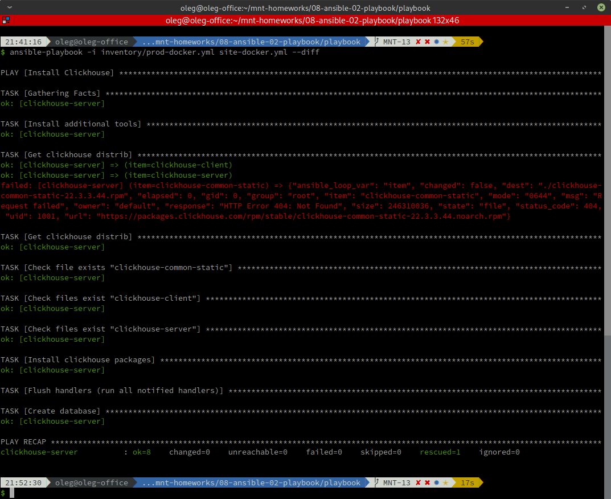

# Домашнее задание к занятию "08.02 Работа с Playbook"

## Подготовка к выполнению

1. Создайте свой собственный (или используйте старый) публичный репозиторий на github с произвольным именем.
2. Скачайте [playbook](./playbook/) из репозитория с домашним заданием и перенесите его в свой репозиторий.
3. Подготовьте хосты в соответствии с группами из предподготовленного playbook.

## Основная часть

1. Приготовьте свой собственный inventory файл `prod.yml`.
2. Допишите playbook: нужно сделать ещё один play, который устанавливает и настраивает [vector](https://vector.dev).
3. При создании tasks рекомендую использовать модули: `get_url`, `template`, `unarchive`, `file`.
4. Tasks должны: скачать нужной версии дистрибутив, выполнить распаковку в выбранную директорию, установить vector.
5. Запустите `ansible-lint site.yml` и исправьте ошибки, если они есть.
6. Попробуйте запустить playbook на этом окружении с флагом `--check`.
7. Запустите playbook на `prod.yml` окружении с флагом `--diff`. Убедитесь, что изменения на системе произведены.
8. Повторно запустите playbook с флагом `--diff` и убедитесь, что playbook идемпотентен.
9. Подготовьте README.md файл по своему playbook. В нём должно быть описано: что делает playbook, какие у него есть параметры и теги.
10. Готовый playbook выложите в свой репозиторий, поставьте тег `08-ansible-02-playbook` на фиксирующий коммит, в ответ предоставьте ссылку на него.

---

### Решение:

1. Создайте свой собственный (или используйте старый) публичный репозиторий на github с произвольным именем.
2. Скачайте [playbook](./playbook/) из репозитория с домашним заданием и перенесите его в свой репозиторий.
3. Подготовьте хосты в соответствии с группами из предподготовленного playbook.

Для выполнения задания можно использовать как [контейнеризированные хосты](./docker/docker-compose.yml):


так и воспользоваться [виртуальными машинами](./terraform/main.tf):


Оба решения **работают одинаково**, хотя и имеют небольшую разницу при управлении через Ansible.


## Основная часть

**1. Приготовьте свой собственный inventory файл `prod.yml`.**

[Для Docker:](./playbook/inventory/prod-docker.yml)

Т.к. использование Docker-контейнеризации накладывает определенные ограничения на реализацию ssh-соединений 
и подключение к контейнерам рекомендуется производить через запуск bash-терминала как приложения
(команда `docker exec`), то в inventory-файле Ansible применён параметр ["ansible_connection: docker"](./playbook/inventory/prod-docker.yml).

[Для удалённых хостов:](./playbook/inventory/prod.yml)

При использовании обычных удалённых хостов ограничений на SSH нет и можно использовать обычное 
ssh-подключение - ["ansible_host: 51.250.14.146"](./playbook/inventory/prod.yml).

**2. Допишите playbook: нужно сделать ещё один play, который устанавливает и настраивает [vector](https://vector.dev).**

[Для Docker](./playbook/vector-docker.yml) для получения достаточных полномочий используется конструкция `remote_user: root`.

[Для удалённых хостов](./playbook/vector.yml) получить (повысить) права можно командой `become: true`.

В остальном конфигурационные файлы одинаковы.

**3. При создании tasks рекомендую использовать модули: `get_url`, `template`, `unarchive`, `file`.**

Отличный совет.

**4. Tasks должны: скачать нужной версии дистрибутив, выполнить распаковку в выбранную директорию, установить vector.**

Скачивание в выбранную директорию выполняется командой:
````
- name: Downloading Vector distributives
  ansible.builtin.get_url:
    mode: 0644
    url: "https://packages.timber.io/vector/latest/{{ vector_latest }}.rpm"
    dest: "/tmp/{{ vector_latest }}.rpm"
````

Распаковка здесь не нужна, но могла бы выполняться командой `ansible.builtin.unarchive`.

Можно проверить, что файл фактически присутствует в требуемом местоположении:
````
- name: Check file exists "vector"
  ansible.builtin.stat:
    path: /tmp/{{ vector_latest }}.rpm
  register: vector_stat
````

Установка файла (при условии, что он был найден в предыдущей команде), выполняется командой:
````
- name: Install Vector packages
  become: true
  ansible.builtin.yum:
    name: "{{ packages }}"
    state: present
  vars:
    packages:
      - "/tmp/{{ vector_latest }}.rpm"
  when: vector_stat.stat.exis
````

**5. Запустите `ansible-lint site.yml` и исправьте ошибки, если они есть.**


Как видим, вариант playbook-файла для обычных виртуальных машин не вызывает нареканий, но версия
для использования контейнеризированного решения вызвала ошибку `command-instead-of-module: service used in place of service module`.

Это произошло из-за того, что стандартный вызов сервиса:
````
- name: Start clickhouse service
  remote_user: root
  ansible.builtin.service:
    name: clickhouse-server
    state: restarted
````

завершается с ошибкой **"Service is in unknown state"** и запуска сервиса не происходит. Поэтому
для обхода этой ситуации нам пришлось использовать специфичную для данного контейнера команду
запуска сервиса:
````
- name: Start clickhouse service
  remote_user: root
  ansible.builtin.command: "service clickhouse-server start"
````

Это, очевидно, непонятно линтовщику, но, к сожалению, если мы хотим применять контейнеры,
то другого варианта у нас нет.

**6. Попробуйте запустить playbook на этом окружении с флагом `--check`.**

Если **ДО реального применения** изменений выполнить `ansible playbook --check`, то можно отследить
предполагаемые изменения в системе:


Как видим, в задаче "Get clickhouse distrib" скачивание двух первых дистрибутивов предполагается
успешным, а третий дистрибутив будет успешно скачан только в следующей задаче
(как и предполагалось).

Далее три задачи проверки наличия файлов проходят успешно (хотя фактически скачивания не
производилось), а следующая задача "Install clickhouse packages" пропущена потому что эта
задача проверяют флаги, установленные командами `register` предыдущих задач.

Далее вызывается задача немедленного вызова обработчиков ("Flush handlers") и команда создания
базы данных `logs` ("Create database").

Проверка предполагаемых изменений на удалённых хостах проходит совершенно аналогично:


Таким образом, флаг `--check` позволяет отследить изменения, которые предполагается внести
в систему.

**7. Запустите playbook на `prod.yml` окружении с флагом `--diff`. Убедитесь, что изменения на системе произведены.**

Если **ДО реального применения** изменений выполнить `ansible playbook --diff`, то можно отследить
предполагаемые изменения в системе:


Здесь отличием от применения флага `--check` является то, что файл фактически будут скачаны: 


Результат для удалённых хостов полностью аналогичен:


Файлы также присутствуют в системе:


**8. Повторно запустите playbook с флагом `--diff` и убедитесь, что playbook идемпотентен.**

Повторный запуск `ansible playbook --diff` показывает, что система остаётся без изменений:



Результат для удалённых хостов полностью аналогичен: 


**9. Подготовьте README.md файл по своему playbook. В нём должно быть описано: что делает playbook, какие у него есть параметры и теги.**

Применим, наконец, изменения для Clickhouse:


И для Vector:


Когда программные продукты установлены можно проверить их версии:


Для удаленных хостов всё происходит точно также при установке Clickhouse:


И для Vector:


Аналогично можно посмотреть версии продуктов:


Каким образом данные изменения были внесены подробно рассмотрено в соответствующем [README-файле](./playbook/README.md).

**10. Готовый playbook выложите в свой репозиторий, поставьте тег `08-ansible-02-playbook` на фиксирующий коммит, в ответ предоставьте ссылку на него.**

[Сделано.](./playbook)

---