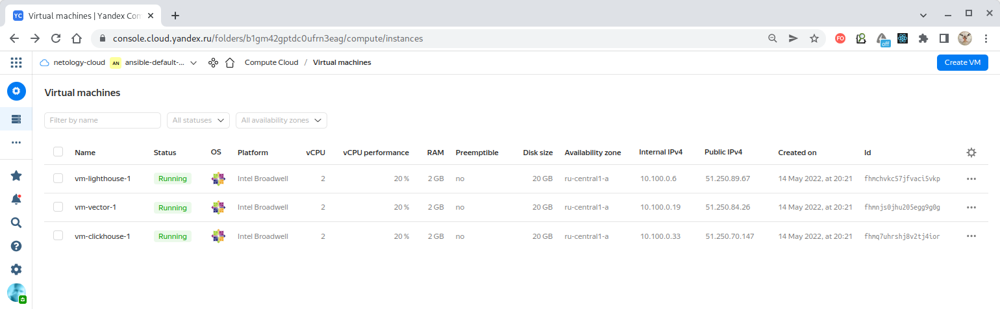
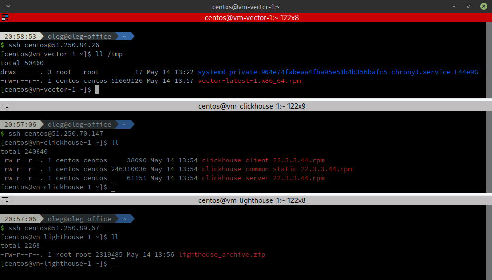

# Домашнее задание к занятию "08.03 Использование Yandex Cloud"

## Подготовка к выполнению

1. Подготовьте в Yandex Cloud три хоста: для `clickhouse`, для `vector` и для `lighthouse`.

## Основная часть

1. Допишите playbook: нужно сделать ещё один play, который устанавливает и настраивает lighthouse.
2. При создании tasks рекомендую использовать модули: `get_url`, `template`, `yum`, `apt`.
3. Tasks должны: скачать статику lighthouse, установить nginx или любой другой webserver, настроить его конфиг для открытия lighthouse, запустить webserver.
4. Приготовьте свой собственный inventory файл `prod.yml`.
5. Запустите `ansible-lint site.yml` и исправьте ошибки, если они есть.
6. Попробуйте запустить playbook на этом окружении с флагом `--check`.
7. Запустите playbook на `prod.yml` окружении с флагом `--diff`. Убедитесь, что изменения на системе произведены.
8. Повторно запустите playbook с флагом `--diff` и убедитесь, что playbook идемпотентен.
9. Подготовьте README.md файл по своему playbook. В нём должно быть описано: что делает playbook, какие у него есть параметры и теги.
10. Готовый playbook выложите в свой репозиторий, поставьте тег `08-ansible-03-yandex` на фиксирующий коммит, в ответ предоставьте ссылку на него.

---

### Как оформить ДЗ?

Выполненное домашнее задание пришлите ссылкой на .md-файл в вашем репозитории.

---

### Решение:

**1. Допишите playbook: нужно сделать ещё один play, который устанавливает и настраивает lighthouse.**

Готово: [playbook](./playbook)

**2. При создании tasks рекомендую использовать модули: `get_url`, `template`, `yum`, `apt`.**

Замечательный совет.

**3. Tasks должны: скачать статику lighthouse, установить nginx или любой другой webserver, настроить его конфиг для открытия lighthouse, запустить webserver.**

Готово: [lighthouse.yml](./playbook/lighthouse.yml)

**4. Приготовьте свой собственный inventory файл `prod.yml`.**

Готово (переименован в более понятный): [hosts.yml](./playbook/inventory/hosts.yml)

**5. Запустите `ansible-lint site.yml` и исправьте ошибки, если они есть.**

````
$ ansible-lint playbook/*                                   
WARNING  Overriding detected file kind 'yaml' with 'playbook' for given positional argument: playbook/clickhouse.yml
WARNING  Overriding detected file kind 'yaml' with 'playbook' for given positional argument: playbook/lighthouse.yml
WARNING  Overriding detected file kind 'yaml' with 'playbook' for given positional argument: playbook/vector.yml
````

Ошибок нет, кроме замечания, что playbook-файлов несколько. Нас это устраивает.

**6. Попробуйте запустить playbook на этом окружении с флагом `--check`.**

Запустим `--check` для Vector:

````
$ ansible-playbook -i inventory/prod.yml vector.yml --check

PLAY [Vector installation] **************************************************************************************************************************************************************************************************************

TASK [Gathering Facts] ******************************************************************************************************************************************************************************************************************
ok: [vector-01]

TASK [Who is the current user?] *********************************************************************************************************************************************************************************************************
ok: [vector-01] => {
    "msg": "centos"
}

TASK [Install additional tools] *********************************************************************************************************************************************************************************************************
changed: [vector-01]

TASK [Downloading Vector distributives] *************************************************************************************************************************************************************************************************
changed: [vector-01]

TASK [Check file exists "vector"] *******************************************************************************************************************************************************************************************************
ok: [vector-01]

TASK [Install Vector packages] **********************************************************************************************************************************************************************************************************
skipping: [vector-01]

TASK [Sending Vector config] ************************************************************************************************************************************************************************************************************
changed: [vector-01]

TASK [Create Vector systemd unit] *******************************************************************************************************************************************************************************************************
changed: [vector-01]

RUNNING HANDLER [start-vector-systemd] **************************************************************************************************************************************************************************************************
skipping: [vector-01]

PLAY RECAP ******************************************************************************************************************************************************************************************************************************
vector-01                  : ok=7    changed=4    unreachable=0    failed=0    skipped=2    rescued=0    ignored=0   
````

Запуск `--check` для Clickhouse:
````
$ ansible-playbook -i inventory/prod.yml clickhouse.yml --check

PLAY [Install Clickhouse] ***************************************************************************************************************************************************************************************************************

TASK [Gathering Facts] ******************************************************************************************************************************************************************************************************************
ok: [clickhouse-01]

TASK [Who is the current user?] *********************************************************************************************************************************************************************************************************
ok: [clickhouse-01] => {
    "msg": "centos"
}

TASK [Install additional tools] *********************************************************************************************************************************************************************************************************
changed: [clickhouse-01]

TASK [Get clickhouse distrib] ***********************************************************************************************************************************************************************************************************
changed: [clickhouse-01] => (item=clickhouse-client)
changed: [clickhouse-01] => (item=clickhouse-server)
failed: [clickhouse-01] (item=clickhouse-common-static) => {"ansible_loop_var": "item", "changed": false, "dest": "./clickhouse-common-static-22.3.3.44.rpm", "elapsed": 0, "item": "clickhouse-common-static", "msg": "Request failed", "response": "HTTP Error 404: Not Found", "status_code": 404, "url": "https://packages.clickhouse.com/rpm/stable/clickhouse-common-static-22.3.3.44.noarch.rpm"}

TASK [Get clickhouse distrib] ***********************************************************************************************************************************************************************************************************
changed: [clickhouse-01]

TASK [Check file exists "clickhouse-common-static"] *************************************************************************************************************************************************************************************
ok: [clickhouse-01]

TASK [Check files exist "clickhouse-client"] ********************************************************************************************************************************************************************************************
ok: [clickhouse-01]

TASK [Check files exist "clickhouse-server"] ********************************************************************************************************************************************************************************************
ok: [clickhouse-01]

TASK [Install clickhouse packages] ******************************************************************************************************************************************************************************************************
skipping: [clickhouse-01]

TASK [Sending Clickhouse config] ********************************************************************************************************************************************************************************************************
changed: [clickhouse-01]

TASK [Flush handlers (run all notified handlers)] ***************************************************************************************************************************************************************************************

RUNNING HANDLER [restart-clickhouse-service] ********************************************************************************************************************************************************************************************
skipping: [clickhouse-01]

TASK [Create database] ******************************************************************************************************************************************************************************************************************
skipping: [clickhouse-01]

TASK [Create table] *********************************************************************************************************************************************************************************************************************
skipping: [clickhouse-01]

PLAY RECAP ******************************************************************************************************************************************************************************************************************************
clickhouse-01              : ok=8    changed=3    unreachable=0    failed=0    skipped=4    rescued=1    ignored=0   
````

Запуск `--check` для Lighthouse:
````
$ ansible-playbook -i inventory/prod.yml lighthouse.yml --check

PLAY [Lighthouse installation] **********************************************************************************************************************************************************************************************************

TASK [Gathering Facts] ******************************************************************************************************************************************************************************************************************
ok: [lighthouse-01]

TASK [Who is the current user?] *********************************************************************************************************************************************************************************************************
ok: [lighthouse-01] => {
    "msg": "centos"
}

TASK [Install additional tools] *********************************************************************************************************************************************************************************************************
changed: [lighthouse-01]

TASK [Install EPEL repo] ****************************************************************************************************************************************************************************************************************
changed: [lighthouse-01]

TASK [Install and launch nginx] *********************************************************************************************************************************************************************************************************
skipping: [lighthouse-01]

TASK [Create nginx config] **************************************************************************************************************************************************************************************************************
changed: [lighthouse-01]

TASK [Get Lighthouse archive] ***********************************************************************************************************************************************************************************************************
changed: [lighthouse-01]

TASK [Check Lighthouse archive downloaded] **********************************************************************************************************************************************************************************************
ok: [lighthouse-01]

TASK [Creating destination directory] ***************************************************************************************************************************************************************************************************
changed: [lighthouse-01]

TASK [Unboxing Lighthouse] **************************************************************************************************************************************************************************************************************
skipping: [lighthouse-01]

TASK [Configure Lighthouse] *************************************************************************************************************************************************************************************************************
changed: [lighthouse-01]

TASK [Set Clickhouse Access Point] ******************************************************************************************************************************************************************************************************
skipping: [lighthouse-01]

PLAY RECAP ******************************************************************************************************************************************************************************************************************************
lighthouse-01              : ok=9    changed=6    unreachable=0    failed=0    skipped=3    rescued=0    ignored=0   
````

Во всех случая видим присутствие отчетов о потенциальных изменениях.

> Обращаем внимание, что фактический запуск сервисов в режиме `--check` не производится благодаря
> установленному признаку `when: not ansible_check_mode`!

**7. Запустите playbook на `prod.yml` окружении с флагом `--diff`. Убедитесь, что изменения на системе произведены.**

С помощью [terraform-конфигурации](./terraform) создадим окружение в Yandex.Cloud:



И запустим сразу все playbook-файлы с флагом `--diff`, что позволит увидеть предполагаемые изменения
систем, и, кроме того, в отличие от флага `--check`, приведет к выполнению команды
`ansible.builtin.get_url` и скачиванию файлов.  

После успешного выполнения команды можно проверить физическое наличие скачанных файлов
на хостах для `Vector`, `Clickhouse` и `Lighthouse` соответственно:



Как видим, все установочные файлы скачаны на хосты.

**8. Повторно запустите playbook с флагом `--diff` и убедитесь, что playbook идемпотентен.**

Повторный запуск 'ansible-playbook' с флагом `--diff` не обнаруживает вносимых изменений в системе.
````
$ ansible-playbook -i inventory/prod.yml *.yml --diff 

PLAY [Install Clickhouse] ***************************************************************************************************************************************************************************************************************

TASK [Gathering Facts] ******************************************************************************************************************************************************************************************************************
ok: [clickhouse-01]

...

PLAY RECAP ******************************************************************************************************************************************************************************************************************************
clickhouse-01              : ok=11   changed=0    unreachable=0    failed=0    skipped=0    rescued=1    ignored=0   
lighthouse-01              : ok=13   changed=0    unreachable=0    failed=0    skipped=0    rescued=0    ignored=0   
vector-01                  : ok=8    changed=0    unreachable=0    failed=0    skipped=0    rescued=0    ignored=0   
````

**9. Подготовьте README.md файл по своему playbook. В нём должно быть описано: что делает playbook, какие у него есть параметры и теги.**

Готово: [README.md](./playbook/README.md)

**10. Готовый playbook выложите в свой репозиторий, поставьте тег `08-ansible-03-yandex` на фиксирующий коммит, в ответ предоставьте ссылку на него.**

Готово: [playbook](./playbook)

---
