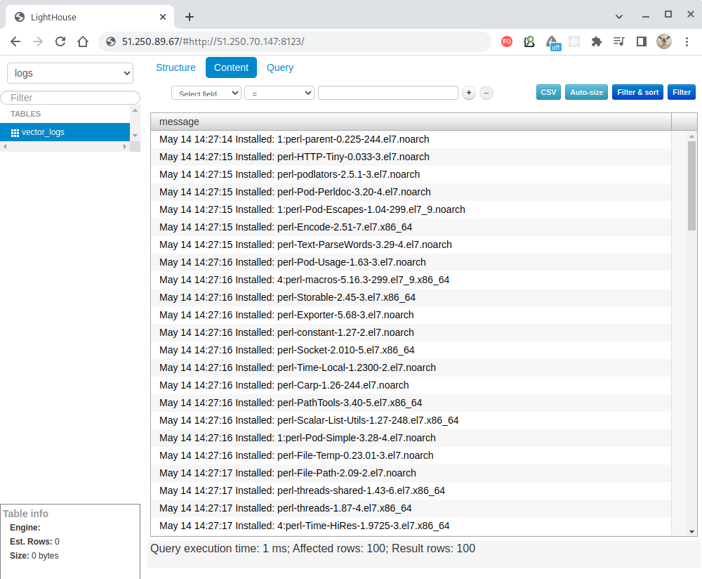

## Описание содержимого playbook-файлов [vector.yml](./vector.yml), [clickhouse.yml](./clickhouse.yml) и [lighthouse.yml](./lighthouse.yml)

---


### Файл [vector.yml](./vector.yml)

Обработчик для запуска `Vector` как системного сервиса
(в режиме `--check` эта задача игнорируется):
````
handlers:
- name: start-vector-systemd
  become: true
  ansible.builtin.systemd:
    name: vector
    state: started
    daemon_reload: true
  when: not ansible_check_mode
````

Скачивание `rpm`-дистрибутива `Vector` в указанную папку хоста:
````
- name: Downloading Vector distributives
  ansible.builtin.get_url:
    mode: 0644
    url: "https://packages.timber.io/vector/latest/{{ vector_latest }}.rpm"
    dest: "/tmp/{{ vector_latest }}.rpm"
````

Установка `Vector` из `rpm`-дистрибутива: 
````
- name: Install Vector packages
  become: true
  ansible.builtin.yum:
    name: "{{ packages }}"
    state: present
  vars:
    packages:
      - "/tmp/{{ vector_latest }}.rpm"
  when: vector_stat.stat.exists
````

Копирование указанного файла конфигурации `Vector` в целевую папку хоста: 
````
- name: Sending Vector config
  become: true
  ansible.builtin.template:
    mode: 0644
    src: templates/vector.yaml.j2
    dest: "{{ vector_config_dest }}"
    backup: true
    validate: vector validate --no-environment --config-yaml %s
````

Копирование указанного файла конфигурации системного сервиса в папку `systemd` хоста:
````
- name: Create Vector systemd unit
  become: true
  ansible.builtin.template:
    mode: 0644
    src: templates/vector.service.j2
    dest: /etc/systemd/system/vector.service
    backup: true
  notify: start-vector-systemd
````

---


### Файл [clickhouse.yml](./clickhouse.yml)

Обработчик для перезапуска сервиса `Clickhouse`:
````
handlers:
- name: restart-clickhouse-service
  become: true
  ansible.builtin.service:
    name: clickhouse-server
    state: restarted
  when: not ansible_check_mode
````

Блок зависимых задач для скачивания набора `rpm`-дистрибутивов из уканного URL
в заданное расположение (в случае ошибки в первой задаче "Get clickhouse distrib" будет
запущена следующая задача): 
````
- block:
    - name: Get clickhouse distrib
      ansible.builtin.get_url:
        mode: 0644
        url: "https://packages.clickhouse.com/rpm/stable/{{ item }}-{{ clickhouse_version }}.noarch.rpm"
        dest: "./{{ item }}-{{ clickhouse_version }}.rpm"
      with_items: "{{ clickhouse_packages }}"
  rescue:
    - name: Get clickhouse distrib
      ansible.builtin.get_url:
        mode: 0644
        url: "https://packages.clickhouse.com/rpm/stable/clickhouse-common-static-{{ clickhouse_version }}.x86_64.rpm"
        dest: "./clickhouse-common-static-{{ clickhouse_version }}.rpm"
````

Установка из `rpm`-дистрибутивов:
````
- name: Install clickhouse packages
  become: true
  ansible.builtin.yum:
    name:
      - clickhouse-common-static-{{ clickhouse_version }}.rpm
      - clickhouse-client-{{ clickhouse_version }}.rpm
      - clickhouse-server-{{ clickhouse_version }}.rpm
````

Копирование указанного конфигурационного файла `Clickhouse` в целевую папку хоста: 
````
- name: Sending Clickhouse config
  become: true
  ansible.builtin.template:
    mode: 0644
    src: templates/clickhouse_config.xml
    dest: /etc/clickhouse-server/config.xml
  notify: restart-clickhouse-service
````

Безотлагательное инициирование срабатывания обработчиков, уже получивших вызов:
````
- name: Flush handlers (run all notified handlers)
  ansible.builtin.meta: flush_handlers
````

Выполнение двух SQL-запросов для создание базы данных с именем `logs` и таблицы в ней с
именем `vector_logs` (таблица будет иметь единственную колонку `message` строкового типа):
````
- name: Create database
  ansible.builtin.command: clickhouse-client -q 'CREATE DATABASE logs'
  register: create_db
  failed_when: create_db.rc != 0 and create_db.rc !=82
  changed_when: create_db.rc == 0
- name: Create table
  ansible.builtin.command: clickhouse-client -q 'CREATE TABLE logs.vector_logs ("message" String) ENGINE = Log'
  register: create_table
  failed_when: create_table.rc != 0 and create_table.rc !=57
  changed_when: create_table.rc == 0
````

---


### Файл [lighthouse.yml](./lighthouse.yml)

Обработчики для запуска и перезапуска сервиса `nginx`:
````
handlers:
  - name: start-nginx
    become: true
    ansible.builtin.command: "nginx"
    when: not ansible_check_mode
  - name: reload-nginx
    become: true
    ansible.builtin.command: "nginx -s reload"
    when: not ansible_check_mode
````

Установка пакета `EPEL` и веб-сервера `nginx`:
````
- name: Install EPEL repo
  become: true
  ansible.builtin.yum:
    name: epel-release
    state: present
- name: Install and launch nginx
  become: true
  ansible.builtin.yum:
    name: nginx
    state: present
  when: not ansible_check_mode
  notify: start-nginx
````

Копирование конфигурационного файла `nginx` в целевую папку хоста:
````
- name: Create nginx config
  become: true
  ansible.builtin.template:
    mode: 0644
    src: templates/lighthouse_nginx.conf.j2
    dest: /etc/nginx/nginx.conf
````

Скачивание `zip`-архива с веб-приложением `Lighthouse` в указанную папку:
````
- name: Get Lighthouse archive
  become: true
  ansible.builtin.get_url:
    mode: 0644
    url: "https://github.com/VKCOM/lighthouse/archive/refs/heads/master.zip"
    dest: "./{{ lighthouse_archive }}.zip"
````

Создание директории, в которую следует распаковать скачанный `zip`-архив:
````
- name: Creating destination directory
  become: true
  ansible.builtin.file:
    path: "{{ lighthouse_unzip_dir }}"
    state: directory
    mode: 0777
````

Распаковка `zip`-архива в созданную папку:
````
- name: Unboxing Lighthouse
  ansible.builtin.unarchive:
    src: "./{{ lighthouse_archive }}.zip"
    dest: "{{ lighthouse_unzip_dir }}"
    remote_src: true
  when: lh_arch_exists.stat.exists
````

Копирование конфигурационного файла `Lighthouse` в целевую папку хоста:
````
- name: Configure Lighthouse
  become: true
  ansible.builtin.template:
    mode: 0644
    src: templates/lighthouse.conf.j2
    dest: /etc/nginx/conf.d/default.conf
````

Замена в файле `lighthouse_clh_access_point_file` строки, подходящей под регулярное выражение,
заданное в переменной `lighthouse_clh_access_point_regexp` на строку, заданную в переменной
`lighthouse_clh_access_point`:
````
- name: Set Clickhouse Access Point
  ansible.builtin.lineinfile:
    path: "{{ lighthouse_clh_access_point_file }}"
    regexp: "{{ lighthouse_clh_access_point_regexp }}"
    line: "{{ lighthouse_clh_access_point }}"
    firstmatch: true
  when: not ansible_check_mode
  notify: reload-nginx
````

По факту, здесь мы заменяем в `js`-файле строку, отвечающую за
URL-путь к сервису `Clickouse` на наш фактический путь, чтобы запуск и настройка системы происходили
с минимальными усилиями для пользователя.

---

Выполнение всех инструкций командой `ansible-playbook -i inventory/prod.yml *.yml` (находясь в
папке [playbook](./)) приводит к скачиванию дистрибутивов `Vector`, `Clickhouse` и `Lighthouse`,
их установке и запуску.

**Vector** - собирает логи из различных источников и отправляет их на Clickhouse.

**Clickhouse** - это база данных, которая накапливает собранные логи.

**Lighthouse** - это веб-интерфейс для отображения накопленных в `Clickhouse` логов, результат
работы которого отображён на следующем скриншоте:



Как видим, все системы работают.

---