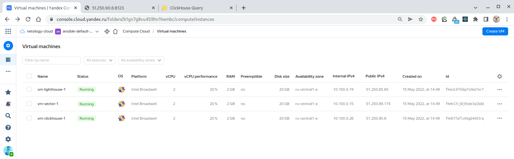
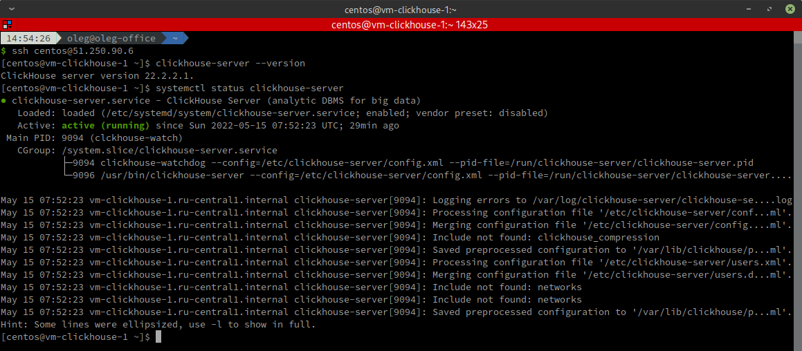
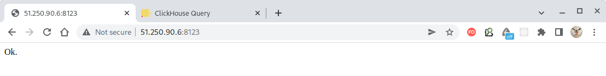
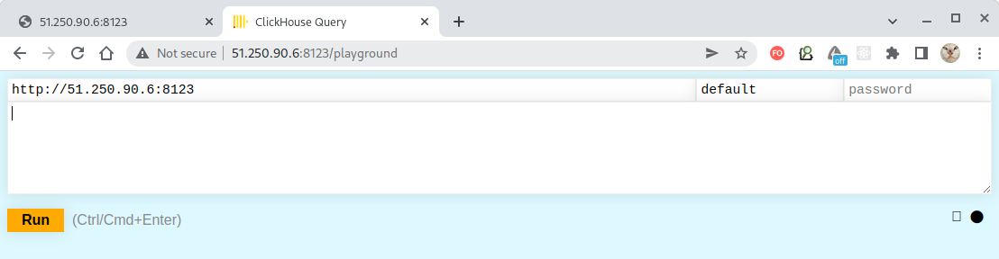
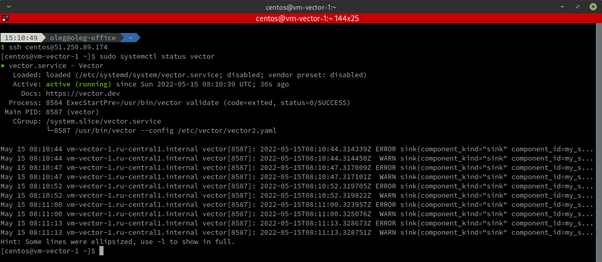
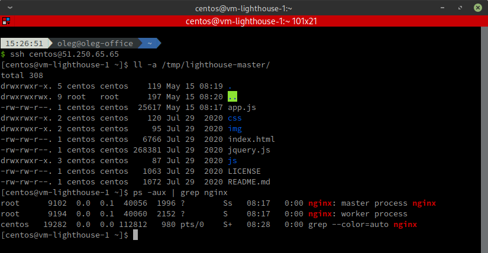
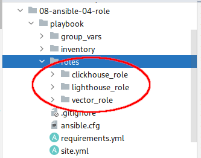
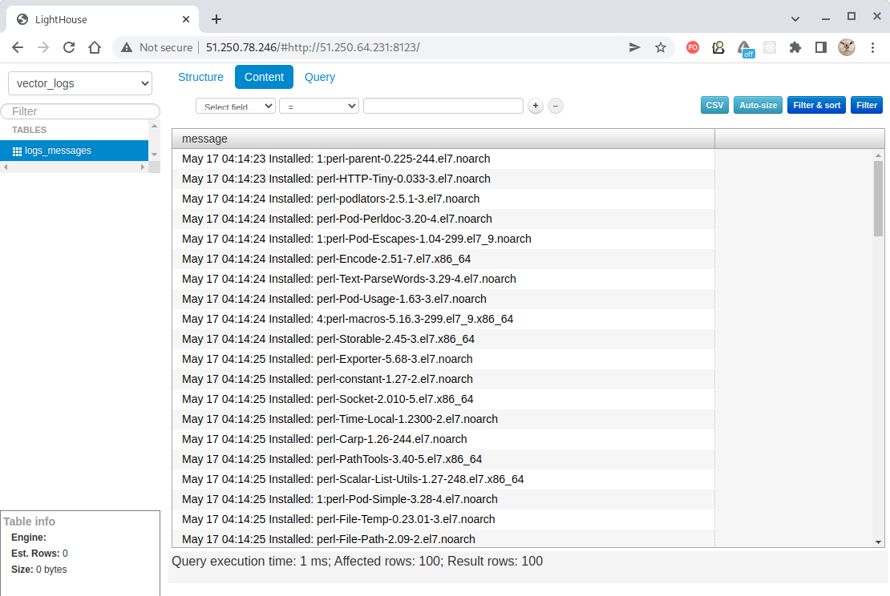

# Домашнее задание к занятию "8.4 Работа с Roles"

## Подготовка к выполнению
1. Создайте два пустых публичных репозитория в любом своём проекте: vector_role и lighthouse_role.
2. Добавьте публичную часть своего ключа к своему профилю в github.

## Основная часть

Наша основная цель - разбить наш playbook на отдельные roles. Задача: сделать roles для clickhouse, vector и lighthouse и написать playbook для использования этих ролей. Ожидаемый результат: существуют три ваших репозитория: два с roles и один с playbook.

1. Создать в старой версии playbook файл `requirements.yml` и заполнить его следующим содержимым:

   ```yaml
   ---
     - src: git@github.com:AlexeySetevoi/ansible-clickhouse.git
       scm: git
       version: "1.11.0"
       name: clickhouse 
   ```

2. При помощи `ansible-galaxy` скачать себе эту роль.
3. Создать новый каталог с ролью при помощи `ansible-galaxy role init vector_role`.
4. На основе tasks из старого playbook заполните новую role. Разнесите переменные между `vars` и `default`. 
5. Перенести нужные шаблоны конфигов в `templates`.
6. Описать в `README.md` обе роли и их параметры.
7. Повторите шаги 3-6 для lighthouse. Помните, что одна роль должна настраивать один продукт.
8. Выложите все roles в репозитории. Проставьте тэги, используя семантическую нумерацию Добавьте roles в `requirements.yml` в playbook.
9. Переработайте playbook на использование roles. Не забудьте про зависимости lighthouse и возможности совмещения `roles` с `tasks`.
10. Выложите playbook в репозиторий.
11. В ответ приведите ссылки на оба репозитория с roles и одну ссылку на репозиторий с playbook.

---

### Решение:


**1. Создать в старой версии playbook файл `requirements.yml` и заполнить его следующим содержимым:**

```yaml
---
- src: git@github.com:AlexeySetevoi/ansible-clickhouse.git
 scm: git
 version: "1.11.0"
 name: clickhouse 
```

Готово.

**2. При помощи `ansible-galaxy` скачать себе эту роль.**
````
$ ansible-galaxy install -r requirements.yml -p roles
Starting galaxy role install process
- extracting clickhouse to /home/oleg/mnt-homeworks/08-ansible-04-role/playbook/roles/clickhouse
- clickhouse (1.11.0) was installed successfully
```` 

После скачивания роли следует выполнить некоторые настройки:
- укажем в файле [vars.yml](./playbook/group_vars/all/vars.yml) IPv4-адреса хостов;
- в файле [main.yml](./playbook/roles/clickhouse_role/defaults/main.yml) укажем требуемую версию
сервиса - будем использовать "22.2.2.1-2";
- указать требуемые параметры в [конфигурационных файлах Clickhouse](./playbook/roles/clickhouse_role/templates)
(для упрощения задачи просто заменим [config.j2](./playbook/roles/clickhouse_role/templates/config.j2)
и [users.j2](./playbook/roles/clickhouse_role/templates/users.j2) на их дефолтные варианты
[config.xml.j2](./playbook/roles/clickhouse_role/templates/config.xml.j2) и
[users.xml.j2](./playbook/roles/clickhouse_role/templates/users.xml.j2) соответственно).

Имея работающие хосты Yandex.Cloud:



Убедимся в работоспособности роли, запустив её командой:
````
$ ansible-playbook -u centos -i inventory/hosts.yml site.yml

PLAY [Apply Clickhouse role] ************************************************************************************************************************************************************************************************************

TASK [Gathering Facts] ******************************************************************************************************************************************************************************************************************
ok: [clickhouse-01]

...

PLAY RECAP ******************************************************************************************************************************************************************************************************************************
clickhouse-01              : ok=25   changed=9    unreachable=0    failed=0    skipped=10   rescued=0    ignored=0   
````

Как видим, роль успешно отработала, установила и запустила требуемую версию сервиса `Clickhouse`
на указанном хосте:



Кроме того, состояние Clickhouse можно проверить, зайдя на его страницу - должно отображаться "Ok.":



Помимо прочего, сервис предоставляет "playground" для создания запросов:



Итак, наш сервис активен.

**3. Создать новый каталог с ролью при помощи `ansible-galaxy role init vector_role`.**
````
$ ansible-galaxy role init vector_role
- Role vector_role was created successfully
````

Каталог `vector_role` с предустановленным набором директорий создан.

**4. На основе tasks из старого playbook заполните новую role. Разнесите переменные между `vars` и `default`.**

_См. следующий пункт._

**5. Перенести нужные шаблоны конфигов в `templates`.**

Процесс создания роли из playbook состоит из следующих шагов:
- копировать все tasks из playbook в файл `main.yml` директории `tasks`;
- перенести все handlers в файл `main.yml` директории `handlers`;
- перенести все templates в одноименную директорию `role`;
- переменные из group_vars перенести в файлы `main.yml` директорий `defaults` и `vars`, в зависимости от внутренней логики;
- заполнить `meta`-информацию (требуется для работы ansible-galaxy);
- заполнить `README`.md файл (помогает сторонним пользователем использовать роль).

После выполнения данных шагов мы получаем новую роль `vector_role`, позволяющую установить,
настроить и запустить сервис "Vector", представляющий из себя настраиваемый сборщик логов. Созданную
роль следует добавить в файл [site.yml](./playbook/site.yml) и после выполнения команды
`ansible-playbook -u centos -i inventory/hosts.yml site.yml` убеждаемся что сервис успешно создан
и работает:



**6. Описать в `README.md` обе роли и их параметры.**

Готово:

[README.md для Vector](./playbook/roles/vector_role/README.md) и [README.md для Lighthouse](./playbook/roles/lighthouse_role/README.md)

[README.md для Clickhouse](./playbook/roles/clickhouse_role/README.md) было скачано с Ansible Galaxy вместе с соответствующей публично доступной ролью.

**7. Повторите шаги 3-6 для lighthouse. Помните, что одна роль должна настраивать один продукт.**

Аналогично ранее выполненным шагам для роли `vector_role` создаём набор директорий для роли
`lighthouse_role`:
````
$ ansible-galaxy role init lighthouse_role                  
- Role lighthouse_role was created successfully
````

Выполняем шаги:
- копировать все tasks из playbook в файл `main.yml` директории `tasks`;
- перенести все handlers в файл `main.yml` директории `handlers`;
- перенести все templates в одноименную директорию `role`;
- переменные из group_vars перенести в файлы `main.yml` директорий `defaults` и `vars`, в зависимости от внутренней логики;
- заполнить `meta`-информацию;
- заполнить `README`.md файл.

После выполнения данных шагов мы получаем новую роль `lighthouse_role`, позволяющую установить,
настроить и запустить сервис "Lighthouse", представляющий из себя веб-интерфейс для отображения
содержимого базы данных "Clickhouse".

Созданную роль следует добавить в файл [site.yml](./playbook/site.yml)
и после выполнения команды `ansible-playbook -u centos -i inventory/hosts.yml site.yml`
убеждаемся что папка `lighthouse-master`, содержащая веб-приложение "Lighthouse", находится
в указанной директории, а веб-сервер `nginx` успешно работает:



**8. Выложите все roles в репозитории. Проставьте тэги, используя семантическую нумерацию Добавьте roles в `requirements.yml` в playbook.**

Добавив теги версий (это обязательно!) к коммитам, отправим роли в соответствующие репозитории:

- [роль для Vector](https://github.com/olezhuravlev/vector-role);
- [роль для Clickhouse](https://github.com/olezhuravlev/clickhouse-role) (доработанный вариант с заранее настроенной конфигурацией);
- [роль для Lighthouse](https://github.com/olezhuravlev/lighthouse-role).

Созданные роли и их репозитории были внесены в [requirements.yml](./playbook/requirements.yml)
чтобы получить возможность в дальнейшем скачивать их с использованием `ansible-galaxy`.

**9. Переработайте playbook на использование roles. Не забудьте про зависимости lighthouse и возможности совмещения `roles` с `tasks`.**

Имея роли и их репозитории в файле [requirements.yml](./playbook/requirements.yml):
````
---
- name: vector_role
  src: git@github.com:olezhuravlev/vector-role.git
  scm: git
  version: 1.0.0
- name: clickhouse_role
  src: git@github.com:olezhuravlev/clickhouse-role.git
  scm: git
  version: 1.0.0
- name: lighthouse_role
  src: git@github.com:olezhuravlev/lighthouse-role.git
  scm: git
  version: 1.0.0
````

Папки ролей можно вообще удалить из playbook и в дальнейшем получить их вновь командой
`ansible-galaxy install`:
````
$ ansible-galaxy install -r requirements.yml -p roles
Starting galaxy role install process
- extracting vector_role to /home/oleg/mnt-homeworks/08-ansible-04-role/playbook/roles/vector_role
- vector_role (1.0.0) was installed successfully
- extracting clickhouse_role to /home/oleg/mnt-homeworks/08-ansible-04-role/playbook/roles/clickhouse_role
- clickhouse_role (1.0.0) was installed successfully
- extracting lighthouse_role to /home/oleg/mnt-homeworks/08-ansible-04-role/playbook/roles/lighthouse_role
- lighthouse_role (1.0.0) was installed successfully
````



После развёртывания конфигурации мы получим всё то же работающее приложение:



**10. Выложите playbook в репозиторий.**

Здесь: [playbook](https://github.com/olezhuravlev/mnt-homeworks/tree/MNT-13/08-ansible-04-role/playbook)

**11. В ответ приведите ссылки на оба репозитория с roles и одну ссылку на репозиторий с playbook.**

### ОТВЕТ:

| Назначение                     | Github-репозиторий                                                                     | Реестр Ansible Galaxy                                   |
|--------------------------------|----------------------------------------------------------------------------------------|---------------------------------------------------------|
| Роль Vector                    | https://github.com/olezhuravlev/vector-role                                            | https://galaxy.ansible.com/olezhuravlev/vector_role     |
| Роль Clickhouse (доработанная) | https://github.com/olezhuravlev/clickhouse-role                                        | https://galaxy.ansible.com/olezhuravlev/clickhouse_role |
| Роль Lighthouse                | https://github.com/olezhuravlev/lighthouse-role                                        | https://galaxy.ansible.com/olezhuravlev/lighthouse_role |
| playbook                       | https://github.com/olezhuravlev/mnt-homeworks/tree/MNT-13/08-ansible-04-role/playbook  |                                                         |

Таким образом, мы создали роли, которые доступны для поиска через [реестр Ansible Galaxy](https://galaxy.ansible.com/olezhuravlev),
скачивания из публичного репозитория, настройки и использования для развёртывания требуемой
инфраструктуры.

---
