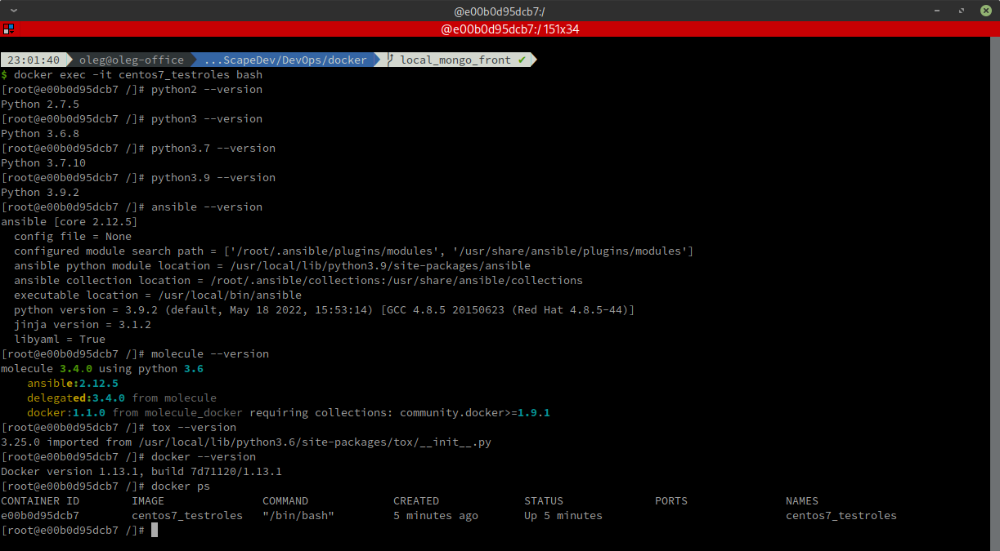

# Домашнее задание к занятию "08.05 Тестирование Roles"

## Подготовка к выполнению
1. Установите molecule: `pip3 install "molecule==3.4.0"`
2. Соберите локальный образ на основе [Dockerfile](./Dockerfile)

## Основная часть

Наша основная цель - настроить тестирование наших ролей. Задача: сделать сценарии тестирования для vector. Ожидаемый результат: все сценарии успешно проходят тестирование ролей.

### Molecule

1. Запустите  `molecule test -s centos7` внутри корневой директории clickhouse-role, посмотрите на вывод команды.
2. Перейдите в каталог с ролью vector-role и создайте сценарий тестирования по умолчанию при помощи `molecule init scenario --driver-name docker`.
3. Добавьте несколько разных дистрибутивов (centos:8, ubuntu:latest) для инстансов и протестируйте роль, исправьте найденные ошибки, если они есть.
4. Добавьте несколько assert'ов в verify.yml файл для  проверки работоспособности vector-role (проверка, что конфиг валидный, проверка успешности запуска, etc). Запустите тестирование роли повторно и проверьте, что оно прошло успешно.
5. Добавьте новый тег на коммит с рабочим сценарием в соответствии с семантическим версионированием.

### Tox

1. Добавьте в директорию с vector-role файлы из [директории](./example)
2. Запустите `docker run --privileged=True -v <path_to_repo>:/opt/vector-role -w /opt/vector-role -it <image_name> /bin/bash`, где path_to_repo - путь до корня репозитория с vector-role на вашей файловой системе.
3. Внутри контейнера выполните команду `tox`, посмотрите на вывод.
4. Добавьте файл `tox.ini` в корень репозитория каждой своей роли.
5. Создайте облегчённый сценарий для `molecule`. Проверьте его на исполнимость.
6. Пропишите правильную команду в `tox.ini` для того чтобы запускался облегчённый сценарий.
7. Запустите `docker` контейнер так, чтобы внутри оказались обе ваши роли.
8. Зайдти поочерёдно в каждую из них и запустите команду `tox`. Убедитесь, что всё отработало успешно.
9. Добавьте новый тег на коммит с рабочим сценарием в соответствии с семантическим версионированием.

После выполнения у вас должно получится два сценария molecule и один tox.ini файл в репозитории. Ссылка на репозиторий являются ответами на домашнее задание. Не забудьте указать в ответе теги решений Tox и Molecule заданий.

## Необязательная часть

1. Проделайте схожие манипуляции для создания роли lighthouse.
2. Создайте сценарий внутри любой из своих ролей, который умеет поднимать весь стек при помощи всех ролей.
3. Убедитесь в работоспособности своего стека. Создайте отдельный verify.yml, который будет проверять работоспособность интеграции всех инструментов между ними.
4. Выложите свои roles в репозитории. В ответ приведите ссылки.

---

### Решение:

**1. Запустите  `molecule test -s centos_7` внутри корневой директории clickhouse-role, посмотрите на вывод команды.**

> Т.к. оригинальная роль 'clickhouse-role' была нами в предыдущих заданиях изменена, то скачаем её заново:
> ````
> $ ansible-galaxy install -r requirements_original.yml -p roles
> Starting galaxy role install process
> - extracting clickhouse to /home/oleg/mnt-homeworks/08-ansible-05-testing/playbook/roles/clickhouse
> - clickhouse (1.11.0) was installed successfully
> ````

Далее, в файле `/playbook/roles/clickhouse/molecule/resources/playbooks/converge.yml` исправим ошибку - 
изменим имя роли с предполагаемого `ansible-clickhouse` на реальное `clickhouse`.

И далее, находясь в папке `/playbook/roles/clickhouse`,запустим процесс тестирования этой роли для ОС Centos7:
````
 ...playbook/roles/clickhouse   MNT-13 ✘ ⬆ ✹ ✭  38s 
$ molecule test -s centos_7
 Перечисляются шаги тестирования:
INFO     centos_7 scenario test matrix: dependency, lint, cleanup, destroy, syntax, create, prepare, converge, idempotence, side_effect, verify, cleanup, destroy
...
 Запуск шага `dependency`:
INFO     Running centos_7 > dependency
...
 Файла requirements.yml нет, пропускается:
WARNING  Skipping, missing the requirements file.
WARNING  Skipping, missing the requirements file.
...
 Запуск шага `lint`:
INFO     Running centos_7 > lint
COMMAND: yamllint .
ansible-lint
flake8
...
 Запуск шага `cleanup`:
INFO     Running centos_7 > cleanup
WARNING  Skipping, cleanup playbook not configured.
...
 Запуск шага `destroy`:
INFO     Running centos_7 > destroy
...
 Проверка `Docker`:
INFO     Sanity checks: 'docker'
...
 Удаление существующей Docker-инфраструктуры, возможно оставшейся от предыдущих пусков:
PLAY [Destroy] *****************************************************************

TASK [Destroy molecule instance(s)] ********************************************
changed: [localhost] => (item=centos_7)

TASK [Wait for instance(s) deletion to complete] *******************************
FAILED - RETRYING: [localhost]: Wait for instance(s) deletion to complete (300 retries left).
ok: [localhost] => (item=centos_7)

TASK [Delete docker networks(s)] ***********************************************

PLAY RECAP *********************************************************************
localhost                  : ok=2    changed=1    unreachable=0    failed=0    skipped=1    rescued=0    ignored=0

 Проверка синтаксиса:
INFO     Running centos_7 > syntax

playbook: /home/oleg/mnt-homeworks/08-ansible-05-testing/playbook/roles/clickhouse/molecule/resources/playbooks/converge.yml
...

 Создание Docker-инфраструктуры, требуемой для тестирования:
INFO     Running centos_7 > create

PLAY [Create] ******************************************************************

TASK [Log into a Docker registry] **********************************************
skipping: [localhost] => (item=None) 
skipping: [localhost]

TASK [Check presence of custom Dockerfiles] ************************************
ok: [localhost] => (item={'capabilities': ['SYS_ADMIN'], 'command': '/usr/sbin/init', 'dockerfile': '../resources/Dockerfile.j2', 'env': {'ANSIBLE_USER': 'ansible', 'DEPLOY_GROUP': 'deployer', 'SUDO_GROUP': 'wheel', 'container': 'docker'}, 'image': 'centos:7', 'name': 'centos_7', 'privileged': True, 'tmpfs': ['/run', '/tmp'], 'volumes': ['/sys/fs/cgroup:/sys/fs/cgroup']})

TASK [Create Dockerfiles from image names] *************************************
changed: [localhost] => (item={'capabilities': ['SYS_ADMIN'], 'command': '/usr/sbin/init', 'dockerfile': '../resources/Dockerfile.j2', 'env': {'ANSIBLE_USER': 'ansible', 'DEPLOY_GROUP': 'deployer', 'SUDO_GROUP': 'wheel', 'container': 'docker'}, 'image': 'centos:7', 'name': 'centos_7', 'privileged': True, 'tmpfs': ['/run', '/tmp'], 'volumes': ['/sys/fs/cgroup:/sys/fs/cgroup']})
...
TASK [Wait for instance(s) creation to complete] *******************************
FAILED - RETRYING: [localhost]: Wait for instance(s) creation to complete (300 retries left).
changed: [localhost] => (item={'failed': 0, 'started': 1, 'finished': 0, 'ansible_job_id': '169997094909.115663', 'results_file': '/home/oleg/.ansible_async/169997094909.115663', 'changed': True, 'item': {'capabilities': ['SYS_ADMIN'], 'command': '/usr/sbin/init', 'dockerfile': '../resources/Dockerfile.j2', 'env': {'ANSIBLE_USER': 'ansible', 'DEPLOY_GROUP': 'deployer', 'SUDO_GROUP': 'wheel', 'container': 'docker'}, 'image': 'centos:7', 'name': 'centos_7', 'privileged': True, 'tmpfs': ['/run', '/tmp'], 'volumes': ['/sys/fs/cgroup:/sys/fs/cgroup']}, 'ansible_loop_var': 'item'})

PLAY RECAP *********************************************************************
localhost                  : ok=7    changed=3    unreachable=0    failed=0    skipped=2    rescued=0    ignored=0

 Запуск шага `prepare` (не сконфигурирован):
INFO     Running centos_7 > prepare
WARNING  Skipping, prepare playbook not configured.

 Запуск шага `converge`:
INFO     Running centos_7 > converge

PLAY [Converge] ****************************************************************

TASK [Gathering Facts] *********************************************************
ok: [centos_7]

TASK [Apply Clickhouse Role] ***************************************************

...

TASK [clickhouse : Ensure clickhouse-server.service is enabled: True and state: restarted] ***
fatal: [centos_7]: FAILED! => {"changed": false, "msg": "Service is in unknown state", "status": {}}

PLAY RECAP *********************************************************************
centos_7                   : ok=19   changed=8    unreachable=0    failed=1    skipped=6    rescued=0    ignored=0

 Сообщение о критической ошибке. Выполнение сценария прерывается:
CRITICAL Ansible return code was 2, command was: ['ansible-playbook', '-D', '--inventory', '/home/oleg/.cache/molecule/clickhouse/centos_7/inventory', '--skip-tags', 'molecule-notest,notest', '/home/oleg/mnt-homeworks/08-ansible-05-testing/playbook/roles/clickhouse/molecule/resources/playbooks/converge.yml']
WARNING  An error occurred during the test sequence action: 'converge'. Cleaning up.

 Запуск шага `cleanup`:
INFO     Running centos_7 > cleanup
WARNING  Skipping, cleanup playbook not configured.

 Запуск шага `destroy` для удаления созданной в процессе тестирования Docker-инфраструктуры:
INFO     Running centos_7 > destroy

PLAY [Destroy] *****************************************************************
...
TASK [Delete docker networks(s)] ***********************************************

PLAY RECAP *********************************************************************
localhost                  : ok=2    changed=2    unreachable=0    failed=0    skipped=1    rescued=0    ignored=0

INFO     Pruning extra files from scenario ephemeral directory
````

Видим, что был собран Docker-образ с ОС Centos-7:


И на основе этого образа был запущен Docker-контейнер в котором, очевидно, и выполнялись требуемые
проверки:


После этого Docker-инфраструктура была полностью удалена.

**2. Перейдите в каталог с ролью vector-role и создайте сценарий тестирования по умолчанию при помощи `molecule init scenario --driver-name docker`.**

````
$ molecule init scenario default --driver-name docker 
INFO     Initializing new scenario default...
INFO     Initialized scenario in /home/oleg/mnt-homeworks/08-ansible-05-testing/playbook/roles/vector_role/molecule/default successfully.
````

Для создания дефолтного сценария достаточно указать `molecule init scenario --driver-name docker`.
Если не указывать `driver-name`, то будет применен дравер `delegated`.

По результату выполнения была создана директория [molecule/default](./playbook/roles/vector_role/molecule/default/) с тремя файлами:

- [moleculе.yml](./playbook/roles/vector_role/molecule/default/molecule.yml) - основной файл Molecule;
- [converge.yml](./playbook/roles/vector_role/molecule/default/converge.yml) - playbook-файл тестов;
- [verify.yml](./playbook/roles/vector_role/molecule/default/verify.yml) - файл дополнительных тестов.

Запустим созданный сценарий тестирования командой `molecule test -s ИмяСценария` (если имя сценария не
указывать, то будет запущен сценарий `default`):

````
$ molecule test -s default
INFO     default scenario test matrix: dependency, lint, cleanup, destroy, syntax, create, prepare, converge, idempotence, side_effect, verify, cleanup, destroy
INFO     Performing prerun...
...
PLAY [Destroy] *****************************************************************
...
PLAY RECAP *********************************************************************
localhost                  : ok=2    changed=1    unreachable=0    failed=0    skipped=1    rescued=0    ignored=0

INFO     Running default > syntax

playbook: /home/oleg/mnt-homeworks/08-ansible-05-testing/playbook/roles/vector_role/molecule/default/converge.yml
INFO     Running default > create

PLAY [Create] ******************************************************************
...
PLAY RECAP *********************************************************************
localhost                  : ok=5    changed=2    unreachable=0    failed=0    skipped=4    rescued=0    ignored=0

INFO     Running default > prepare
WARNING  Skipping, prepare playbook not configured.
INFO     Running default > converge

PLAY [Converge] ****************************************************************
...
PLAY RECAP *********************************************************************
instance                   : ok=9    changed=5    unreachable=0    failed=0    skipped=1    rescued=0    ignored=0

INFO     Running default > idempotence

PLAY [Converge] ****************************************************************
...
PLAY RECAP *********************************************************************
instance                   : ok=9    changed=0    unreachable=0    failed=0    skipped=0    rescued=0    ignored=0

INFO     Idempotence completed successfully.
INFO     Running default > side_effect
WARNING  Skipping, side effect playbook not configured.
INFO     Running default > verify
INFO     Running Ansible Verifier

PLAY [Verify] ******************************************************************
...
PLAY RECAP *********************************************************************
instance                   : ok=1    changed=0    unreachable=0    failed=0    skipped=0    rescued=0    ignored=0

INFO     Verifier completed successfully.
INFO     Running default > cleanup
WARNING  Skipping, cleanup playbook not configured.
INFO     Running default > destroy

PLAY [Destroy] *****************************************************************
...
PLAY RECAP *********************************************************************
localhost                  : ok=2    changed=2    unreachable=0    failed=0    skipped=1    rescued=0    ignored=0
````
Как видим, сценарий успешно отрабатывает все дефолтные шаги.

**3. Добавьте несколько разных дистрибутивов (centos:8, ubuntu:latest) для инстансов и протестируйте роль, исправьте найденные ошибки, если они есть.**

Подготовим [Dockerfile для "ОС Centos 7"](./Dockerfile_Centos7) и [Dockerfile для ОС "Ubuntu 20.04"](./playbook/roles/vector_role/molecule/ubuntu_2004/resources/Dockerfile). 

В целях разнообразия будем использовать разные подходы - для "Centos 7" будем использовать заранее собранный образ:
````
platforms:
  - name: centos_7
    image: centos7_testroles_2:latest
    pre_build_image: true
````

А для "Ubuntu 20.04" будем использовать только указание на соответствующий [Dockerfile](./playbook/roles/vector_role/molecule/ubuntu_2004/resources/Dockerfile),
подготовленный специально для целей конкретного тестирования и поэтому хранящийся в [папке с ресурсами данного сценария](./playbook/roles/vector_role/molecule/ubuntu_2004/resources/):
````
platforms:
  - name: ubuntu_2004
    image: ubuntu:20.04
    dockerfile: ./resources/Dockerfile
    pre_build_image: false
    command: "/bin/sh"
````

В последнем случае предварительно собранного образа нет, но предполагается, что Molecule соберет его самостоятельно.

Обращаем внимание, что т.к. Docker испытывает некоторые проблемы при [запуске системных сервисов](./playbook/roles/vector_role/handlers/main.yml),
то для упрощения такой запуск у нас отключен для случая использования инстансов в виде Docker-контейнеров:
````
when:
  - ansible_virtualization_type != "docker"
````

В целях эксперимента попробуем запустить тестирования не собирая образы инстансов заранее:

Запустим тестирование для "Centos 7":
````
$ molecule test -s centos_7
INFO     centos_7 scenario test matrix: dependency, lint, cleanup, destroy, syntax, create, prepare, converge, idempotence, side_effect, verify, cleanup, destroy
INFO     Performing prerun...
...
PLAY [Create] ******************************************************************

TASK [Check presence of custom Dockerfiles] ************************************
ok: [localhost] => (item={'image': 'centos7_testroles_2:latest', 'name': 'centos_7', 'pre_build_image': True})

TASK [Create Dockerfiles from image names] *************************************
skipping: [localhost] => (item={'image': 'centos7_testroles_2:latest', 'name': 'centos_7', 'pre_build_image': True}) 

TASK [Discover local Docker images] ********************************************
ok: [localhost] => (item={'changed': False, 'skipped': True, 'skip_reason': 'Conditional result was False', 'item': {'image': 'centos7_testroles_2:latest', 'name': 'centos_7', 'pre_build_image': True}, 'ansible_loop_var': 'item', 'i': 0, 'ansible_index_var': 'i'})

TASK [Build an Ansible compatible image (new)] *********************************
skipping: [localhost] => (item=molecule_local/centos7_testroles_2:latest) 
...
TASK [Wait for instance(s) creation to complete] *******************************
FAILED - RETRYING: [localhost]: Wait for instance(s) creation to complete (300 retries left).
failed: [localhost] (item={'failed': 0, 'started': 1, 'finished': 0, 'ansible_job_id': '388961541274.204033', 'results_file': '/home/oleg/.ansible_async/388961541274.204033', 'changed': True, 'item': {'image': 'centos7_testroles_2:latest', 'name': 'centos_7', 'pre_build_image': True}, 'ansible_loop_var': 'item'}) => {"ansible_job_id": "388961541274.204033", "ansible_loop_var": "item", "attempts": 2, "changed": false, "finished": 1, "item": {"ansible_job_id": "388961541274.204033", "ansible_loop_var": "item", "changed": true, "failed": 0, "finished": 0, "item": {"image": "centos7_testroles_2:latest", "name": "centos_7", "pre_build_image": true}, "results_file": "/home/oleg/.ansible_async/388961541274.204033", "started": 1}, "msg": "Error pulling image centos7_testroles_2:latest - 404 Client Error for http+docker://localhost/v1.41/images/create?tag=latest&fromImage=centos7_testroles_2: Not Found (\"pull access denied for centos7_testroles_2, repository does not exist or may require 'docker login': denied: requested access to the resource is denied\")", "results_file": "/home/oleg/.ansible_async/388961541274.204033", "started": 1, "stderr": "", "stderr_lines": [], "stdout": "", "stdout_lines": []}

PLAY RECAP *********************************************************************
localhost                  : ok=4    changed=1    unreachable=0    failed=1    skipped=4    rescued=0    ignored=0

CRITICAL Ansible return code was 2, command was: ['ansible-playbook', '--inventory', '/home/oleg/.cache/molecule/vector_role/centos_7/inventory', '--skip-tags', 'molecule-notest,notest', '/home/oleg/.local/lib/python3.10/site-packages/molecule_docker/playbooks/create.yml']
WARNING  An error occurred during the test sequence action: 'create'. Cleaning up.
INFO     Running centos_7 > cleanup
WARNING  Skipping, cleanup playbook not configured.
INFO     Running centos_7 > destroy
...
````

Здесь мы видим, что отрабатывая сценарий, Molecule пропускает фазу генерации образа по причине наличия
флага `'pre_build_image': True`, и потом, пытаясь запустить искомый образ прерывает работу по
причине критической ошибки отсутствия доступного образа - **"Error pulling image centos7_testroles_2:latest"**.

Соберем образ самостоятельно командой `docker build -t centos7_testroles:latest -f Dockerfile_Centos7 .`
(точка в конце обязательна, т.к. указывает путь к контекстным файлам сборки образа). Это займёт
некоторое время, но когда образ будет собран запустим тестирование для "Centos 7" повторно:
````
$ molecule test -s centos_7
INFO     centos_7 scenario test matrix: dependency, lint, cleanup, destroy, syntax, create, prepare, converge, idempotence, side_effect, verify, cleanup, destroy
...
PLAY [Destroy] *****************************************************************
...
PLAY RECAP *********************************************************************
localhost                  : ok=2    changed=1    unreachable=0    failed=0    skipped=1    rescued=0    ignored=0

INFO     Running centos_7 > syntax

playbook: /home/oleg/mnt-homeworks/08-ansible-05-testing/playbook/roles/vector_role/molecule/centos_7/converge.yml
INFO     Running centos_7 > create

PLAY [Create] ******************************************************************

TASK [Log into a Docker registry] **********************************************
...
PLAY [Converge] ****************************************************************

TASK [Gathering Facts] *********************************************************
ok: [centos_7]

TASK [Include vector_role] *****************************************************

TASK [vector_role : Downloading Vector distributives] **************************
changed: [centos_7]

TASK [vector_role : Check file exists "vector"] ********************************
ok: [centos_7]

TASK [vector_role : Install Vector packages] ***********************************
changed: [centos_7]

TASK [vector_role : Sending Vector config] *************************************
changed: [centos_7]

TASK [vector_role : Create Vector systemd unit] ********************************
changed: [centos_7]

RUNNING HANDLER [vector_role : start-vector-systemd] ***************************
skipping: [centos_7]

PLAY RECAP *********************************************************************
centos_7                   : ok=9    changed=4    unreachable=0    failed=0    skipped=1    rescued=0    ignored=0

INFO     Running centos_7 > idempotence

PLAY [Converge] ****************************************************************

TASK [Gathering Facts] *********************************************************
ok: [centos_7]

TASK [Include vector_role] *****************************************************

TASK [vector_role : Downloading Vector distributives] **************************
ok: [centos_7]

TASK [vector_role : Check file exists "vector"] ********************************
ok: [centos_7]

TASK [vector_role : Install Vector packages] ***********************************
ok: [centos_7]

TASK [vector_role : Sending Vector config] *************************************
ok: [centos_7]

TASK [vector_role : Create Vector systemd unit] ********************************
ok: [centos_7]

PLAY RECAP *********************************************************************
centos_7                   : ok=9    changed=0    unreachable=0    failed=0    skipped=0    rescued=0    ignored=0

INFO     Idempotence completed successfully.
INFO     Running centos_7 > side_effect
WARNING  Skipping, side effect playbook not configured.
INFO     Running centos_7 > verify
INFO     Running Ansible Verifier

PLAY [Verify] ******************************************************************

TASK [Example assertion] *******************************************************
ok: [centos_7] => {
    "changed": false,
    "msg": "All assertions passed"
}

PLAY RECAP *********************************************************************
centos_7                   : ok=1    changed=0    unreachable=0    failed=0    skipped=0    rescued=0    ignored=0

INFO     Verifier completed successfully.
INFO     Running centos_7 > cleanup
WARNING  Skipping, cleanup playbook not configured.
INFO     Running centos_7 > destroy

PLAY [Destroy] *****************************************************************
...
PLAY RECAP *********************************************************************
localhost                  : ok=2    changed=2    unreachable=0    failed=0    skipped=1    rescued=0    ignored=0

INFO     Pruning extra files from scenario ephemeral directory
````

Тестирование проходит успешно и видим, что в процессе тестирования использовался наш собранный образ:


Запустим тестирование для "Ubuntu 20.04". Напомним, что образ для него заранее не создавался:
````
$ molecule test -s ubuntu_2004
INFO     ubuntu_2004 scenario test matrix: dependency, lint, cleanup, destroy, syntax, create, prepare, converge, idempotence, side_effect, verify, cleanup, destroy
...
PLAY [Destroy] *****************************************************************
...
PLAY RECAP *********************************************************************
localhost                  : ok=2    changed=1    unreachable=0    failed=0    skipped=1    rescued=0    ignored=0

INFO     Running ubuntu_2004 > syntax

playbook: /home/oleg/mnt-homeworks/08-ansible-05-testing/playbook/roles/vector_role/molecule/ubuntu_2004/converge.yml
INFO     Running ubuntu_2004 > create

PLAY [Create] ******************************************************************

TASK [Log into a Docker registry] **********************************************
...
TASK [Check presence of custom Dockerfiles] ************************************
ok: [localhost] => (item={'dockerfile': './resources/Dockerfile', 'image': 'molecule_local/ubuntu:20.04', 'name': 'ubuntu_2004', 'pre_build_image': False})

TASK [Create Dockerfiles from image names] *************************************
changed: [localhost] => (item={'dockerfile': './resources/Dockerfile', 'image': 'molecule_local/ubuntu:20.04', 'name': 'ubuntu_2004', 'pre_build_image': False})

TASK [Discover local Docker images] ********************************************
ok: [localhost] => (item={'diff': [], 'dest': '/home/oleg/.cache/molecule/vector_role/ubuntu_2004/Dockerfile_molecule_local_ubuntu_20_04', 'src': '/home/oleg/.ansible/tmp/ansible-tmp-1653215905.2754073-390470-206048659941552/source', 'md5sum': 'a0752cdbd3f80916c430f8e0a9733d08', 'checksum': 'dfc9bfe592583add546ab9a272338623c5bc6616', 'changed': True, 'uid': 1000, 'gid': 1000, 'owner': 'oleg', 'group': 'oleg', 'mode': '0600', 'state': 'file', 'size': 775, 'invocation': {'module_args': {'src': '/home/oleg/.ansible/tmp/ansible-tmp-1653215905.2754073-390470-206048659941552/source', 'dest': '/home/oleg/.cache/molecule/vector_role/ubuntu_2004/Dockerfile_molecule_local_ubuntu_20_04', 'mode': '0600', 'follow': False, '_original_basename': 'Dockerfile', 'checksum': 'dfc9bfe592583add546ab9a272338623c5bc6616', 'backup': False, 'force': True, 'unsafe_writes': False, 'content': None, 'validate': None, 'directory_mode': None, 'remote_src': None, 'local_follow': None, 'owner': None, 'group': None, 'seuser': None, 'serole': None, 'selevel': None, 'setype': None, 'attributes': None}}, 'failed': False, 'item': {'dockerfile': './resources/Dockerfile', 'image': 'molecule_local/ubuntu:20.04', 'name': 'ubuntu_2004', 'pre_build_image': False}, 'ansible_loop_var': 'item', 'i': 0, 'ansible_index_var': 'i'})

TASK [Build an Ansible compatible image (new)] *********************************
changed: [localhost] => (item=molecule_local/ubuntu:20.04)
...
PLAY RECAP *********************************************************************
localhost                  : ok=7    changed=4    unreachable=0    failed=0    skipped=2    rescued=0    ignored=0
...
PLAY [Converge] ****************************************************************

TASK [Gathering Facts] *********************************************************
ok: [ubuntu_2004]

TASK [Include vector_role] *****************************************************

TASK [vector_role : Downloading RPM-archive (Centos)] **************************
skipping: [ubuntu_2004]

TASK [vector_role : Check file exists "vector" (Centos)] ***********************
skipping: [ubuntu_2004]

TASK [vector_role : Install Vector packages from RPM-archive (Centos)] *********
skipping: [ubuntu_2004]

TASK [vector_role : Repository installation (Ubuntu)] **************************
ok: [ubuntu_2004]

TASK [vector_role : Install Vector packages from repository (Ubuntu)] **********
changed: [ubuntu_2004]

TASK [vector_role : Sending Vector config] *************************************
changed: [ubuntu_2004]

TASK [vector_role : Create Vector systemd unit] ********************************
changed: [ubuntu_2004]

RUNNING HANDLER [vector_role : start-vector-systemd] ***************************
skipping: [ubuntu_2004]

PLAY RECAP *********************************************************************
ubuntu_2004                : ok=10   changed=4    unreachable=0    failed=0    skipped=6    rescued=0    ignored=0

INFO     Running ubuntu_2004 > idempotence

PLAY [Converge] ****************************************************************

TASK [Gathering Facts] *********************************************************
ok: [ubuntu_2004]

TASK [Include vector_role] *****************************************************

TASK [vector_role : Downloading RPM-archive (Centos)] **************************
skipping: [ubuntu_2004]

TASK [vector_role : Check file exists "vector" (Centos)] ***********************
skipping: [ubuntu_2004]

TASK [vector_role : Install Vector packages from RPM-archive (Centos)] *********
skipping: [ubuntu_2004]

TASK [vector_role : Repository installation (Ubuntu)] **************************
ok: [ubuntu_2004]

TASK [vector_role : Install Vector packages from repository (Ubuntu)] **********
ok: [ubuntu_2004]

TASK [vector_role : Sending Vector config] *************************************
ok: [ubuntu_2004]

TASK [vector_role : Create Vector systemd unit] ********************************
ok: [ubuntu_2004]

PLAY RECAP *********************************************************************
ubuntu_2004                : ok=10   changed=0    unreachable=0    failed=0    skipped=5    rescued=0    ignored=0

INFO     Idempotence completed successfully.
INFO     Running ubuntu_2004 > side_effect
WARNING  Skipping, side effect playbook not configured.
INFO     Running ubuntu_2004 > verify
INFO     Running Ansible Verifier

PLAY [Verify] ******************************************************************

TASK [Example assertion] *******************************************************
ok: [ubuntu_2004] => {
    "changed": false,
    "msg": "All assertions passed"
}

PLAY RECAP *********************************************************************
ubuntu_2004                : ok=1    changed=0    unreachable=0    failed=0    skipped=0    rescued=0    ignored=0

INFO     Verifier completed successfully.
INFO     Running ubuntu_2004 > cleanup
WARNING  Skipping, cleanup playbook not configured.
INFO     Running ubuntu_2004 > destroy

PLAY [Destroy] *****************************************************************
...
PLAY RECAP *********************************************************************
localhost                  : ok=2    changed=2    unreachable=0    failed=0    skipped=1    rescued=0    ignored=0

INFO     Pruning extra files from scenario ephemeral directory
````

На этот раз процесс тестирования продолжается намного дольше за счет необходимости сборки образа
(впрочем, при последущем запуске повторного построения уже не понадобится и будет использован
существующий образ).

**4. Добавьте несколько assert'ов в verify.yml файл для  проверки работоспособности vector-role (проверка, что конфиг валидный, проверка успешности запуска, etc). Запустите тестирование роли повторно и проверьте, что оно прошло успешно.**

Добавим несколько простых проверок для [Vector](./playbook/roles/vector_role/molecule/centos_7/verify.yml).

Проверим версию Vector:
````
- name: Check Vector version
  shell: "vector --version | cut -d ' ' -f2"
  register: vector_ver
- name: Check Vector version
  vars:
    vector_ver_expected: "0.21.2"
  assert:
    that:
      - vector_ver.stdout == vector_ver_expected
    fail_msg: "Wrong version {{ vector_ver }} - must be {{ vector_ver_expected }}!"
    success_msg: "Vector version {{ vector_ver.stdout }} is correct!"
````

А также будем проверять наличие конфигурационного файла:
````
- name: Stat Vector config file
  stat:
    path: "/etc/vector/vector2.yaml"
  register: file_config_stat
- name: Check if Vector config exists
  assert:
    that:
      - file_config_stat.stat.exists == true
````

Запустим проверку:
````
$ molecule verify -s centos_7
INFO     centos_7 scenario test matrix: verify
INFO     Performing prerun...
INFO     Guessed /home/oleg/mnt-homeworks as project root directory
INFO     Using /home/oleg/.cache/ansible-lint/fc2276/roles/olezhuravlev.vector_role symlink to current repository in order to enable Ansible to find the role using its expected full name.
INFO     Added ANSIBLE_ROLES_PATH=~/.ansible/roles:/usr/share/ansible/roles:/etc/ansible/roles:/home/oleg/.cache/ansible-lint/fc2276/roles
INFO     Running centos_7 > verify
INFO     Running Ansible Verifier
INFO     Sanity checks: 'docker'

PLAY [Verify] ******************************************************************

TASK [Stat Vector config file] *************************************************
ok: [centos_7]

TASK [Check if Vector config exists] *******************************************
ok: [centos_7] => {
    "changed": false,
    "msg": "All assertions passed"
}

TASK [Check Vector version] ****************************************************
changed: [centos_7]

TASK [Check Vector version] ****************************************************
ok: [centos_7] => {
    "changed": false,
    "msg": "Vector version 0.21.2 is correct!"
}

PLAY RECAP *********************************************************************
centos_7                   : ok=4    changed=1    unreachable=0    failed=0    skipped=0    rescued=0    ignored=0

INFO     Verifier completed successfully.
````

Все проверки проходят успешно.


**5. Добавьте новый тег на коммит с рабочим сценарием в соответствии с семантическим версионированием.**

[Готово](https://github.com/olezhuravlev/mnt-homeworks/tree/MNT-13/08-ansible-05-testing).

### Tox

**1. Добавьте в директорию с vector-role файлы из [директории](./example)**

Готово [здесь](playbook/roles/vector_role/tox.ini) и [здесь](playbook/roles/vector_role/tox-requirements.txt).

**2. Запустите `docker run --privileged=True -v <path_to_repo>:/opt/vector-role -w /opt/vector-role -it <image_name> /bin/bash`, где path_to_repo - путь до корня репозитория с vector-role на вашей файловой системе.**

Помимо того, что предложенный [Dockerfile](./Dockerfile) некорректен и на его основе нельзя собрать
образ, мы еще не будем привыкать к [плохому](https://jpetazzo.github.io/2015/09/03/do-not-use-docker-in-docker-for-ci/)
и использовать привилегированный режим, а просто воспользуемся ранее подготовленным [образом](./Dockerfile_Centos7) и
запустим его, передавая в него сокет демона Docker:
````
$ docker run -it \
    -v /var/run/docker.sock:/var/run/docker.sock \
    -v /home/oleg/mnt-homeworks/08-ansible-05-testing/playbook/roles:/opt/playbook/roles \
    -w /opt/playbook/roles/vector_role \
    --name centos7_testroles centos7_testroles /bin/bash
````

Обращаем внимание, что в контейнер монтируется целиком папка [roles](./playbook/roles), чтобы
впоследствии иметь доступ ко всем ролям.

Таким образом, новые контейнеры будут создаваться не внутри этого контейнера, а "рядом" с ним.

**3. Внутри контейнера выполните команду `tox`, посмотрите на вывод.**

Инициируем тестирование командой `tox` и наблюдаем, как "Tox" пытается устанавливать недостающие
инструменты и выполнять сценарий `centos_7` (команда `molecule test -s centos_7`)
на [разных версиях](./Dockerfile_Centos7) виртуального окружения Python:

````
[root@4e6185491dc2 vector-role]# tox
py37-ansible210 recreate: /opt/vector-role/.tox/py37-ansible210
py37-ansible210 installdeps: -rtox-requirements.txt, ansible<3.0
py37-ansible210 installed: ansible==2.10.7,ansible-base==2.10.17,ansible-compat==1.0.0,ansible-lint==5.1.3,arrow==1.2.2,bcrypt==3.2.2,binaryornot==0.4.4,bracex==2.3,cached-property==1.5.2,Cerberus==1.3.2,certifi==2022.5.18.1,cffi==1.15.0,chardet==4.0.0,charset-normalizer==2.0.12,click==8.1.3,click-help-colors==0.9.1,commonmark==0.9.1,cookiecutter==1.7.3,cryptography==37.0.2,distro==1.7.0,docker==5.0.3,enrich==1.2.7,idna==3.3,importlib-metadata==4.11.4,Jinja2==3.1.2,jinja2-time==0.2.0,jmespath==1.0.0,lxml==4.8.0,MarkupSafe==2.1.1,molecule==3.4.0,molecule-docker==1.1.0,packaging==21.3,paramiko==2.11.0,pathspec==0.9.0,pluggy==0.13.1,poyo==0.5.0,pycparser==2.21,Pygments==2.12.0,PyNaCl==1.5.0,pyparsing==3.0.9,python-dateutil==2.8.2,python-slugify==6.1.2,PyYAML==5.4.1,requests==2.27.1,rich==12.4.4,ruamel.yaml==0.17.21,ruamel.yaml.clib==0.2.6,selinux==0.2.1,six==1.16.0,subprocess-tee==0.3.5,tenacity==8.0.1,text-unidecode==1.3,typing_extensions==4.2.0,urllib3==1.26.9,wcmatch==8.3,websocket-client==1.3.2,yamllint==1.26.3,zipp==3.8.0
py37-ansible210 run-test-pre: PYTHONHASHSEED='2747155523'
py37-ansible210 run-test: commands[0] | molecule test -s centos_7 --destroy always
INFO     centos_7 scenario test matrix: dependency, lint, cleanup, destroy, syntax, create, prepare, converge, idempotence, side_effect, verify, cleanup, destroy
INFO     Performing prerun...
WARNING  Failed to guess project directory using git: 
...
CRITICAL Lint failed with error code 1
WARNING  An error occurred during the test sequence action: 'lint'. Cleaning up.
...
PLAY [Destroy] *****************************************************************
...
PLAY RECAP *********************************************************************
localhost                  : ok=2    changed=1    unreachable=0    failed=0    skipped=1    rescued=0    ignored=0

INFO     Pruning extra files from scenario ephemeral directory
ERROR: InvocationError for command /opt/vector-role/.tox/py37-ansible210/bin/molecule test -s centos_7 --destroy always (exited with code 1)
py37-ansible30 recreate: /opt/vector-role/.tox/py37-ansible30
py37-ansible30 installdeps: -rtox-requirements.txt, ansible<3.1
py37-ansible30 installed: ansible==3.0.0,ansible-base==2.10.17,ansible-compat==1.0.0,ansible-lint==5.1.3,arrow==1.2.2,bcrypt==3.2.2,binaryornot==0.4.4,bracex==2.3,cached-property==1.5.2,Cerberus==1.3.2,certifi==2022.5.18.1,cffi==1.15.0,chardet==4.0.0,charset-normalizer==2.0.12,click==8.1.3,click-help-colors==0.9.1,commonmark==0.9.1,cookiecutter==1.7.3,cryptography==37.0.2,distro==1.7.0,docker==5.0.3,enrich==1.2.7,idna==3.3,importlib-metadata==4.11.4,Jinja2==3.1.2,jinja2-time==0.2.0,jmespath==1.0.0,lxml==4.8.0,MarkupSafe==2.1.1,molecule==3.4.0,molecule-docker==1.1.0,packaging==21.3,paramiko==2.11.0,pathspec==0.9.0,pluggy==0.13.1,poyo==0.5.0,pycparser==2.21,Pygments==2.12.0,PyNaCl==1.5.0,pyparsing==3.0.9,python-dateutil==2.8.2,python-slugify==6.1.2,PyYAML==5.4.1,requests==2.27.1,rich==12.4.4,ruamel.yaml==0.17.21,ruamel.yaml.clib==0.2.6,selinux==0.2.1,six==1.16.0,subprocess-tee==0.3.5,tenacity==8.0.1,text-unidecode==1.3,typing_extensions==4.2.0,urllib3==1.26.9,wcmatch==8.3,websocket-client==1.3.2,yamllint==1.26.3,zipp==3.8.0
py37-ansible30 run-test-pre: PYTHONHASHSEED='2747155523'
py37-ansible30 run-test: commands[0] | molecule test -s centos_7 --destroy always
INFO     centos_7 scenario test matrix: dependency, lint, cleanup, destroy, syntax, create, prepare, converge, idempotence, side_effect, verify, cleanup, destroy
INFO     Performing prerun...
WARNING  Failed to guess project directory using git: 
...
CRITICAL Lint failed with error code 1
WARNING  An error occurred during the test sequence action: 'lint'. Cleaning up.
...
PLAY [Destroy] *****************************************************************
...
PLAY RECAP *********************************************************************
localhost                  : ok=2    changed=1    unreachable=0    failed=0    skipped=1    rescued=0    ignored=0

INFO     Pruning extra files from scenario ephemeral directory
ERROR: InvocationError for command /opt/vector-role/.tox/py37-ansible30/bin/molecule test -s centos_7 --destroy always (exited with code 1)
py39-ansible210 recreate: /opt/vector-role/.tox/py39-ansible210
py39-ansible210 installdeps: -rtox-requirements.txt, ansible<3.0
py39-ansible210 installed: ansible==2.10.7,ansible-base==2.10.17,ansible-compat==2.1.0,ansible-lint==5.1.3,arrow==1.2.2,attrs==21.4.0,bcrypt==3.2.2,binaryornot==0.4.4,bracex==2.3,Cerberus==1.3.2,certifi==2022.5.18.1,cffi==1.15.0,chardet==4.0.0,charset-normalizer==2.0.12,click==8.1.3,click-help-colors==0.9.1,commonmark==0.9.1,cookiecutter==1.7.3,cryptography==37.0.2,distro==1.7.0,docker==5.0.3,enrich==1.2.7,idna==3.3,Jinja2==3.1.2,jinja2-time==0.2.0,jmespath==1.0.0,jsonschema==4.5.1,lxml==4.8.0,MarkupSafe==2.1.1,molecule==3.4.0,molecule-docker==1.1.0,packaging==21.3,paramiko==2.11.0,pathspec==0.9.0,pluggy==0.13.1,poyo==0.5.0,pycparser==2.21,Pygments==2.12.0,PyNaCl==1.5.0,pyparsing==3.0.9,pyrsistent==0.18.1,python-dateutil==2.8.2,python-slugify==6.1.2,PyYAML==5.4.1,requests==2.27.1,rich==12.4.4,ruamel.yaml==0.17.21,ruamel.yaml.clib==0.2.6,selinux==0.2.1,six==1.16.0,subprocess-tee==0.3.5,tenacity==8.0.1,text-unidecode==1.3,urllib3==1.26.9,wcmatch==8.3,websocket-client==1.3.2,yamllint==1.26.3
py39-ansible210 run-test-pre: PYTHONHASHSEED='2747155523'
py39-ansible210 run-test: commands[0] | molecule test -s centos_7 --destroy always
INFO     centos_7 scenario test matrix: dependency, lint, cleanup, destroy, syntax, create, prepare, converge, idempotence, side_effect, verify, cleanup, destroy
INFO     Performing prerun...
WARNING  Failed to guess project directory using git: 
...
CRITICAL Lint failed with error code 1
WARNING  An error occurred during the test sequence action: 'lint'. Cleaning up.
...
PLAY [Destroy] *****************************************************************
...
PLAY RECAP *********************************************************************
localhost                  : ok=2    changed=1    unreachable=0    failed=0    skipped=1    rescued=0    ignored=0

INFO     Pruning extra files from scenario ephemeral directory
ERROR: InvocationError for command /opt/vector-role/.tox/py39-ansible210/bin/molecule test -s centos_7 --destroy always (exited with code 1)
py39-ansible30 recreate: /opt/vector-role/.tox/py39-ansible30
py39-ansible30 installdeps: -rtox-requirements.txt, ansible<3.1
py39-ansible30 installed: ansible==3.0.0,ansible-base==2.10.17,ansible-compat==2.1.0,ansible-lint==5.1.3,arrow==1.2.2,attrs==21.4.0,bcrypt==3.2.2,binaryornot==0.4.4,bracex==2.3,Cerberus==1.3.2,certifi==2022.5.18.1,cffi==1.15.0,chardet==4.0.0,charset-normalizer==2.0.12,click==8.1.3,click-help-colors==0.9.1,commonmark==0.9.1,cookiecutter==1.7.3,cryptography==37.0.2,distro==1.7.0,docker==5.0.3,enrich==1.2.7,idna==3.3,Jinja2==3.1.2,jinja2-time==0.2.0,jmespath==1.0.0,jsonschema==4.5.1,lxml==4.8.0,MarkupSafe==2.1.1,molecule==3.4.0,molecule-docker==1.1.0,packaging==21.3,paramiko==2.11.0,pathspec==0.9.0,pluggy==0.13.1,poyo==0.5.0,pycparser==2.21,Pygments==2.12.0,PyNaCl==1.5.0,pyparsing==3.0.9,pyrsistent==0.18.1,python-dateutil==2.8.2,python-slugify==6.1.2,PyYAML==5.4.1,requests==2.27.1,rich==12.4.4,ruamel.yaml==0.17.21,ruamel.yaml.clib==0.2.6,selinux==0.2.1,six==1.16.0,subprocess-tee==0.3.5,tenacity==8.0.1,text-unidecode==1.3,urllib3==1.26.9,wcmatch==8.3,websocket-client==1.3.2,yamllint==1.26.3
py39-ansible30 run-test-pre: PYTHONHASHSEED='2747155523'
py39-ansible30 run-test: commands[0] | molecule test -s centos_7 --destroy always
INFO     centos_7 scenario test matrix: dependency, lint, cleanup, destroy, syntax, create, prepare, converge, idempotence, side_effect, verify, cleanup, destroy
INFO     Performing prerun...
WARNING  Failed to guess project directory using git: 
...
CRITICAL Lint failed with error code 1
WARNING  An error occurred during the test sequence action: 'lint'. Cleaning up.
...
PLAY [Destroy] *****************************************************************
...
PLAY RECAP *********************************************************************
localhost                  : ok=2    changed=1    unreachable=0    failed=0    skipped=1    rescued=0    ignored=0

INFO     Pruning extra files from scenario ephemeral directory
ERROR: InvocationError for command /opt/vector-role/.tox/py39-ansible30/bin/molecule test -s centos_7 --destroy always (exited with code 1)
_________________________________________ summary __________________________________________________
ERROR:   py37-ansible210: commands failed
ERROR:   py37-ansible30: commands failed
ERROR:   py39-ansible210: commands failed
ERROR:   py39-ansible30: commands failed
````

Как видим, выполнение сценария `centos_7` производилось в 4-х разных виртуальных окружениях
и сопровождалось множеством ошибок, с каждой из которых следует разбираться отдельно.

**4. Добавьте файл `tox.ini` в корень репозитория каждой своей роли.**

Воу-воу... Добавим позже, сначала настроим сценарий на использование нужной роли.

**5. Создайте облегчённый сценарий для `molecule`. Проверьте его на исполнимость.**

Создадим сценарий с именем [`compatibility`](./playbook/roles/vector_role/molecule/compatibility):
````
$ molecule init scenario compatibility --driver-name docker
````

Пусть этот [сценарий](./playbook/roles/vector_role/molecule/compatibility/molecule.yml) выполняет
только следующие стадии тестирования - `destroy`, `create`, `converge` и опять `destroy`.

Проверим работоспособность этого сценария с помощью "Molecule":
````
$ molecule test -s compatibility --destroy always
INFO     compatibility scenario test matrix: destroy, create, converge, destroy
INFO     Performing prerun...
INFO     Guessed /home/oleg/mnt-homeworks as project root directory
INFO     Using /home/oleg/.cache/ansible-lint/fc2276/roles/olezhuravlev.vector_role symlink to current repository in order to enable Ansible to find the role using its expected full name.
INFO     Added ANSIBLE_ROLES_PATH=~/.ansible/roles:/usr/share/ansible/roles:/etc/ansible/roles:/home/oleg/.cache/ansible-lint/fc2276/roles
INFO     Running compatibility > destroy
INFO     Sanity checks: 'docker'

PLAY [Destroy] *****************************************************************

TASK [Destroy molecule instance(s)] ********************************************
changed: [localhost] => (item=centos_7)

TASK [Wait for instance(s) deletion to complete] *******************************
FAILED - RETRYING: [localhost]: Wait for instance(s) deletion to complete (300 retries left).
ok: [localhost] => (item=centos_7)

TASK [Delete docker networks(s)] ***********************************************

PLAY RECAP *********************************************************************
localhost                  : ok=2    changed=1    unreachable=0    failed=0    skipped=1    rescued=0    ignored=0

INFO     Running compatibility > create

PLAY [Create] ******************************************************************

TASK [Log into a Docker registry] **********************************************
skipping: [localhost] => (item=None) 
skipping: [localhost]

TASK [Check presence of custom Dockerfiles] ************************************
ok: [localhost] => (item={'image': 'centos7_testroles:latest', 'name': 'centos_7', 'pre_build_image': True})

TASK [Create Dockerfiles from image names] *************************************
skipping: [localhost] => (item={'image': 'centos7_testroles:latest', 'name': 'centos_7', 'pre_build_image': True}) 

TASK [Discover local Docker images] ********************************************
ok: [localhost] => (item={'changed': False, 'skipped': True, 'skip_reason': 'Conditional result was False', 'item': {'image': 'centos7_testroles:latest', 'name': 'centos_7', 'pre_build_image': True}, 'ansible_loop_var': 'item', 'i': 0, 'ansible_index_var': 'i'})

TASK [Build an Ansible compatible image (new)] *********************************
skipping: [localhost] => (item=molecule_local/centos7_testroles:latest) 

TASK [Create docker network(s)] ************************************************

TASK [Determine the CMD directives] ********************************************
ok: [localhost] => (item={'image': 'centos7_testroles:latest', 'name': 'centos_7', 'pre_build_image': True})

TASK [Create molecule instance(s)] *********************************************
changed: [localhost] => (item=centos_7)

TASK [Wait for instance(s) creation to complete] *******************************
FAILED - RETRYING: [localhost]: Wait for instance(s) creation to complete (300 retries left).
changed: [localhost] => (item={'failed': 0, 'started': 1, 'finished': 0, 'ansible_job_id': '470555601297.574216', 'results_file': '/home/oleg/.ansible_async/470555601297.574216', 'changed': True, 'item': {'image': 'centos7_testroles:latest', 'name': 'centos_7', 'pre_build_image': True}, 'ansible_loop_var': 'item'})

PLAY RECAP *********************************************************************
localhost                  : ok=5    changed=2    unreachable=0    failed=0    skipped=4    rescued=0    ignored=0

INFO     Running compatibility > converge

PLAY [Converge] ****************************************************************

TASK [Gathering Facts] *********************************************************
ok: [centos_7]

TASK [Include vector_role] *****************************************************

TASK [vector_role : Who is the current user?] **********************************
ok: [centos_7] => {
    "msg": "root"
}

TASK [vector_role : What is ansible_virtualization_type?] **********************
ok: [centos_7] => {
    "msg": "docker"
}

TASK [vector_role : What is ansible_distribution?] *****************************
ok: [centos_7] => {
    "msg": "CentOS"
}

TASK [vector_role : Install additional tools (Centos)] *************************
ok: [centos_7]

TASK [vector_role : Install additional tools (Ubuntu)] *************************
skipping: [centos_7]

TASK [vector_role : What is vector_version?] ***********************************
ok: [centos_7] => {
    "msg": "vector-latest-1.x86_64"
}

TASK [vector_role : Downloading RPM-archive (Centos)] **************************
changed: [centos_7]

TASK [vector_role : Check file exists "vector" (Centos)] ***********************
ok: [centos_7]

TASK [vector_role : Install Vector packages from RPM-archive (Centos)] *********
changed: [centos_7]

TASK [vector_role : What is vector_version?] ***********************************
skipping: [centos_7]

TASK [vector_role : Repository installation (Ubuntu)] **************************
skipping: [centos_7]

TASK [vector_role : Install Vector packages from repository (Ubuntu)] **********
skipping: [centos_7]

TASK [vector_role : Sending Vector config] *************************************
changed: [centos_7]

TASK [vector_role : Create Vector systemd unit] ********************************
changed: [centos_7]

RUNNING HANDLER [vector_role : start-vector-systemd] ***************************
skipping: [centos_7]

PLAY RECAP *********************************************************************
centos_7                   : ok=11   changed=4    unreachable=0    failed=0    skipped=5    rescued=0    ignored=0

INFO     Running compatibility > destroy

PLAY [Destroy] *****************************************************************

TASK [Destroy molecule instance(s)] ********************************************
changed: [localhost] => (item=centos_7)

TASK [Wait for instance(s) deletion to complete] *******************************
FAILED - RETRYING: [localhost]: Wait for instance(s) deletion to complete (300 retries left).
FAILED - RETRYING: [localhost]: Wait for instance(s) deletion to complete (299 retries left).
changed: [localhost] => (item=centos_7)

TASK [Delete docker networks(s)] ***********************************************

PLAY RECAP *********************************************************************
localhost                  : ok=2    changed=2    unreachable=0    failed=0    skipped=1    rescued=0    ignored=0

INFO     Pruning extra files from scenario ephemeral directory
````

Как видим, сценарий отрабатывает успешно.

**6. Пропишите правильную команду в `tox.ini` для того чтобы запускался облегчённый сценарий.**

[Готово](./playbook/roles/vector_role/tox.ini).

**7. Запустите `docker` контейнер так, чтобы внутри оказались обе ваши роли.**

Т.к. мы монтировали в контейнер целиком папку [roles](./playbook/roles), то у нас и так все роли
доступны из контейнера.

**8. Зайдите поочерёдно в каждую из них и запустите команду `tox`. Убедитесь, что всё отработало успешно.**

> К сожалению, по невыясненным причинам "Tox" отказывается разворачивать виртуальные окружения в
> контейнерах Docker, несмотря на то, что запуск этих же сценариев с помощью "Molecule" в этих же
> контейнерах происходит без проблем. Разбор причин такого поведения "Tox" находится за
> пределами текущей темы.
> 
> Как следствие, дальнейший запуск сценариев через "Tox" мы будем проводить на локальной машине.

Запускаем команду `tox` для роли [vector-role](./playbook/roles/vector_role).

````
$ tox   
py37-ansible210 create: /home/oleg/mnt-homeworks/08-ansible-05-testing/playbook/roles/vector_role/.tox/py37-ansible210
py37-ansible210 installdeps: -rtox-requirements.txt, ansible<3.0
py37-ansible210 installed: ansible==2.10.7,ansible-base==2.10.17,ansible-compat==1.0.0,ansible-lint==5.1.3,arrow==1.2.2,bcrypt==3.2.2,binaryornot==0.4.4,bracex==2.3,cached-property==1.5.2,Cerberus==1.3.2,certifi==2022.5.18.1,cffi==1.15.0,chardet==4.0.0,charset-normalizer==2.0.12,click==8.1.3,click-help-colors==0.9.1,commonmark==0.9.1,cookiecutter==1.7.3,cryptography==37.0.2,distro==1.7.0,docker==5.0.3,enrich==1.2.7,idna==3.3,importlib-metadata==4.11.4,Jinja2==3.1.2,jinja2-time==0.2.0,jmespath==1.0.0,lxml==4.8.0,MarkupSafe==2.1.1,molecule==3.4.0,molecule-docker==1.1.0,packaging==21.3,paramiko==2.11.0,pathspec==0.9.0,pluggy==0.13.1,poyo==0.5.0,pycparser==2.21,Pygments==2.12.0,PyNaCl==1.5.0,pyparsing==3.0.9,python-dateutil==2.8.2,python-slugify==6.1.2,PyYAML==5.4.1,requests==2.27.1,rich==12.4.4,ruamel.yaml==0.17.21,ruamel.yaml.clib==0.2.6,selinux==0.2.1,six==1.16.0,subprocess-tee==0.3.5,tenacity==8.0.1,text-unidecode==1.3,typing_extensions==4.2.0,urllib3==1.26.9,wcmatch==8.3,websocket-client==1.3.2,yamllint==1.26.3,zipp==3.8.0
py37-ansible210 run-test-pre: PYTHONHASHSEED='786158019'
py37-ansible210 run-test: commands[0] | molecule test -s compatibility --destroy always
INFO     compatibility scenario test matrix: destroy, create, converge, destroy
INFO     Performing prerun...
INFO     Guessed /home/oleg/mnt-homeworks as project root directory
INFO     Using /home/oleg/.cache/ansible-lint/fc2276/roles/olezhuravlev.vector_role symlink to current repository in order to enable Ansible to find the role using its expected full name.
INFO     Added ANSIBLE_ROLES_PATH=~/.ansible/roles:/usr/share/ansible/roles:/etc/ansible/roles:/home/oleg/.cache/ansible-lint/fc2276/roles
INFO     Running compatibility > destroy
INFO     Sanity checks: 'docker'
...
INFO     Pruning extra files from scenario ephemeral directory
py37-ansible30 create: /home/oleg/mnt-homeworks/08-ansible-05-testing/playbook/roles/vector_role/.tox/py37-ansible30
py37-ansible30 installdeps: -rtox-requirements.txt, ansible<3.1
py37-ansible30 installed: ansible==3.0.0,ansible-base==2.10.17,ansible-compat==1.0.0,ansible-lint==5.1.3,arrow==1.2.2,bcrypt==3.2.2,binaryornot==0.4.4,bracex==2.3,cached-property==1.5.2,Cerberus==1.3.2,certifi==2022.5.18.1,cffi==1.15.0,chardet==4.0.0,charset-normalizer==2.0.12,click==8.1.3,click-help-colors==0.9.1,commonmark==0.9.1,cookiecutter==1.7.3,cryptography==37.0.2,distro==1.7.0,docker==5.0.3,enrich==1.2.7,idna==3.3,importlib-metadata==4.11.4,Jinja2==3.1.2,jinja2-time==0.2.0,jmespath==1.0.0,lxml==4.8.0,MarkupSafe==2.1.1,molecule==3.4.0,molecule-docker==1.1.0,packaging==21.3,paramiko==2.11.0,pathspec==0.9.0,pluggy==0.13.1,poyo==0.5.0,pycparser==2.21,Pygments==2.12.0,PyNaCl==1.5.0,pyparsing==3.0.9,python-dateutil==2.8.2,python-slugify==6.1.2,PyYAML==5.4.1,requests==2.27.1,rich==12.4.4,ruamel.yaml==0.17.21,ruamel.yaml.clib==0.2.6,selinux==0.2.1,six==1.16.0,subprocess-tee==0.3.5,tenacity==8.0.1,text-unidecode==1.3,typing_extensions==4.2.0,urllib3==1.26.9,wcmatch==8.3,websocket-client==1.3.2,yamllint==1.26.3,zipp==3.8.0
py37-ansible30 run-test-pre: PYTHONHASHSEED='786158019'
py37-ansible30 run-test: commands[0] | molecule test -s compatibility --destroy always
INFO     compatibility scenario test matrix: destroy, create, converge, destroy
INFO     Performing prerun...
INFO     Guessed /home/oleg/mnt-homeworks as project root directory
INFO     Using /home/oleg/.cache/ansible-lint/fc2276/roles/olezhuravlev.vector_role symlink to current repository in order to enable Ansible to find the role using its expected full name.
INFO     Added ANSIBLE_ROLES_PATH=~/.ansible/roles:/usr/share/ansible/roles:/etc/ansible/roles:/home/oleg/.cache/ansible-lint/fc2276/roles
INFO     Running compatibility > destroy
INFO     Sanity checks: 'docker'
...
INFO     Pruning extra files from scenario ephemeral directory
py39-ansible210 create: /home/oleg/mnt-homeworks/08-ansible-05-testing/playbook/roles/vector_role/.tox/py39-ansible210
py39-ansible210 installdeps: -rtox-requirements.txt, ansible<3.0
py39-ansible210 installed: ansible==2.10.7,ansible-base==2.10.17,ansible-compat==2.1.0,ansible-lint==5.1.3,arrow==1.2.2,attrs==21.4.0,bcrypt==3.2.2,binaryornot==0.4.4,bracex==2.3,Cerberus==1.3.2,certifi==2022.5.18.1,cffi==1.15.0,chardet==4.0.0,charset-normalizer==2.0.12,click==8.1.3,click-help-colors==0.9.1,commonmark==0.9.1,cookiecutter==1.7.3,cryptography==37.0.2,distro==1.7.0,docker==5.0.3,enrich==1.2.7,idna==3.3,Jinja2==3.1.2,jinja2-time==0.2.0,jmespath==1.0.0,jsonschema==4.5.1,lxml==4.8.0,MarkupSafe==2.1.1,molecule==3.4.0,molecule-docker==1.1.0,packaging==21.3,paramiko==2.11.0,pathspec==0.9.0,pluggy==0.13.1,poyo==0.5.0,pycparser==2.21,Pygments==2.12.0,PyNaCl==1.5.0,pyparsing==3.0.9,pyrsistent==0.18.1,python-dateutil==2.8.2,python-slugify==6.1.2,PyYAML==5.4.1,requests==2.27.1,rich==12.4.4,ruamel.yaml==0.17.21,ruamel.yaml.clib==0.2.6,selinux==0.2.1,six==1.16.0,subprocess-tee==0.3.5,tenacity==8.0.1,text-unidecode==1.3,urllib3==1.26.9,wcmatch==8.3,websocket-client==1.3.2,yamllint==1.26.3
py39-ansible210 run-test-pre: PYTHONHASHSEED='786158019'
py39-ansible210 run-test: commands[0] | molecule test -s compatibility --destroy always
INFO     compatibility scenario test matrix: destroy, create, converge, destroy
INFO     Performing prerun...
INFO     Guessed /home/oleg/mnt-homeworks as project root directory
INFO     Using /home/oleg/.cache/ansible-lint/fc2276/roles/olezhuravlev.vector_role symlink to current repository in order to enable Ansible to find the role using its expected full name.
INFO     Added ANSIBLE_ROLES_PATH=~/.ansible/roles:/usr/share/ansible/roles:/etc/ansible/roles:/home/oleg/.cache/ansible-lint/fc2276/roles
INFO     Running compatibility > destroy
INFO     Sanity checks: 'docker'
...
INFO     Pruning extra files from scenario ephemeral directory
py39-ansible30 create: /home/oleg/mnt-homeworks/08-ansible-05-testing/playbook/roles/vector_role/.tox/py39-ansible30
py39-ansible30 installdeps: -rtox-requirements.txt, ansible<3.1
py39-ansible30 installed: ansible==3.0.0,ansible-base==2.10.17,ansible-compat==2.1.0,ansible-lint==5.1.3,arrow==1.2.2,attrs==21.4.0,bcrypt==3.2.2,binaryornot==0.4.4,bracex==2.3,Cerberus==1.3.2,certifi==2022.5.18.1,cffi==1.15.0,chardet==4.0.0,charset-normalizer==2.0.12,click==8.1.3,click-help-colors==0.9.1,commonmark==0.9.1,cookiecutter==1.7.3,cryptography==37.0.2,distro==1.7.0,docker==5.0.3,enrich==1.2.7,idna==3.3,Jinja2==3.1.2,jinja2-time==0.2.0,jmespath==1.0.0,jsonschema==4.5.1,lxml==4.8.0,MarkupSafe==2.1.1,molecule==3.4.0,molecule-docker==1.1.0,packaging==21.3,paramiko==2.11.0,pathspec==0.9.0,pluggy==0.13.1,poyo==0.5.0,pycparser==2.21,Pygments==2.12.0,PyNaCl==1.5.0,pyparsing==3.0.9,pyrsistent==0.18.1,python-dateutil==2.8.2,python-slugify==6.1.2,PyYAML==5.4.1,requests==2.27.1,rich==12.4.4,ruamel.yaml==0.17.21,ruamel.yaml.clib==0.2.6,selinux==0.2.1,six==1.16.0,subprocess-tee==0.3.5,tenacity==8.0.1,text-unidecode==1.3,urllib3==1.26.9,wcmatch==8.3,websocket-client==1.3.2,yamllint==1.26.3
py39-ansible30 run-test-pre: PYTHONHASHSEED='786158019'
py39-ansible30 run-test: commands[0] | molecule test -s compatibility --destroy always
INFO     compatibility scenario test matrix: destroy, create, converge, destroy
INFO     Performing prerun...
INFO     Guessed /home/oleg/mnt-homeworks as project root directory
INFO     Using /home/oleg/.cache/ansible-lint/fc2276/roles/olezhuravlev.vector_role symlink to current repository in order to enable Ansible to find the role using its expected full name.
INFO     Added ANSIBLE_ROLES_PATH=~/.ansible/roles:/usr/share/ansible/roles:/etc/ansible/roles:/home/oleg/.cache/ansible-lint/fc2276/roles
INFO     Running compatibility > destroy
INFO     Sanity checks: 'docker'
...
INFO     Pruning extra files from scenario ephemeral directory
______________________________________ summary _____________________________________________________
  py37-ansible210: commands succeeded
  py37-ansible30: commands succeeded
  py39-ansible210: commands succeeded
  py39-ansible30: commands succeeded
  congratulations :)
````

Роль [vector_role](./playbook/roles/vector_role) успешно отработала во всех окружениях.

Теперь скопируем наш облегченный сценарий в папку роли [lighthouse_role](./playbook/roles/lighthouse_role),
а также скопируем туда файлы [tox.ini](./playbook/roles/lighthouse_role/tox.ini) и
[tox-requirements.txt](./playbook/roles/lighthouse_role/tox-requirements.txt). Кроме того,
в файле [converge.yml](./playbook/roles/lighthouse_role/molecule/compatibility/converge.yml) не
забудем поменять указание на текущую роль.

Запускаем "Tox" для роли  [lighthouse_role](./playbook/roles/lighthouse_role):
````
$ tox 
py37-ansible210 create: /home/oleg/mnt-homeworks/08-ansible-05-testing/playbook/roles/lighthouse_role/.tox/py37-ansible210
py37-ansible210 installdeps: -rtox-requirements.txt, ansible<3.0
py37-ansible210 installed: ansible==2.10.7,ansible-base==2.10.17,ansible-compat==1.0.0,ansible-lint==5.1.3,arrow==1.2.2,bcrypt==3.2.2,binaryornot==0.4.4,bracex==2.3,cached-property==1.5.2,Cerberus==1.3.2,certifi==2022.5.18.1,cffi==1.15.0,chardet==4.0.0,charset-normalizer==2.0.12,click==8.1.3,click-help-colors==0.9.1,commonmark==0.9.1,cookiecutter==1.7.3,cryptography==37.0.2,distro==1.7.0,docker==5.0.3,enrich==1.2.7,idna==3.3,importlib-metadata==4.11.4,Jinja2==3.1.2,jinja2-time==0.2.0,jmespath==1.0.0,lxml==4.8.0,MarkupSafe==2.1.1,molecule==3.4.0,molecule-docker==1.1.0,packaging==21.3,paramiko==2.11.0,pathspec==0.9.0,pluggy==0.13.1,poyo==0.5.0,pycparser==2.21,Pygments==2.12.0,PyNaCl==1.5.0,pyparsing==3.0.9,python-dateutil==2.8.2,python-slugify==6.1.2,PyYAML==5.4.1,requests==2.27.1,rich==12.4.4,ruamel.yaml==0.17.21,ruamel.yaml.clib==0.2.6,selinux==0.2.1,six==1.16.0,subprocess-tee==0.3.5,tenacity==8.0.1,text-unidecode==1.3,typing_extensions==4.2.0,urllib3==1.26.9,wcmatch==8.3,websocket-client==1.3.2,yamllint==1.26.3,zipp==3.8.0
py37-ansible210 run-test-pre: PYTHONHASHSEED='1446984632'
py37-ansible210 run-test: commands[0] | molecule test -s compatibility --destroy always
INFO     compatibility scenario test matrix: destroy, create, converge, destroy
INFO     Performing prerun...
INFO     Guessed /home/oleg/mnt-homeworks as project root directory
INFO     Using /home/oleg/.cache/ansible-lint/fc2276/roles/olezhuravlev.lighthouse_role symlink to current repository in order to enable Ansible to find the role using its expected full name.
INFO     Added ANSIBLE_ROLES_PATH=~/.ansible/roles:/usr/share/ansible/roles:/etc/ansible/roles:/home/oleg/.cache/ansible-lint/fc2276/roles
INFO     Running compatibility > destroy
INFO     Sanity checks: 'docker'
...
INFO     Pruning extra files from scenario ephemeral directory
py37-ansible30 create: /home/oleg/mnt-homeworks/08-ansible-05-testing/playbook/roles/lighthouse_role/.tox/py37-ansible30
py37-ansible30 installdeps: -rtox-requirements.txt, ansible<3.1
py37-ansible30 installed: ansible==3.0.0,ansible-base==2.10.17,ansible-compat==1.0.0,ansible-lint==5.1.3,arrow==1.2.2,bcrypt==3.2.2,binaryornot==0.4.4,bracex==2.3,cached-property==1.5.2,Cerberus==1.3.2,certifi==2022.5.18.1,cffi==1.15.0,chardet==4.0.0,charset-normalizer==2.0.12,click==8.1.3,click-help-colors==0.9.1,commonmark==0.9.1,cookiecutter==1.7.3,cryptography==37.0.2,distro==1.7.0,docker==5.0.3,enrich==1.2.7,idna==3.3,importlib-metadata==4.11.4,Jinja2==3.1.2,jinja2-time==0.2.0,jmespath==1.0.0,lxml==4.8.0,MarkupSafe==2.1.1,molecule==3.4.0,molecule-docker==1.1.0,packaging==21.3,paramiko==2.11.0,pathspec==0.9.0,pluggy==0.13.1,poyo==0.5.0,pycparser==2.21,Pygments==2.12.0,PyNaCl==1.5.0,pyparsing==3.0.9,python-dateutil==2.8.2,python-slugify==6.1.2,PyYAML==5.4.1,requests==2.27.1,rich==12.4.4,ruamel.yaml==0.17.21,ruamel.yaml.clib==0.2.6,selinux==0.2.1,six==1.16.0,subprocess-tee==0.3.5,tenacity==8.0.1,text-unidecode==1.3,typing_extensions==4.2.0,urllib3==1.26.9,wcmatch==8.3,websocket-client==1.3.2,yamllint==1.26.3,zipp==3.8.0
py37-ansible30 run-test-pre: PYTHONHASHSEED='1446984632'
py37-ansible30 run-test: commands[0] | molecule test -s compatibility --destroy always
INFO     compatibility scenario test matrix: destroy, create, converge, destroy
INFO     Performing prerun...
INFO     Guessed /home/oleg/mnt-homeworks as project root directory
INFO     Using /home/oleg/.cache/ansible-lint/fc2276/roles/olezhuravlev.lighthouse_role symlink to current repository in order to enable Ansible to find the role using its expected full name.
INFO     Added ANSIBLE_ROLES_PATH=~/.ansible/roles:/usr/share/ansible/roles:/etc/ansible/roles:/home/oleg/.cache/ansible-lint/fc2276/roles
INFO     Running compatibility > destroy
INFO     Sanity checks: 'docker'
...
INFO     Pruning extra files from scenario ephemeral directory
py39-ansible210 create: /home/oleg/mnt-homeworks/08-ansible-05-testing/playbook/roles/lighthouse_role/.tox/py39-ansible210
py39-ansible210 installdeps: -rtox-requirements.txt, ansible<3.0
py39-ansible210 installed: ansible==2.10.7,ansible-base==2.10.17,ansible-compat==2.1.0,ansible-lint==5.1.3,arrow==1.2.2,attrs==21.4.0,bcrypt==3.2.2,binaryornot==0.4.4,bracex==2.3,Cerberus==1.3.2,certifi==2022.5.18.1,cffi==1.15.0,chardet==4.0.0,charset-normalizer==2.0.12,click==8.1.3,click-help-colors==0.9.1,commonmark==0.9.1,cookiecutter==1.7.3,cryptography==37.0.2,distro==1.7.0,docker==5.0.3,enrich==1.2.7,idna==3.3,Jinja2==3.1.2,jinja2-time==0.2.0,jmespath==1.0.0,jsonschema==4.5.1,lxml==4.8.0,MarkupSafe==2.1.1,molecule==3.4.0,molecule-docker==1.1.0,packaging==21.3,paramiko==2.11.0,pathspec==0.9.0,pluggy==0.13.1,poyo==0.5.0,pycparser==2.21,Pygments==2.12.0,PyNaCl==1.5.0,pyparsing==3.0.9,pyrsistent==0.18.1,python-dateutil==2.8.2,python-slugify==6.1.2,PyYAML==5.4.1,requests==2.27.1,rich==12.4.4,ruamel.yaml==0.17.21,ruamel.yaml.clib==0.2.6,selinux==0.2.1,six==1.16.0,subprocess-tee==0.3.5,tenacity==8.0.1,text-unidecode==1.3,urllib3==1.26.9,wcmatch==8.3,websocket-client==1.3.2,yamllint==1.26.3
py39-ansible210 run-test-pre: PYTHONHASHSEED='1446984632'
py39-ansible210 run-test: commands[0] | molecule test -s compatibility --destroy always
INFO     compatibility scenario test matrix: destroy, create, converge, destroy
INFO     Performing prerun...
INFO     Guessed /home/oleg/mnt-homeworks as project root directory
INFO     Using /home/oleg/.cache/ansible-lint/fc2276/roles/olezhuravlev.lighthouse_role symlink to current repository in order to enable Ansible to find the role using its expected full name.
INFO     Added ANSIBLE_ROLES_PATH=~/.ansible/roles:/usr/share/ansible/roles:/etc/ansible/roles:/home/oleg/.cache/ansible-lint/fc2276/roles
INFO     Running compatibility > destroy
INFO     Sanity checks: 'docker'
...
INFO     Pruning extra files from scenario ephemeral directory
py39-ansible30 create: /home/oleg/mnt-homeworks/08-ansible-05-testing/playbook/roles/lighthouse_role/.tox/py39-ansible30
py39-ansible30 installdeps: -rtox-requirements.txt, ansible<3.1
py39-ansible30 installed: ansible==3.0.0,ansible-base==2.10.17,ansible-compat==2.1.0,ansible-lint==5.1.3,arrow==1.2.2,attrs==21.4.0,bcrypt==3.2.2,binaryornot==0.4.4,bracex==2.3,Cerberus==1.3.2,certifi==2022.5.18.1,cffi==1.15.0,chardet==4.0.0,charset-normalizer==2.0.12,click==8.1.3,click-help-colors==0.9.1,commonmark==0.9.1,cookiecutter==1.7.3,cryptography==37.0.2,distro==1.7.0,docker==5.0.3,enrich==1.2.7,idna==3.3,Jinja2==3.1.2,jinja2-time==0.2.0,jmespath==1.0.0,jsonschema==4.5.1,lxml==4.8.0,MarkupSafe==2.1.1,molecule==3.4.0,molecule-docker==1.1.0,packaging==21.3,paramiko==2.11.0,pathspec==0.9.0,pluggy==0.13.1,poyo==0.5.0,pycparser==2.21,Pygments==2.12.0,PyNaCl==1.5.0,pyparsing==3.0.9,pyrsistent==0.18.1,python-dateutil==2.8.2,python-slugify==6.1.2,PyYAML==5.4.1,requests==2.27.1,rich==12.4.4,ruamel.yaml==0.17.21,ruamel.yaml.clib==0.2.6,selinux==0.2.1,six==1.16.0,subprocess-tee==0.3.5,tenacity==8.0.1,text-unidecode==1.3,urllib3==1.26.9,wcmatch==8.3,websocket-client==1.3.2,yamllint==1.26.3
py39-ansible30 run-test-pre: PYTHONHASHSEED='1446984632'
py39-ansible30 run-test: commands[0] | molecule test -s compatibility --destroy always
INFO     compatibility scenario test matrix: destroy, create, converge, destroy
INFO     Performing prerun...
INFO     Guessed /home/oleg/mnt-homeworks as project root directory
INFO     Using /home/oleg/.cache/ansible-lint/fc2276/roles/olezhuravlev.lighthouse_role symlink to current repository in order to enable Ansible to find the role using its expected full name.
INFO     Added ANSIBLE_ROLES_PATH=~/.ansible/roles:/usr/share/ansible/roles:/etc/ansible/roles:/home/oleg/.cache/ansible-lint/fc2276/roles
INFO     Running compatibility > destroy
INFO     Sanity checks: 'docker'
...
INFO     Pruning extra files from scenario ephemeral directory
______________________________________ summary _____________________________________________________
  py37-ansible210: commands succeeded
  py37-ansible30: commands succeeded
  py39-ansible210: commands succeeded
  py39-ansible30: commands succeeded
  congratulations :)
````

Как видим, для роли [lighthouse_role](./playbook/roles/lighthouse_role) тестирование также прошло успешно.


9. Добавьте новый тег на коммит с рабочим сценарием в соответствии с семантическим версионированием.

[Всё решение](https://github.com/olezhuravlev/mnt-homeworks/tree/MNT-13/08-ansible-05-testing).

[Коммит с выполненным заданием по Molecule](https://github.com/olezhuravlev/mnt-homeworks/commit/31ed04dd750ec0b05e1b607cd6f577dc91d2e5b8) и к нему [тег 1.2.0](https://github.com/olezhuravlev/mnt-homeworks/releases/tag/1.2.0).

[Коммит с выполненным заданием по Tox](https://github.com/olezhuravlev/mnt-homeworks/commit/273c491c5cb5071f4f9988b5c94c1c1c6aaadcdf) и к нему [тег 1.3.0](https://github.com/olezhuravlev/mnt-homeworks/releases/tag/1.3.0).


## Необязательная часть

**1. Проделайте схожие манипуляции для создания роли lighthouse.**

Уже сделано в задании №8.

**2. Создайте сценарий внутри любой из своих ролей, который умеет поднимать весь стек при помощи всех ролей.**

Здесь следует уточнить, что поднятие стека должно осуществляться командой
`molecule converge -s <Имя сценария>`.

**3. Убедитесь в работоспособности своего стека. Создайте отдельный verify.yml, который будет проверять работоспособность интеграции всех инструментов между ними.**

**4. Выложите свои roles в репозитории. В ответ приведите ссылки.**

| Назначение                     | Github-репозиторий                                                                       | Реестр Ansible Galaxy                                   |
|--------------------------------|------------------------------------------------------------------------------------------|---------------------------------------------------------|
| Роль Vector                    | https://github.com/olezhuravlev/vector-role                                              | https://galaxy.ansible.com/olezhuravlev/vector_role     |
| Роль Clickhouse (доработанная) | https://github.com/olezhuravlev/clickhouse-role                                          | https://galaxy.ansible.com/olezhuravlev/clickhouse_role |
| Роль Lighthouse                | https://github.com/olezhuravlev/lighthouse-role                                          | https://galaxy.ansible.com/olezhuravlev/lighthouse_role |
| playbook                       | https://github.com/olezhuravlev/mnt-homeworks/tree/MNT-13/08-ansible-05-testing/playbook |                                                         |

---

# ADDENDUM

### Подготовка тестового образа

У учетом того, что запуск контейнера внутри контейнера является
[нежелательным](https://jpetazzo.github.io/2015/09/03/do-not-use-docker-in-docker-for-ci/)
изменим подход и будем использовать более корректный подход с пробросом сокета Docker-демона
хост-машины в контейнер.

> Если версия Molecule 3.4.0, то ansible-lint д.б. версии меньше 6!

[Адаптировав](./Dockerfile_Centos7) образ под новые требования, собираем его:
````
$ docker build -t centos7_testroles:latest -f Dockerfile_Centos7 .
````

Запускаем образ с передачей ему сокета демона Docker:
````
$ docker run -itd -v /var/run/docker.sock:/var/run/docker.sock --name centos7_testroles centos7_testroles
````

Подключаемся через bash к контейнеру, проверяем версии Python, ansible, molexule, tox и доступность демона Docker:
````
$ docker exec -it centos7_testroles bash  
[root@ca6a722e2d26 /]# python2 --version
Python 2.7.5
[root@ca6a722e2d26 /]# python3 --version
Python 3.6.8
[root@ca6a722e2d26 /]# python3.7 --version
Python 3.7.10
[root@ca6a722e2d26 /]# python3.9 --version
Python 3.9.2
[root@ca6a722e2d26 /]# ansible --version
ansible [core 2.12.5]
  config file = None
  configured module search path = ['/root/.ansible/plugins/modules', '/usr/share/ansible/plugins/modules']
  ansible python module location = /usr/local/lib/python3.9/site-packages/ansible
  ansible collection location = /root/.ansible/collections:/usr/share/ansible/collections
  executable location = /usr/local/bin/ansible
  python version = 3.9.2 (default, May 22 2022, 06:01:40) [GCC 4.8.5 20150623 (Red Hat 4.8.5-44)]
  jinja version = 3.1.2
  libyaml = True
[root@ca6a722e2d26 /]# molecule --version
molecule 3.4.0 using python 3.9 
    ansible:2.12.5
    delegated:3.4.0 from molecule
    docker:1.1.0 from molecule_docker requiring collections: community.docker>=1.9.1
[root@ca6a722e2d26 /]# tox --version
3.25.0 imported from /usr/local/lib/python3.9/site-packages/tox/__init__.py
[root@ca6a722e2d26 /]# docker --version
Docker version 1.13.1, build 7d71120/1.13.1
````

Как видим, т.к. мы передали сокет Docker-демона с хоста в наш контейнер, то он отображает тот же
набор работающих контейнеров, что мы видим на хосте.



Таким образом, мы имеет контейнер, полностью готовый для использования Ansible, Molecule и Tox.


### Инициализация роли `vector_role` с помошью molecule:

````
$ molecule init role vector_role --driver-name docker
INFO     Initializing new role vector_role...
Using /etc/ansible/ansible.cfg as config file
- Role vector_role was created successfully
INFO     Initialized role in /home/oleg/mnt-homeworks/08-ansible-05-testing/playbook/roles/vector_role successfully.
````

Создаются:

- директория роли со стандартным для ansible-ролей набором вложенных папок;
- директория molecule с поддиректорией default, содержащей сценарий тестирования по-умолчанию с файлами:
    - [moleculе.yml](./playbook/roles/vector_role/molecule/default/molecule.yml) - основной файл Molecule;
    - [converge.yml](./playbook/roles/vector_role/molecule/default/converge.yml) - playbook-файл тестов;
    - [verify.yml](./playbook/roles/vector_role/molecule/default/verify.yml) - файл дополнительных тестов.
- .yamllint - позволяет проводить проверки при помощи не только `ansible-lint`, но и при помощи `yaml-lint`;


### Файл [moleculе.yml](./playbook/roles/vector_role/molecule/default/molecule.yml)

Зависимость роли от других ролей. Если в эту же директорию поместить файл `requirements.yml`, то Molecule
автоматически скачает указанные роли с использованием заданного разрешателя (здесь - `ansible-galaxy`):
````
dependency: 
  name: galaxy
````

Драйвер создания экземпляров виртуальных машин. В данном случае - Docker:
````
driver:
  name: docker
````

Создаваемые экземпляры виртуальных машин:
````
platforms:
  - name: instance
    image: docker.io/pycontribs/centos:8
    pre_build_image: true
````
`pre_build_image: true` означает, что образ ВМ уже создан. Если же указать `pre_build_image: false`,
то нужно будет указать Dockerfile, c помощью которого следует создать образ.

Инструмент выполнения проверок (всегда применяется Ansible):
````
provisioner:
  name: ansible
````
Кроме того, здесь можно добавить раздел для указания специализированных `group_vars` для хостов.

Инструмент выполнения дополнительных проверок (всегда применяется Ansible):
````
verifier:
  name: ansible
````

### Файл [converge.yml](./playbook/roles/vector_role/molecule/default/converge.yml)

Это playbook, запускаемый на этапе проверки исполнимости и идемпотентности роли.

Здесь, это единственный play с одной задачей, задающей использование нашей текущей роли:

````
- name: Converge
  hosts: all
  tasks:
    - name: "Include clickhouse2"
      include_role:
        name: "clickhouse2"
````

### Файл [verify.yml](./playbook/roles/vector_role/molecule/default/verify.yml)

Это playbook, запускаемый в самом конце и содержащий указание проверок,
которые следует произвести:

````
- name: Verify
  hosts: all
  gather_facts: false
  tasks:
  - name: Example assertion
    assert:
      that: true
````

`assert: that: true` означает, что проверка всегда успешна (т.е. ничего фактически не проверяется).
Можно не пользоваться `assert`, а использовать другие команды, подобно тем, что используются
в задачах Ansible.

### Файл create.yml

Playbook для создания ВМ.

Если инициализировать сценарий с драйвером delegated, то заготовка
файла будет создана автоматически.

### Файл destroy.yml

Playbook для создания ВМ.

Если инициализировать сценарий с драйвером delegated, то заготовка
файла будет создана автоматически.

### Файл prepare.yml

Playbook, выполняемый после создания инфраструктуры (create.yml), но перед первым converge.yml роли.
Именно в этом файле предпочтительно указывать роли, требуемые для текущей роли, а не в файле
converge.yml.

### Файл side-effect.yml

Playbook, в котором можно указать действия, которые необходимо выполнить после применения роли к
хосту, но до выполнения [verify.yml](./playbook/roles/vector_role/molecule/default/verify.yml)
(например, что-то донастроить или наполнить тестовыми данными, чтобы
[verify.yml](./playbook/roles/vector_role/molecule/default/verify.yml)) было, что проверять.

---
