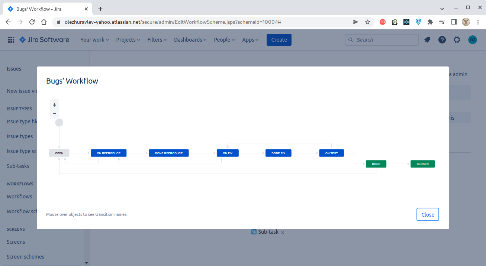

# Домашнее задание к занятию "09.01 Жизненный цикл ПО"

## Подготовка к выполнению
1. Получить бесплатную [JIRA](https://www.atlassian.com/ru/software/jira/free)
2. Настроить её для своей "команды разработки"
3. Создать доски kanban и scrum

## Основная часть
В рамках основной части необходимо создать собственные workflow для двух типов задач: bug и остальные типы задач. Задачи типа bug должны проходить следующий жизненный цикл:
1. Open -> On reproduce
2. On reproduce -> Open, Done reproduce
3. Done reproduce -> On fix
4. On fix -> On reproduce, Done fix
5. Done fix -> On test
6. On test -> On fix, Done
7. Done -> Closed, Open

Остальные задачи должны проходить по упрощённому workflow:
1. Open -> On develop
2. On develop -> Open, Done develop
3. Done develop -> On test
4. On test -> On develop, Done
5. Done -> Closed, Open

Создать задачу с типом bug, попытаться провести его по всему workflow до Done. Создать задачу с типом epic, к ней привязать несколько задач с типом task, провести их по всему workflow до Done. При проведении обеих задач по статусам использовать kanban. Вернуть задачи в статус Open.
Перейти в scrum, запланировать новый спринт, состоящий из задач эпика и одного бага, стартовать спринт, провести задачи до состояния Closed. Закрыть спринт.

Если всё отработало в рамках ожидания - выгрузить схемы workflow для импорта в XML. Файлы с workflow приложить к решению задания.

---

### Решение

Созданные доски (колонки по умолчанию нуждаются в дальнейшей настройке - привязке к соответствующим статусам, которые будут созданы ниже):

| Kanban Board           |      Scrum Board       |
|:----------------------:|:----------------------:|
|   |    |

Жизненный цикл Bugs-задач:
1. Open -> On reproduce
2. On reproduce -> Open, Done reproduce
3. Done reproduce -> On fix
4. On fix -> On reproduce, Done fix
5. Done fix -> On test
6. On test -> On fix, Done
7. Done -> Closed, Open

Жизненный цикл остальных задач:
1. Open -> On develop
2. On develop -> Open, Done develop
3. Done develop -> On test
4. On test -> On develop, Done
5. Done -> Closed, Open

Привязка типа задач к соответствующему жизненному циклу:

Настройка колонок (для Kanban и Scrum-досок одинаково):

**Создать задачу с типом bug, попытаться провести его по всему workflow до Done. Создать задачу с типом epic, к ней привязать несколько задач с типом task, провести их по всему workflow до Done. При проведении обеих задач по статусам использовать kanban. Вернуть задачи в статус Open.
Перейти в scrum, запланировать новый спринт, состоящий из задач эпика и одного бага, стартовать спринт, провести задачи до состояния Closed. Закрыть спринт.**

Готово:

**Если всё отработало в рамках ожидания - выгрузить схемы workflow для импорта в XML. Файлы с workflow приложить к решению задания.**

Файлы рабочих процессов:

[Для багов](./bugs_workflow.xml).

[Для прочих задач](./tasks_workflow.xml).

---
