# Домашнее задание к занятию "09.03 CI\CD"

## Подготовка к выполнению

1. Создаём 2 VM в yandex cloud со следующими параметрами: 2CPU 4RAM Centos7(остальное по минимальным требованиям)
2. Прописываем в [inventory](./infrastructure/inventory/cicd/hosts.yml) [playbook'a](./infrastructure/site.yml) созданные хосты
3. Добавляем в [files](./infrastructure/files/) файл со своим публичным ключом (id_rsa.pub). Если ключ называется иначе - найдите таску в плейбуке, которая использует id_rsa.pub имя и исправьте на своё
4. Запускаем playbook, ожидаем успешного завершения
5. Проверяем готовность Sonarqube через [браузер](http://localhost:9000)
6. Заходим под admin\admin, меняем пароль на свой
7.  Проверяем готовность Nexus через [бразуер](http://localhost:8081)
8. Подключаемся под admin\admin123, меняем пароль, сохраняем анонимный доступ

## Знакомство с SonarQube

### Основная часть

1. Создаём новый проект, название произвольное
2. Скачиваем пакет sonar-scanner, который нам предлагает скачать сам sonarqube
3. Делаем так, чтобы binary был доступен через вызов в shell (или меняем переменную PATH или любой другой удобный вам способ)
4. Проверяем `sonar-scanner --version`
5. Запускаем анализатор против кода из директории [example](./example) с дополнительным ключом `-Dsonar.coverage.exclusions=fail.py`
6. Смотрим результат в интерфейсе
7. Исправляем ошибки, которые он выявил(включая warnings)
8. Запускаем анализатор повторно - проверяем, что QG пройдены успешно
9. Делаем скриншот успешного прохождения анализа, прикладываем к решению ДЗ

## Знакомство с Nexus

### Основная часть

1. В репозиторий `maven-public` загружаем артефакт с GAV параметрами:
   1. groupId: netology
   2. artifactId: java
   3. version: 8_282
   4. classifier: distrib
   5. type: tar.gz
2. В него же загружаем такой же артефакт, но с version: 8_102
3. Проверяем, что все файлы загрузились успешно
4. В ответе присылаем файл `maven-metadata.xml` для этого артефекта

### Знакомство с Maven

### Подготовка к выполнению

1. Скачиваем дистрибутив с [maven](https://maven.apache.org/download.cgi)
2. Разархивируем, делаем так, чтобы binary был доступен через вызов в shell (или меняем переменную PATH или любой другой удобный вам способ)
3. Удаляем из `apache-maven-<version>/conf/settings.xml` упоминание о правиле, отвергающем http соединение( раздел mirrors->id: my-repository-http-unblocker)
4. Проверяем `mvn --version`
5. Забираем директорию [mvn](./mvn) с pom

### Основная часть

1. Меняем в `pom.xml` блок с зависимостями под наш артефакт из первого пункта задания для Nexus (java с версией 8_282)
2. Запускаем команду `mvn package` в директории с `pom.xml`, ожидаем успешного окончания
3. Проверяем директорию `~/.m2/repository/`, находим наш артефакт
4. В ответе присылаем исправленный файл `pom.xml`

---

## Решение


### Подготовка
 
В папке [terraform](./terraform):
````
$ terraform init
$ terraform apply -auto-approve
````

После выполнения в Yandex.Cloud будут созданы две виртуальные машины:

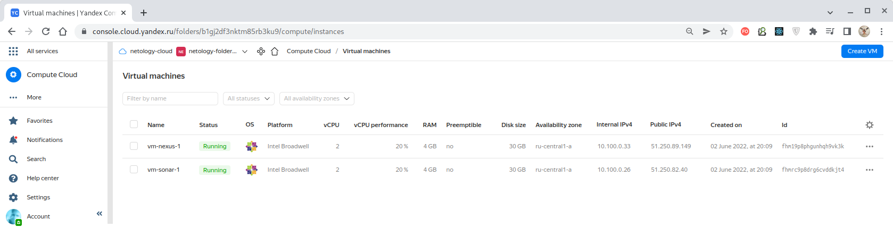

В файле [hosts.yml](./infrastructure/inventory/cicd/hosts.yml) задаем публичные IPv4-адреса
созданных виртуальных машин, и затем в папке [infrastructure](./infrastructure) выполняем:
````
$ ansible-playbook site.yml -i inventory/cicd/hosts.yml
````

В результате, на созданные виртуальные машины будет установлен **SonarQube** (порт 9000)
и **Nexus** (порт 8081):

| SonarQube: http://51.250.82.40:9000  |   Nexus: http://51.250.89.149:8081   |
|:------------------------------------:|:------------------------------------:|
|      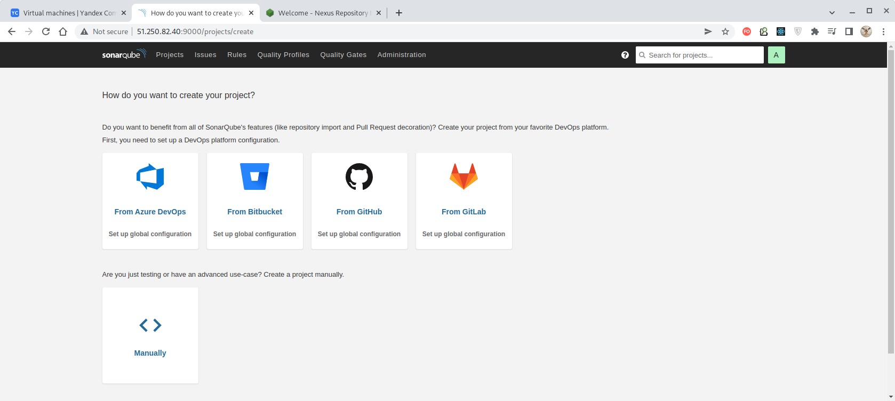                  |         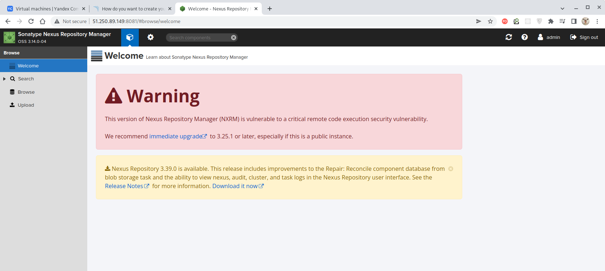            |
| Пользователь/пароль: **sonar/sonar** | Пользователь/пароль: **admin/admin** |

С этого момента инфраструктура готова к использованию.


### Знакомство с SonarQube

Создаем новый проект, задаём ему имя "TestProject-1", выбираем тип анализа "Locally":

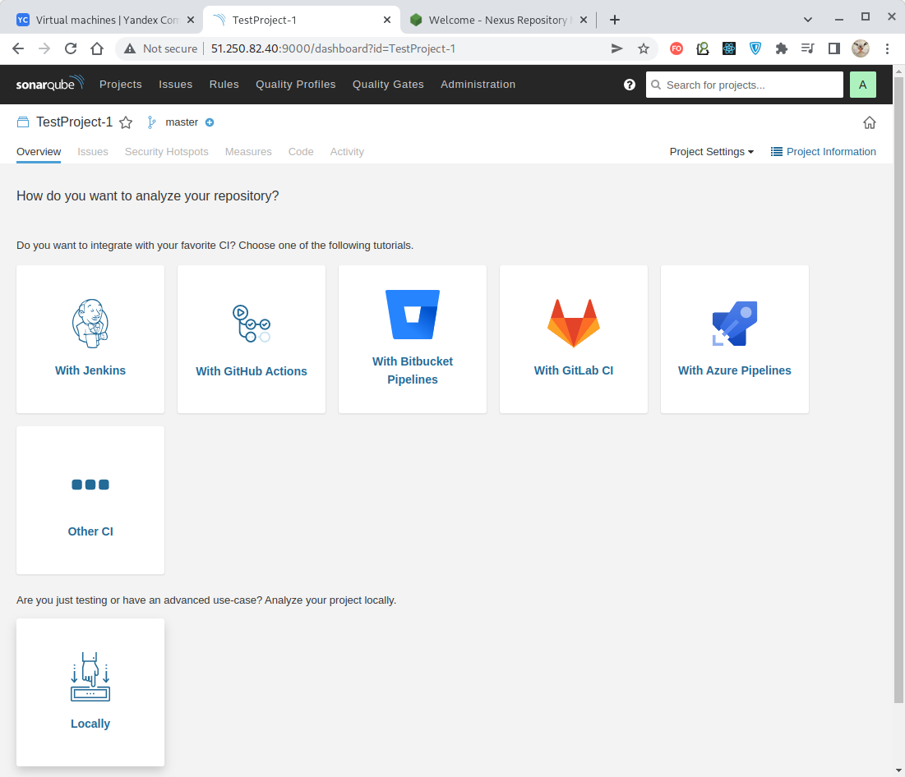

Генерируем токен, выбираем анализ (в нашем случае для Python) и выбираем ОС "Linux":

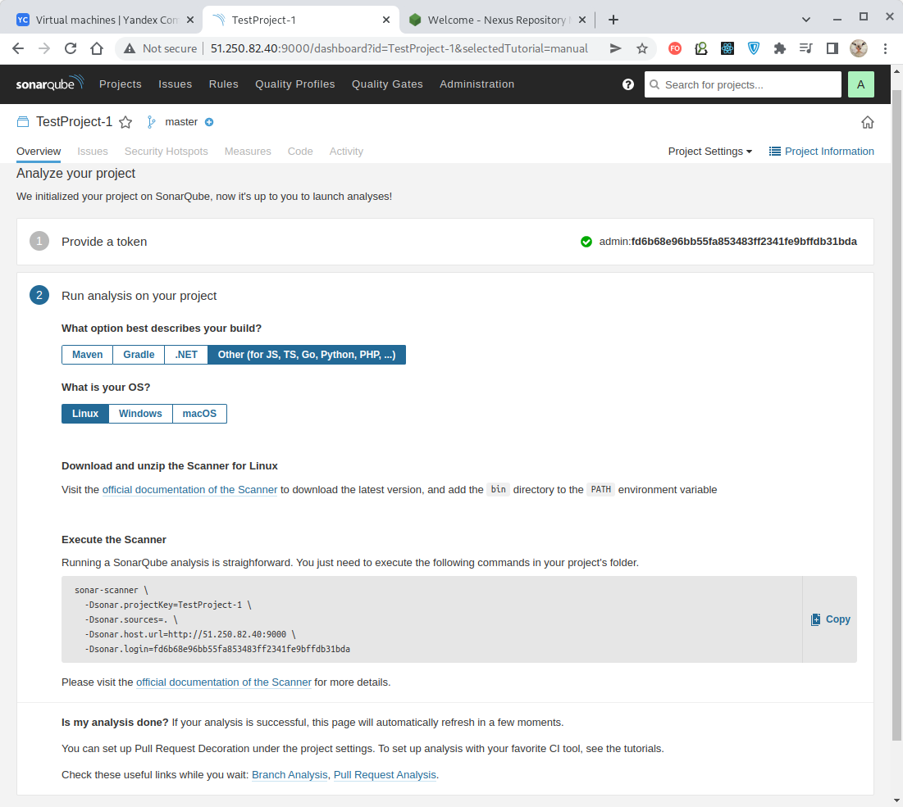

В сером поле указана командная строка для запуска процедура сканирования. При этом используется приложение Sonar-scanner, которое
следует установить на машину, на которой непосредственно будет производится сканирование.

Для этого заходим по указанной ссылке "[official documentation of the Scanner](https://redirect.sonarsource.com/doc/download-scanner.html)"
и скачиваем на локальную машину (не на виртуальную, где запущен сам SonarQube!) архив, соответствующий нашей ОС (в данном случае - Linux 64-bit):

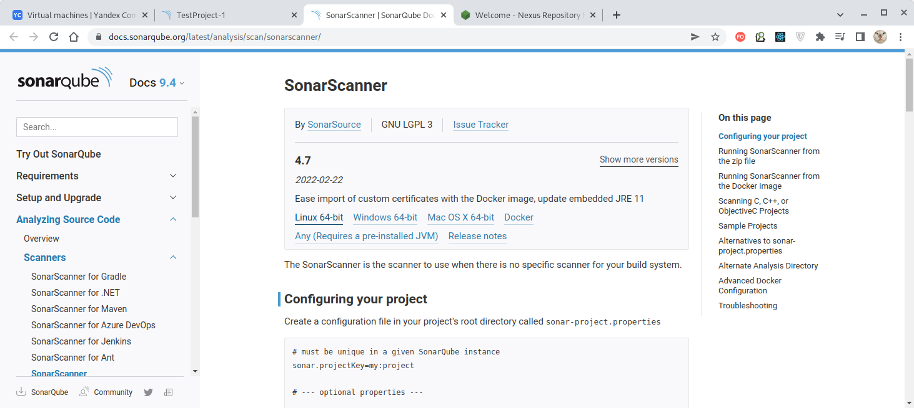

Скаченный файл sonar-scanner-cli-4.7.0.2747-linux.zip распаковываем в директорию текущего пользователя (можно в любую)
и добавляем в переменную окружения`PATH` путь к папке `bin`:
````bash
$ export PATH=$(pwd):$PATH
$ echo $PATH              
/home/oleg/sonar-scanner-4.7.0.2747-linux/bin:/home/oleg/yandex-cloud/bin:/home/oleg/.local/bin:/usr/local/bin:/usr/bin:/bin:/usr/local/sbin:/usr/lib/jvm/default/bin:/usr/bin/site_perl:/usr/bin/vendor_perl:/usr/bin/core_perl:/var/lib/snapd/snap/bin:/usr/lib/jvm/amazon-corretto-11.0.3.7.1-linux-x64/bin:/home/oleg/gradle-6.9/bin:/home/oleg/bin/generate-message/bin:/home/oleg/.yarn/bin:/usr/local/go/bin
$ sonar-scanner --version
INFO: Scanner configuration file: /home/oleg/sonar-scanner-4.7.0.2747-linux/conf/sonar-scanner.properties
INFO: Project root configuration file: NONE
INFO: SonarScanner 4.7.0.2747
INFO: Java 11.0.14.1 Eclipse Adoptium (64-bit)
INFO: Linux 5.17.9-1-MANJARO amd64
````

Т.о. "**Sonar-scanner**" установлен и м.б. вызыван с помощью указанной ранее команды с одним
уточнением - в ключи команды нужно добавить ключ `-Dsonar.coverage.exclusions`, отключающий проверку
степени покрытия указанного файла кода тестами (такая проверка выходит за рамки данной темы):
````bash
$ sonar-scanner \
  -Dsonar.projectKey=TestProject-1 \
  -Dsonar.sources=example/ \
  -Dsonar.host.url=http://51.250.82.40:9000 \
  -Dsonar.login=fd6b68e96bb55fa853483ff2341fe9bffdb31bda \                                  
  -Dsonar.coverage.exclusions=example/fail.py
INFO: Scanner configuration file: /home/oleg/sonar-scanner-4.7.0.2747-linux/conf/sonar-scanner.properties
INFO: Project root configuration file: NONE
INFO: SonarScanner 4.7.0.2747
INFO: Java 11.0.14.1 Eclipse Adoptium (64-bit)
INFO: Linux 5.17.9-1-MANJARO amd64
...
INFO: ANALYSIS SUCCESSFUL, you can browse http://51.250.82.40:9000/dashboard?id=TestProject-1
INFO: Note that you will be able to access the updated dashboard once the server has processed the submitted analysis report
INFO: More about the report processing at http://51.250.82.40:9000/api/ce/task?id=AYEk7uVsryHDsKrc_n0G
INFO: Analysis total time: 5.905 s
INFO: ------------------------------------------------------------------------
INFO: EXECUTION SUCCESS
INFO: ------------------------------------------------------------------------
INFO: Total time: 7.017s
INFO: Final Memory: 8M/56M
INFO: ------------------------------------------------------------------------
````

По результатам проверки создан отчет, доступный в нашем случае по адресу
`http://51.250.82.40:9000/dashboard?id=TestProject-1`:

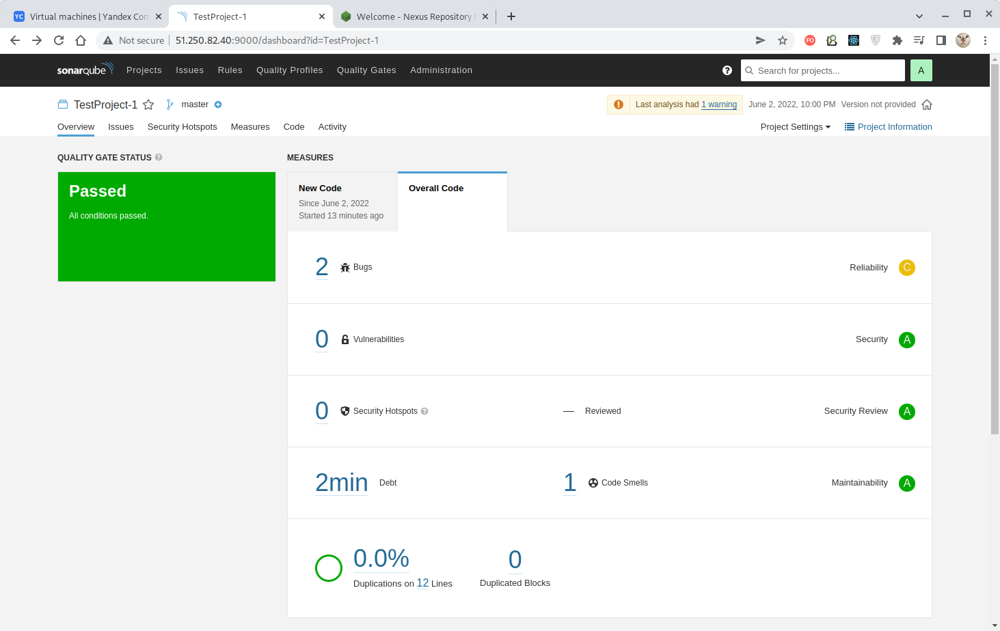

На закладке "Issues" можно увидеть содержание ошибок:

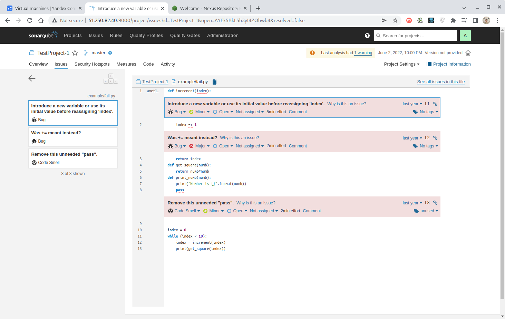

Исправляем ошибки, проводим тестирование и видим, что на этот раз замечаний к коду нет:

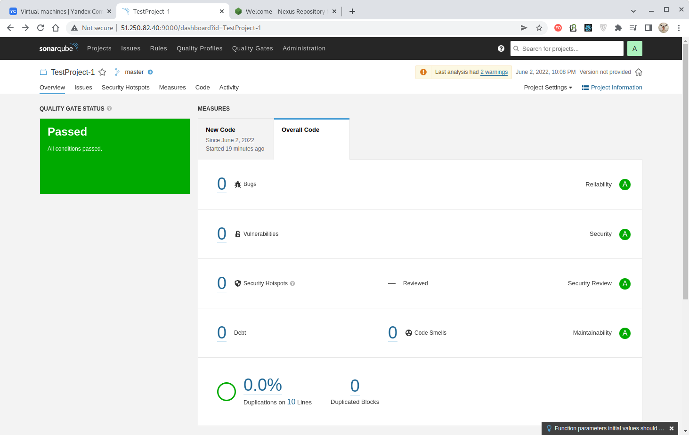


### Знакомство с Nexus

Загружаем в Nexus файл с GAV-координатами `netology:java:8_282` и `netology:java:8_102`

| `netology:java:8_282`   | `netology:java:8_102`   |
|:-----------------------:|:-----------------------:|
|  | 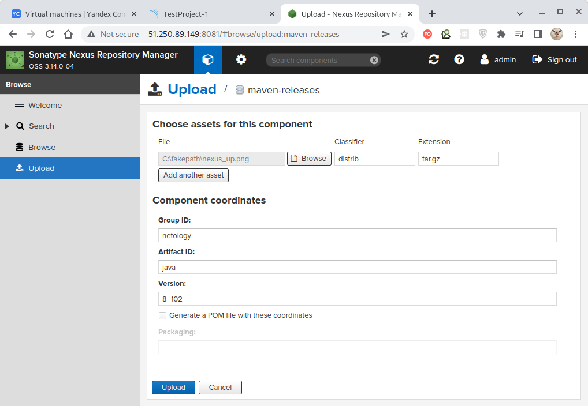 |


> В демонстрационных целях можно использовать любой файл с любым расширением, поэтому просто
> воспользуемся графическим файлом [nexus_up.png](./nexus_up.png).


На закладке "Browse" можно увидеть успешно загруженные артефакты:

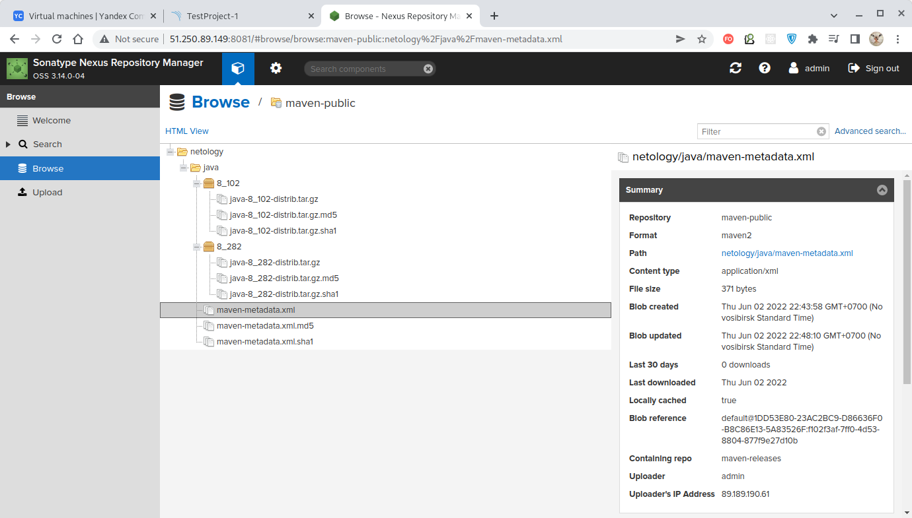

Файл метаданных [maven-metadata.xml](./maven-metadata.xml) можно выгрузить по предоставленной ссылке
(нужно выделить файл в дереве файлов и откроется панель со строкой "**Path**") и он имеет следующее содержимое:
````xml
<?xml version="1.0" encoding="UTF-8"?>
<metadata modelVersion="1.1.0">
  <groupId>netology</groupId>
  <artifactId>java</artifactId>
  <versioning>
    <latest>8_282</latest>
    <release>8_282</release>
    <versions>
      <version>8_102</version>
      <version>8_282</version>
    </versions>
    <lastUpdated>20220602154810</lastUpdated>
  </versioning>
</metadata>
````


### Знакомство с Maven


#### Подготовка

Выясним расположение конфигурационного файла локально установленного Maven:
````bash
$ whereis mvn    
mvn: /usr/bin/mvn /opt/maven/bin/mvn
````

В конфигурационном файле `/opt/maven/conf/settings.xml` найдем и закомментируем раздел
`maven-default-http-blocker`, отвечающий за запрет скачивания по http-протоколу:
````xml
 <!--
 <mirror>
   <id>maven-default-http-blocker</id>
   <mirrorOf>external:http:*</mirrorOf>
   <name>Pseudo repository to mirror external repositories initially using HTTP.</name>
   <url>http://0.0.0.0/</url>
   <blocked>true</blocked>
 </mirror>
 -->
````

Теперь мы можем скачивать артефакты по **незащищенному http-протоколу** (именно его мы используем
для доступа к нашей виртуальной машине с установленным "Nexus").

#### Получение артефакта по его GAV-координатам

В файле [pom.xml](./mvn/pom.xml) укажем для зависимости координаты артефакта, созданного в предыдущем задании:
````xml
<dependency>
  <groupId>netology</groupId>
  <artifactId>java</artifactId>
  <version>8_282</version>
  <classifier>distrib</classifier>
  <type>tar.gz</type>
</dependency>
````

Для сборки проекта выполним команду `mvn package`:
````bash
$ mvn package  
[INFO] Scanning for projects...
[INFO] 
[INFO] --------------------< com.netology.app:simple-app >---------------------
[INFO] Building simple-app 1.0-SNAPSHOT
[INFO] --------------------------------[ jar ]---------------------------------
Downloading from my-yandex-cloud-nexus-repo: http://51.250.89.149:8081/repository/maven-public/netology/java/8_282/java-8_282.pom
Downloading from central: https://repo.maven.apache.org/maven2/netology/java/8_282/java-8_282.pom
[WARNING] The POM for netology:java:tar.gz:distrib:8_282 is missing, no dependency information available
Downloading from my-yandex-cloud-nexus-repo: http://51.250.89.149:8081/repository/maven-public/netology/java/8_282/java-8_282-distrib.tar.gz
Downloaded from my-yandex-cloud-nexus-repo: http://51.250.89.149:8081/repository/maven-public/netology/java/8_282/java-8_282-distrib.tar.gz (116 kB at 386 kB/s)
[INFO] 
[INFO] --- maven-resources-plugin:2.6:resources (default-resources) @ simple-app ---
[WARNING] Using platform encoding (UTF-8 actually) to copy filtered resources, i.e. build is platform dependent!
[INFO] skip non existing resourceDirectory /home/oleg/mnt-homeworks/09-ci-03-cicd/mvn/src/main/resources
[INFO] 
[INFO] --- maven-compiler-plugin:3.1:compile (default-compile) @ simple-app ---
[INFO] No sources to compile
[INFO] 
[INFO] --- maven-resources-plugin:2.6:testResources (default-testResources) @ simple-app ---
[WARNING] Using platform encoding (UTF-8 actually) to copy filtered resources, i.e. build is platform dependent!
[INFO] skip non existing resourceDirectory /home/oleg/mnt-homeworks/09-ci-03-cicd/mvn/src/test/resources
[INFO] 
[INFO] --- maven-compiler-plugin:3.1:testCompile (default-testCompile) @ simple-app ---
[INFO] No sources to compile
[INFO] 
[INFO] --- maven-surefire-plugin:2.12.4:test (default-test) @ simple-app ---
[INFO] No tests to run.
[INFO] 
[INFO] --- maven-jar-plugin:2.4:jar (default-jar) @ simple-app ---
[WARNING] JAR will be empty - no content was marked for inclusion!
[INFO] Building jar: /home/oleg/mnt-homeworks/09-ci-03-cicd/mvn/target/simple-app-1.0-SNAPSHOT.jar
[INFO] ------------------------------------------------------------------------
[INFO] BUILD SUCCESS
[INFO] ------------------------------------------------------------------------
[INFO] Total time:  2.899 s
[INFO] Finished at: 2022-06-02T23:29:27+07:00
[INFO] ------------------------------------------------------------------------
````

Артефакты, указанные в нашем [pom](./mvn/pom.xml)-файле были получены.

Проверяем наличие скачанного артефакта в локальном репозитории:

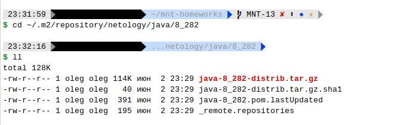

Таким образом, артефакт с указанными GAV-координатами был получен из удалённого репозитория,
сохранен в локальной копии и доступен для использования в проектах.

> Если файл нашего артефакта `java-8_282-distrib.tar.gz` открыть как png-файл, то мы обнаружим
> внутри [исходную картинку](./nexus_up.png), потому что репозиторий безразличен к содержимому
> хранимых файлов и никак не изменяет их содержимое!
> 
---
