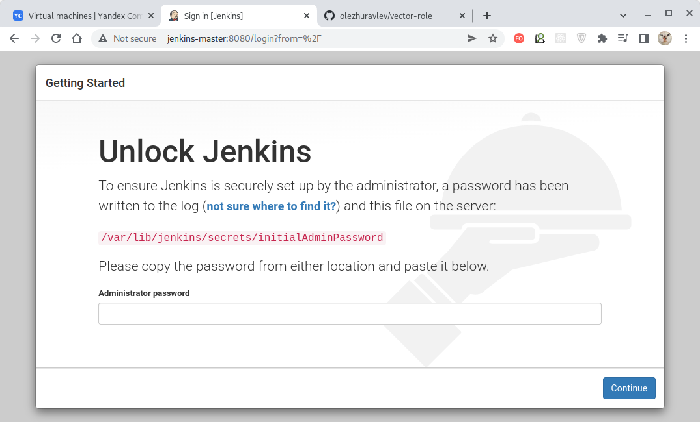
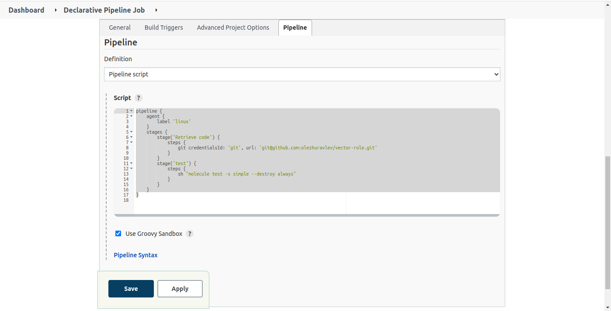
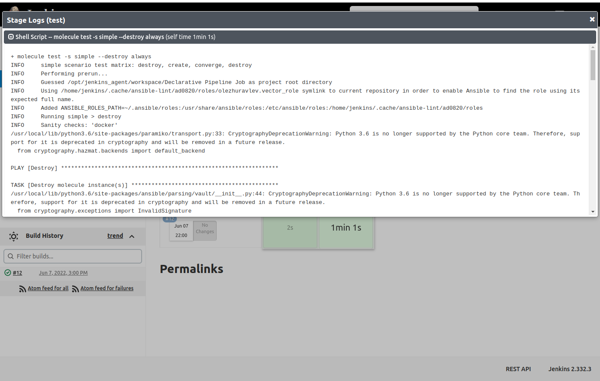
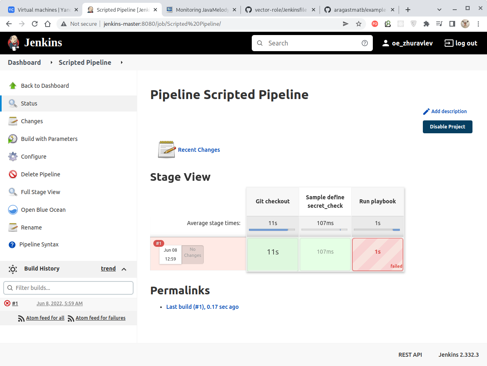

# Домашнее задание к занятию "09.04 Jenkins"

## Подготовка к выполнению

1. Создать 2 VM: для jenkins-master и jenkins-agent.
2. Установить jenkins при помощи playbook'a.
3. Запустить и проверить работоспособность.
4. Сделать первоначальную настройку.

## Основная часть

1. Сделать Freestyle Job, который будет запускать `molecule test` из любого вашего репозитория с ролью.
2. Сделать Declarative Pipeline Job, который будет запускать `molecule test` из любого вашего репозитория с ролью.
3. Перенести Declarative Pipeline в репозиторий в файл `Jenkinsfile`.
4. Создать Multibranch Pipeline на запуск `Jenkinsfile` из репозитория.
5. Создать Scripted Pipeline, наполнить его скриптом из [pipeline](./pipeline).
6. Внести необходимые изменения, чтобы Pipeline запускал `ansible-playbook` без флагов `--check --diff`, если не установлен параметр при запуске джобы (prod_run = True), по умолчанию параметр имеет значение False и запускает прогон с флагами `--check --diff`.
7. Проверить работоспособность, исправить ошибки, исправленный Pipeline вложить в репозиторий в файл `ScriptedJenkinsfile`.
8. Отправить ссылку на репозиторий с ролью и Declarative Pipeline и Scripted Pipeline.

## Необязательная часть

1. Создать скрипт на groovy, который будет собирать все Job, которые завершились хотя бы раз неуспешно. Добавить скрипт в репозиторий с решеним с названием `AllJobFailure.groovy`.
2. Дополнить Scripted Pipeline таким образом, чтобы он мог сначала запустить через Ya.Cloud CLI необходимое количество инстансов, прописать их в инвентори плейбука и после этого запускать плейбук. Тем самым, мы должны по нажатию кнопки получить готовую к использованию систему.

---

## Решение

### Подготовка к выполнению

Создаем с помощью [Terraform](./terraform) две виртуальные машины Yandex.Cloud:


Указываем в файле [hosts.yml](./infrastructure/inventory/cicd/hosts.yml) присвоенные IPv4-адреса
созданных виртуальных машин и запускаем ansible-playbook для создания программной инфраструктуры:
````bash
$ ansible-playbook site.yml -i inventory/cicd/hosts.yml

PLAY [Preapre all hosts] ****************************************************************************************************************************************************************************************************************

TASK [Gathering Facts] ******************************************************************************************************************************************************************************************************************
ok: [jenkins-master-01]
ok: [jenkins-agent-01]
...
PLAY RECAP ******************************************************************************************************************************************************************************************************************************
jenkins-agent-01           : ok=17   changed=14   unreachable=0    failed=0    skipped=0    rescued=0    ignored=0   
jenkins-master-01          : ok=11   changed=9    unreachable=0    failed=0    skipped=0    rescued=0    ignored=0   
````

> В файле [hosts.yml](./infrastructure/inventory/cicd/hosts.yml) лучше указывать IP-адреса хостов,
> чтобы избежать дополнительных сложностей с идентификацией хоста и ложным обнаружением атаки
> "man-in-the-middle", но при работе через веб-интерфейс всё же удобнее использовать локальные
> доменные имена, которые можно один раз определить в файле `/etc/host` в привязке конкретным IPv4-адресам:
> ````
> 51.250.3.105     jenkins-master
> 51.250.72.81     jenkins-agent
> ````
> При таком подходе в случае изменении IPv4-адресов доменные адреса остаются те же.

После этого заходим на веб-страницу "Jenkins" и она нам предлагает ввести пароль по-умолчанию:



Через ssh-соединение подключаемся к машине, из указанного файла получаем пароль по умолчанию,
и вводим его на этой странице. После этого в открывшейся панели выбираем установку
рекомендуемых плагинов и ждём, пока процедура установки отработает:


Послу установки рекомендуемых плагинов Jenkins предлагает задать пользователя-администратора:


После этого подтверждаем URL, используемый "Jenkins", и попадаем на стартовую страницу:


По умолчанию "Jenkins" использует локализацию, установленную для браузера, поэтому для использования
других локализаций придётся дополнительно установить плагин "Locale".
Выбираем "Настроить Jenkins" -> "Управление плагинами" -> Закладка "Доступные" -> В поле поиска
указать имя плагина, после чего в получившемся списке **выделить требуемый плагин галкой**:


После нажатия кнопки "Download now and install after restart" плагин будет загружен, на странице
успешной загрузки в самом низу нужно поставить галку "Перезапустить Jenkins по окончанию установки 
и отсутствии активных задач" и дождаться перезагрузки "Jenkins":


После этого логинимся под администратором (здесь - admin/admin), переходим в настройки
"Настроить Jenkins" -> "Конфигурация системы" -> поле "Default Language" (до установки плагина его не было)
и вводим в него "en" (или "ENGLISH") и ниже ставим галку
"Ignore browser preference and force this language to all users":

> Надпись "Ignore browser preference and force this language to all users" не локализована для 
> русского языка и поэтому не отображается.
> 
> Именно отсутствие некоторых локализаций является причиной того, что мы сразу переключаем
> "Jenkins" на использование английского языка!


После нажатия кнопки "Применить" "Jenkins" переходит на использование английского языка:


**Далее следует настроить исполнителей.**

В меню справа Build Executor Status мы видим, что по умолчанию созданы два исполнителя,
принадлежащих агенту "Built-In node", которых нам следует удалить. Для этого переходим в меню
"Manage Jenkins -> Manage Nodes and Clouds" (или просто на панели слева жмем на заголовок
меню "Build Executor Status"): 


Заходим в настройки агента "Built-In node" путем выбора у него пункта меню "Configure" и в
открывшейся панели удаляем существующих исполнителей путем назначения нулевого их количества:


После нажатия кнопки "Save" исполнители данного агента будут удалены.

Затем создадим новый узел (агента). Жмём "New Node", задаём имя, например, "node-01", указываем
тип "Permanent Agent" и задаём его параметры:


Заслуживают пояснения следующие параметры:
- `Remote rood directory` - папка на хосте агента, где расположены файлы, требуемые агенту для работы;
- `Labels` - один или несколько тегов, используемых для отнесения агента к той или иной группе; 
- `Launch command` - команда, с помощью которой запускается агент.


> Обращаем внимание, что в параметре "Lauch command" следует указать IPv4-адрес узла Jenkins-агента
> и папку, в которую при инсталляции [с помощью Ansible](./infrastructure/site.yml) был помещен
> файл `agent.jar`.
> 
> Если доменное имя хоста зарегистрировано в публичном DNS, то вместо IP-адреса можно использовать
> и его.

После нажатия кнопки "Save" мы можем наблюдать созданного агента "node-01" и двух его бездействующих
исполнителей:


Статус созданного агента "node-01" можно увидеть на странице его лога:


На этом настройка "Jenkins" для наших целей заканчивается.


### Основная часть

**1. Сделать Freestyle Job, который будет запускать `molecule test` из любого вашего репозитория с ролью.**

Воспользуемся [ролью](https://github.com/olezhuravlev/vector-role) для запуска сервиса "Vector",
созданной в одном из предыдущих заданий.

Роль снабжена простым тестом, проверяющим, что в определенной среде (здесь - "Centos 7") роль
отрабатывает без ошибок.

Проверим работу теста через непосредственный ручной запуск Molecule-теста:
````
$ molecule test -s compatibility --destroy always
INFO     compatibility scenario test matrix: destroy, create, converge, destroy
INFO     Performing prerun...
...
PLAY RECAP *********************************************************************
localhost                  : ok=2    changed=2    unreachable=0    failed=0    skipped=1    rescued=0    ignored=0

INFO     Pruning extra files from scenario ephemeral directory
````

Видим, что при ручном запуске роль отрабатывает нормально и теперь организуем автоматический запуск
этого же теста с помощью "Jenkins".

Сначала укажем приватный ssh-ключ, который необходим для доступа к Github по `ssh`.
Для этого из главной панели "Jenkins" заходим в "Manage Jenkins", "Manage Credentials", далее
в разделе "Stores scoped to Jenkins" жмём "Jenkins", потом "Global credentials (unrestricted)" и
"Add Credentials". В открывшейся панели вводим параметры ключа:


И ключ для использования в "Jenkins" будет добавлен:


Данный приватный ключ можно использовать для безопасного подключения к "Jenkins" к любым ресурсам,
которым назначен парный ему публичный ключ.  

Теперь настроим саму задачу. Для этого на главной странице "Jenkins" выбираем "New Item",
далее вводим имя элемента, например, "Freestyle run", и выбираем "Freestyle project". Жмём "OK":


Далее настроим параметры задачи следующим образом:


Здесь в поле "Label Expression" указан тег `linux`. Он обозначает агента, который должен исполнять
данную задачу (агенту был ранее присвоен набор присущих ему тегов).
Если тег не присвоить, то такая задача не будет исполняться нашим агентом.


Здесь в поле "Repository URL" указан репозиторий, который необходимо скачать для выполнения задачи
(здесь по сути аналог команды `git clone git@github.com:olezhuravlev/vector-role.git`).


Здесь команды, перечисленные в поле "Execute shell", будут выполнятся из корня репозитория, ранее
указанного в поле "Repository URL". К моменту исполнения данного скрипта содержимое самого
репозитория уже будет скачано на хост агента.

Задачу сохраняем, после чего запустим её нажатием кнопки "Build Now".


После успешного выполнения задачи она помечается зеленым:

|               Dashboard               |                 Build Status                 |             Build Console Output              |
|:-------------------------------------:|:--------------------------------------------:|:---------------------------------------------:|
|  |  |  |


**2. Сделать Declarative Pipeline Job, который будет запускать `molecule test` из любого вашего репозитория с ролью.**

На главной странице "Jenkins" выбираем "New Item", далее вводим имя элемента, например,
"Declarative Pipeline Job", и выбираем "Pipeline". Жмём "OK"

В поле "Pipeline" -> "Script" опишем задачу следующим образом:

````bash
pipeline {
    agent {
        label 'linux'
    }
    stages {
        stage('Retrieve code') {
            steps {
                git credentialsId: 'git', url: 'git@github.com:olezhuravlev/vector-role.git'
            }
        }
        stage('test') {
            steps {
                sh "molecule test -s simple --destroy always"
            }
        }
    }
}
````



После успешного выполнения можно увидеть результат выполнения задачи по стадиям, включая лог каждой
из них:

|                 Build Status                 |             Stage 2 Build Console             |
|:--------------------------------------------:|:---------------------------------------------:|
|  |  |


**3. Перенести Declarative Pipeline в репозиторий в файл `Jenkinsfile`.**

Скопируем скрипт из предыдущего задания и удалим из него стадию получения кода из репозитория приведя к виду:
````bash
pipeline {
    agent {
        label 'linux'
    }
    stages {
        stage('test') {
            steps {
                sh "molecule test -s simple --destroy always"
            }
        }
    }
}
````

Сохраним этот скрипт в корне репозитория нашей роли в файле с именем
[Jenkinsfile](https://github.com/olezhuravlev/vector-role/blob/master/Jenkinsfile).


**4. Создать Multibranch Pipeline на запуск `Jenkinsfile` из репозитория.**

> **Multibranch Pipeline** отличается от обычного **Pipeline** тем, что привязан к разным веткам
> git-репозитория и, в случае появления изменений в ветке, выполняет расположенный в ней
> `Jenkinsfile` (имя файла м.б. другим).
> 
> Обычный же **Pipeline** просто запускается на определенной ветке и выполняет заданный скрипт.

На главной странице "Jenkins" выбираем "New Item", далее вводим имя элемента, например,
"Multibranch Pipeline", и выбираем "Multibranch Pipeline". Жмём "OK"

В поле "Pipeline" -> "Script" опишем задачу следующим образом:


При запуске задачи будет выполнен скрипт из файла
[Jenkinsfile](https://github.com/olezhuravlev/vector-role/blob/master/Jenkinsfile), хранящегося
в самом репозитории. Аналогично предыдущим видам задач можно увидеть статус и лог её выполненных
стадий:

|                 Build Status                  |             Stage 2 Build Console             |
|:---------------------------------------------:|:---------------------------------------------:|
|   |  |


**5. Создать Scripted Pipeline, наполнить его скриптом из [pipeline](./pipeline).**

На главной странице "Jenkins" выбираем "New Item", далее вводим имя элемента, например,
"Scripted Pipeline", и выбираем "Pipeline". Жмём "OK".

Далее, в разделе "Pipeline" выбираем "Pipeline script" и в поле "Script" копируем содержимое файла
[pipeline/Jenkins](./pipeline/Jenkinsfile) и модифицируем его для нашего случая:


> Обращаем внимание, что в самом скрипте значение `credentialsId` должно быть изменено на
> идентификатор агента, используемого в данной инсталляции Jenkins!
> 
> Репозиторий в параметре `url` так же д.б. соответствующим.

Запускаем и видим, что скрипт отработал с ошибкой - роли "java" не существует:


|            Task Result Error             |            Tase Result Error Console             |
|:----------------------------------------:|:------------------------------------------------:|
|  |  |

Тем не менее, получение данных из репозитория и запуск скрипта происходит - "Jenkins" отрабатывает
как и ожидалось.

**6. Внести необходимые изменения, чтобы Pipeline запускал `ansible-playbook` без флагов `--check --diff`, если не установлен параметр при запуске джобы (prod_run = True), по умолчанию параметр имеет значение False и запускает прогон с флагами `--check --diff`.**

Добавим в созданный ранее скрипт "Scripted Pipeline" параметр `prod_run` вида "Choice" с двумя
опциями - `True` и `False`, причем `False` указываем первым, чтобы он являлся значением
по-умолчанию:


Теперь изменяем скрипт так, чтобы значение параметра `prod_run` учитывалось при вызове `ansible-playbook`:

````bash
node("linux"){
    stage("Git checkout"){
        git credentialsId: 'git', url: 'git@github.com:olezhuravlev/example-playbook.git'
    }
    stage("Sample define secret_check"){
        secret_check=true
    }
    stage("Run playbook"){
        if (secret_check){
            if ("${prod_run}" == "True") {
                echo "Prod mode!"
                sh 'ansible-playbook site.yml -i inventory/prod.yml'
            } else {
                echo "Check&Diff mode!"
                sh 'ansible-playbook site.yml -i inventory/prod.yml --check --diff'
            }
        }
        else{
            echo 'need more action'
        }
    }
}
````

**7. Проверить работоспособность, исправить ошибки, исправленный Pipeline вложить в репозиторий в файл `ScriptedJenkinsfile`.**

Запускаем задачу кнопкой "Build with parameters" и видим, что у нас запрашивается значение
параметра:


Выполнение скрипта происходит с той же ошибкой - роль `java` отсутствует.

|             Task Result Error              |             Tase Result Error Console              |
|:------------------------------------------:|:--------------------------------------------------:|
|  |  |

Поправим этот недочёт просто создав недостающую роль без какого-либо функционала (находясь в корневой
директории данного `playbook`):
````bash
$ ansible-galaxy init java                                      
- Role java was created successfully
````

После исправления задача отрабатывает нормально:

|                  prod_run == False                   |                prod_run == True                 |
|:----------------------------------------------------:|:-----------------------------------------------:|
|  |  |


[ScriptedJenkinsFile](./pipeline/ScriptedJenkinsFile)

**8. Отправить ссылку на репозиторий с ролью и Declarative Pipeline и Scripted Pipeline.**

[Роль](https://github.com/olezhuravlev/vector-role) с
[декларативным pipeline](https://github.com/olezhuravlev/vector-role/blob/master/Jenkinsfile).

 Файл со [скриптованным pipeline](./pipeline/ScriptedJenkinsFile).

---
