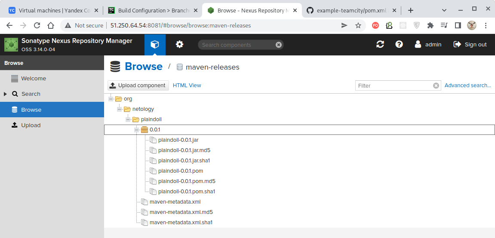

# Домашнее задание к занятию "09.05 Teamcity"

## Подготовка к выполнению

1. В Ya.Cloud создайте новый инстанс (4CPU4RAM) на основе образа `jetbrains/teamcity-server`
2. Дождитесь запуска teamcity, выполните первоначальную настройку
3. Создайте ещё один инстанс(2CPU4RAM) на основе образа `jetbrains/teamcity-agent`. Пропишите к нему переменную окружения `SERVER_URL: "http://<teamcity_url>:8111"`
4. Авторизуйте агент
5. Сделайте fork [репозитория](https://github.com/aragastmatb/example-teamcity)
6. Создать VM (2CPU4RAM) и запустить [playbook](./infrastructure)

## Основная часть

1. Создайте новый проект в teamcity на основе fork
2. Сделайте autodetect конфигурации
3. Сохраните необходимые шаги, запустите первую сборку master'a
4. Поменяйте условия сборки: если сборка по ветке `master`, то должен происходит `mvn clean deploy`, иначе `mvn clean test`
5. Для deploy будет необходимо загрузить [settings.xml](./teamcity/settings.xml) в набор конфигураций maven у teamcity, предварительно записав туда креды для подключения к nexus
6. В pom.xml необходимо поменять ссылки на репозиторий и nexus
7. Запустите сборку по master, убедитесь что всё прошло успешно, артефакт появился в nexus
8. Мигрируйте `build configuration` в репозиторий
9. Создайте отдельную ветку `feature/add_reply` в репозитории
10. Напишите новый метод для класса Welcomer: метод должен возвращать произвольную реплику, содержащую слово `hunter`
11. Дополните тест для нового метода на поиск слова `hunter` в новой реплике
12. Сделайте push всех изменений в новую ветку в репозиторий
13. Убедитесь что сборка самостоятельно запустилась, тесты прошли успешно
14. Внесите изменения из произвольной ветки `feature/add_reply` в `master` через `Merge`
15. Убедитесь, что нет собранного артефакта в сборке по ветке `master`
16. Настройте конфигурацию так, чтобы она собирала `.jar` в артефакты сборки
17. Проведите повторную сборку мастера, убедитесь, что сбора прошла успешно и артефакты собраны
18. Проверьте, что конфигурация в репозитории содержит все настройки конфигурации из teamcity
19. В ответ предоставьте ссылку на репозиторий

---

## Решение

#### Подготовка

Учитывая тот факт, что в данной конфигурации и "Teamcity" и "Teamcity Agent" работают в
Docker-контейнерах на одной и той же виртуальной машине, то "Teamcity Agent" может получать доступ
к конейнеру с "Teamcity" просто по имени этого контейнера - "teamcity"
(файл [docker-compose.yml](./teamcity/docker-compose.yml)):

````yaml
teamcity-agent:
    image: jetbrains/teamcity-agent
    container_name: teamcity-agent
    depends_on:
      - teamcity
    volumes:
      - /home/ubuntu/teamcity/agent/:/data/teamcity_agent/conf
    environment:
      SERVER_URL: "http://teamcity:8111"
````

Создаём виртуальные машины с помощью "Terraform" и применяемому "Docker-compose":

````bash
$ terraform apply -auto-approve
````

В результате имеем набор запущенных виртуальных машин с работающими экземлярами "Teamcity" и
"Teamcity Agent":


Для удобства внесем запись об используемом IPv4-адресе в файл `/etc/hosts` чтобы получить
возможность обращаться к серверу "Teamcity" по доменному имени:
````bash
51.250.95.73    teamcity
````

Теперь сервер "Teamcity" работает, доступен по доменному имени (порт 8111) и готов для
первоначальной настройки:


Первоначальная настройка тривиальна и заключается в указании используемой СУБД (для наших целей
удовлетворимся HSQLDB), соглашении с лицензией, которую никто не читает и создании пользователя
и пароля (здесь - admin/admin.)

Кроме того, убедимся, что "Teamcity Agent" доступен:


И авторизуем его:


После инициализации Teamcity полностью готов к созданию проекта.

Для настройки репозитория "Nexus" укажем действительный IPv4-адрес виртуальной машины, на которой он
д.б. запущен (файл [hosts.yml](./infrastructure/inventory/cicd/hosts.yml)):

````yaml
---
all:
  hosts:
    nexus-01:
      ansible_host: 51.250.64.54
  children:
    nexus:
      hosts:
        nexus-01:
  vars:
    ansible_connection_type: paramiko
    ansible_user: ubuntu
````

После чего с помощью предоставленной [конфигурации Ansible](./infrastructure) развернем сервер репозитория
"Nexus":

````bash
$ ansible-playbook site.yml -i inventory/cicd/hosts.yml

PLAY [Get Nexus installed] **************************************************************************************************************************************************************************************************************
...
...
PLAY RECAP ******************************************************************************************************************************************************************************************************************************
nexus-01                   : ok=17   changed=15   unreachable=0    failed=0    skipped=2    rescued=0    ignored=0   
````

Теперь репозиторий доступен по заданному IPv4-адресу (порт 8081):


Имея полученный через форк [репозиторий](https://github.com/olezhuravlev/example-teamcity)
подготовим его к работе путем удаления из него ненужной пока папки `.teamcity`, а также файлов
IDE-специфичных файлов `.classpath` и `.project`.

На этом подготовка инфраструктуры завершена.


**1. Создайте новый проект в teamcity на основе fork**
 
Сначала добавим приватный ключ, чтобы "Teamcity" получил доступ к Git-репозиторию:


Затем жмем кнопку "Create Project" и указываем ссылку клонирования репозитория:


После успешного подключения к репозиторию можно указать дефолтную ветку репозитория. Обычно это
`master` или толерантный `main`:


**2. Сделайте autodetect конфигурации**

Шаги сборки будут автоматически предложены по результатам сканирования
[pom-файла репозитория](https://github.com/olezhuravlev/example-teamcity/blob/master/pom.xml):


Как видим, здесь предлагается шаг `clean`, являющийся стандартной первой фазой любой сборки, и
шаг `test`, потому что в pom-файле присуствует указание на `junit`:

````pom
<dependency>
    <groupId>junit</groupId>
    <artifactId>junit</artifactId>
    <version>4.12</version>
    <scope>test</scope>
</dependency>
````


**3. Сохраните необходимые шаги, запустите первую сборку master'a**

Добавим стадию `package`, формирующую JAR-артефакт проекта:


И запустим сборку:


Через некоторое время сборка завершается:


Выполненные сборки (успешные и неуспешные) можно видеть в виде списка:


**4. Поменяйте условия сборки: если сборка по ветке `master`, то должен происходит `mvn clean deploy`, иначе `mvn clean test`**

`deploy` - это фаза сборки Maven, выполняющая копирование результирующего артефакта в удалённый репозиторий.

Лучше бы использовать разные сборки для разных типов веток, но уж если указано поменять условие
данной сборки, то воспользуемся настройкой шагов сборки в зависимости от ветки.

Для редактирования параметров сборки жмем кнопку "Edit Configuration Settings" (правый верхний угол
экрана) и в разделе "Build Steps" в строке "Add Condition" жмем кнопку "Other Condition".

Откроется диалоговое окно, в котором укажем применение шага для ветки `master`.


Для другого шага сборки зададим параметры для ветки, **не являющейся** `master`:


В списке шагов можно видеть условие выполнения каждого шага:


Для проверки выполнения шагов веток, не являющихся мастер, создадим новую ветку, внесём в неё
незначительные изменение, отправим ветку в Git-репозиторий и дождемся выполнения сборки:


Сборка выполнена успешно и в логе мы можем увидет, что шаг, подразумевающий выполнение фаз
`clean` и `deploy` был пропущен, потому что ветка не являлась веткой `master`:


**5. Для deploy будет необходимо загрузить [settings.xml](./teamcity/settings.xml) в набор конфигураций maven у teamcity, предварительно записав туда креды для подключения к nexus**

Чтобы проверить работоспособность шага `deploy` нам нужно указать репозиторий, в котором следует
размещать готовый артефакт, а также учетные данные для доступа к репозиторию.

По умолчанию "Nexus" создаётся с предустановленным пользователем-администратором, имеющим
аутентификационные данные `admin/admin123`. Мы ими воспользуемся и укажем в конфигурационном файле
[settings.xml](./teamcity/settings.xml), используемом для настройки подключения "Teamcity" к
"Nexus":

````xml
<server>
  <id>nexus</id>
  <username>admin</username>
  <password>admin123</password>
</server>
````

В настройках проекта на закладке "Maven Settings" жмем кнопку "Upload settings file" и загружаем
файл [settings.xml](./teamcity/settings.xml):


Загруженный файл будет отображен в списке:


Кроме этого, загруженный файл [settings.xml](./teamcity/settings.xml) следует указать в настройках
"User settings selection" того шага сборки, который применяет фазу `deploy`:


**6. В pom.xml необходимо поменять ссылки на репозиторий и nexus**

Переключаемся на ветку `master`, в файле
[pom.xml](https://github.com/olezhuravlev/example-teamcity/blob/master/pom.xml) указываем
действительный IPv4-адрес нашего репозитория "Nexus" и отправляем ветку в репозиторий:

````xml
<distributionManagement>
    <repository>
        <id>nexus</id>
        <url>http://51.250.64.54:8081/repository/maven-releases</url>
    </repository>
</distributionManagement>
````


**7. Запустите сборку по master, убедитесь что всё прошло успешно, артефакт появился в nexus**

Дожидаемся, пока "Teamcity" обнаружит изменения в ветке `master`, выполнит сборку и загрузку
артефакта в репозиторий:


После этого сформированный артефакт можно наблюдать в веб-интерфейсе репозитория "Nexus": 




**8. Мигрируйте `build configuration` в репозиторий**

Настройки сборки в конфигурации хранятся в папке `.teams`.
Для экспорта настоек переходим в настройках проекта на закладку "Version Settings" и далее выбираем
"Synchronization enabled". После этого нужно указать параметры хранения настроек - ветку репозитория,
формат хранения и пр.:


После нажатия кнопки "Apply" настройки сборки будут сохранены в указанной ветке репозитория в папке
"[.teamcity](https://github.com/olezhuravlev/example-teamcity/tree/master/.teamcity)":


**9. Создайте отдельную ветку `feature/add_reply` в репозитории**

[Создали](https://github.com/olezhuravlev/example-teamcity/tree/add_reply).


**10. Напишите новый метод для класса Welcomer: метод должен возвращать произвольную реплику, содержащую слово `hunter`**

[Написали](https://github.com/olezhuravlev/example-teamcity/blob/add_reply/src/main/java/plaindoll/Welcomer.java):

````java
public String sayNeedMoreVespeneGas() {
  return "We require more Vespene Gas, gorgeous hunter!";
}
````


**11. Дополните тест для нового метода на поиск слова `hunter` в новой реплике**

[Дополнили](https://github.com/olezhuravlev/example-teamcity/blob/add_reply/src/test/java/plaindoll/WelcomerTest.java):

````java
@Test
public void testSayNeedMoreVespeneGas() {
  assertThat("Wrong Vespene Gas message",
    welcomer.sayNeedMoreVespeneGas(),
    allOf(containsString("Vespene"), containsString("hunter")));
}
````


**12. Сделайте push всех изменений в новую ветку в репозиторий**

[Сделали](https://github.com/olezhuravlev/example-teamcity/tree/add_reply).

**13. Убедитесь что сборка самостоятельно запустилась, тесты прошли успешно**

Сборка самостоятельно запустилась:


Тесты прошли успешно:


**14. Внесите изменения из произвольной ветки `feature/add_reply` в `master` через `Merge`**

> Т.к. это ветка master, и артефакт, собранный на её основе автоматически отправляется в репозиторий
> "Nexus", то в pom-файле не забываем обновить версию:
>
> ````xml
> <version>0.1.0</version>
> ````
>
> В противном случае, фаза `deploy` закончится с ошибкой, т.к. репозиторий не позволяет обновлять
> артефакты!

Для слияния веток воспользуемся командой `git merge` и отправим merge-коммит в репозиторий:

````bash
$ git checkout master                      
Switched to branch 'master'
Your branch is up to date with 'origin/master'.

$ git merge add_reply                      
Updating 24d25cd..fb6b0e3
Fast-forward
 src/main/java/plaindoll/HelloPlayer.java  | 13 +++++++------
 src/main/java/plaindoll/Welcomer.java     | 27 +++++++++++++++++----------
 src/test/java/plaindoll/WelcomerTest.java | 50 ++++++++++++++++++++++++++++++--------------------
 3 files changed, 54 insertions(+), 36 deletions(-)

$ git push   
Total 0 (delta 0), reused 0 (delta 0), pack-reused 0
To github.com:olezhuravlev/example-teamcity.git
   24d25cd..fb6b0e3  master -> master
````

Как и в предыдущий раз, сборка будет запущена автоматически.


**15. Убедитесь, что нет собранного артефакта в сборке по ветке `master`**

Сборка завершается успешно, включая фазу `deploy`, и созданный артефакт под версией `0.1.0` размещен
в репозитории "Nexus":


Однако артефакт в самой сборке "Teamcity" отсутствует (иконка перечеркнута):


**16. Настройте конфигурацию так, чтобы она собирала `.jar` в артефакты сборки**

Чтобы некоторые файлы (например, артефакты) оказались в составе сборки заходим в настройки сборки
на закладку "General Settings" и в строке "Artifact paths" по нажатию иконки справа откроется состав
последней успешной сборки, в котором можно выбрать требуемые файлы:


Другим способом указания файлов является указание шаблона, по которому эти файлы д.б. отобраны:


Здесь запись `target/*.jar => target` означает:
> "файлы с расширением `jar` из директории `target`
> репозитория следует разместить в директории `target` сборки".


**17. Проведите повторную сборку мастера, убедитесь, что сбора прошла успешно и артефакты собраны**

После сохранения параметров и успеха очередной сборки указанные файлы будут входить в состав сборки,
сохранённой на сервере "Teamcity":


**18. Проверьте, что конфигурация в репозитории содержит все настройки конфигурации из teamcity**

По факту, в папке "[.teamcity](https://github.com/olezhuravlev/example-teamcity/tree/master/.teamcity)"
оказались:

- [наш файл](./teamcity/settings.xml) настроек [settings.xml](https://github.com/olezhuravlev/example-teamcity/blob/master/.teamcity/pluginData/_Self/mavenSettings/settings.xml);
- сгенерированный файл [settings.tks](https://github.com/olezhuravlev/example-teamcity/blob/master/.teamcity/settings.kts), на языке Kotlin описывающий алгоритм сборки;
- сгенерированный файл [pom.xml](https://github.com/olezhuravlev/example-teamcity/blob/master/.teamcity/pom.xml), декларирующий зависимости, необходимые для исполнения файла [settings.tks](https://github.com/olezhuravlev/example-teamcity/blob/master/.teamcity/settings.kts).


**19. В ответ предоставьте ссылку на репозиторий**

[Ссылка на репозиторий](https://github.com/olezhuravlev/example-teamcity).

---
