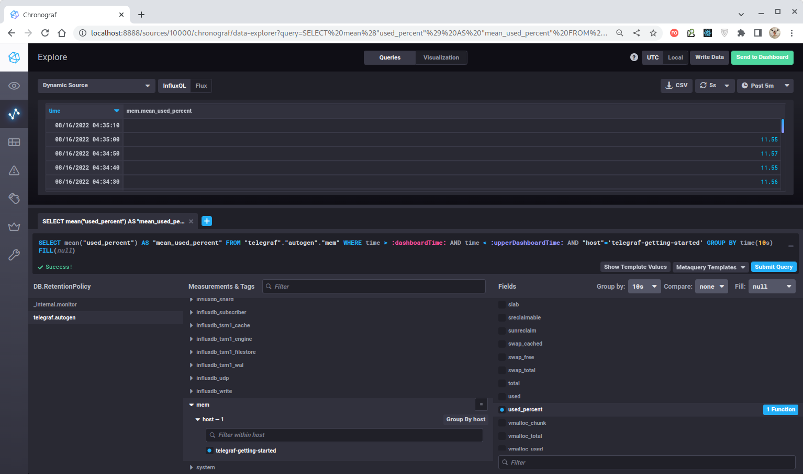
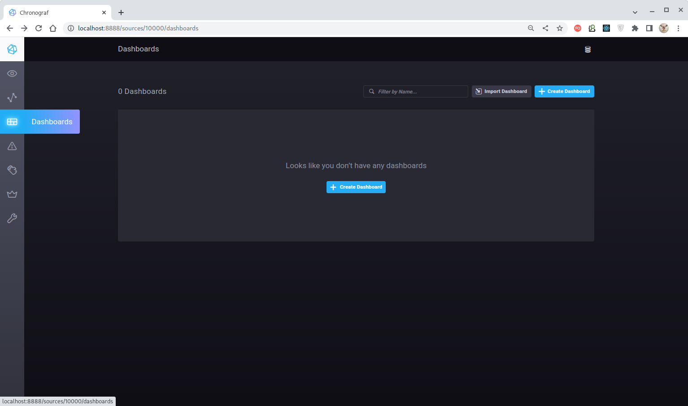
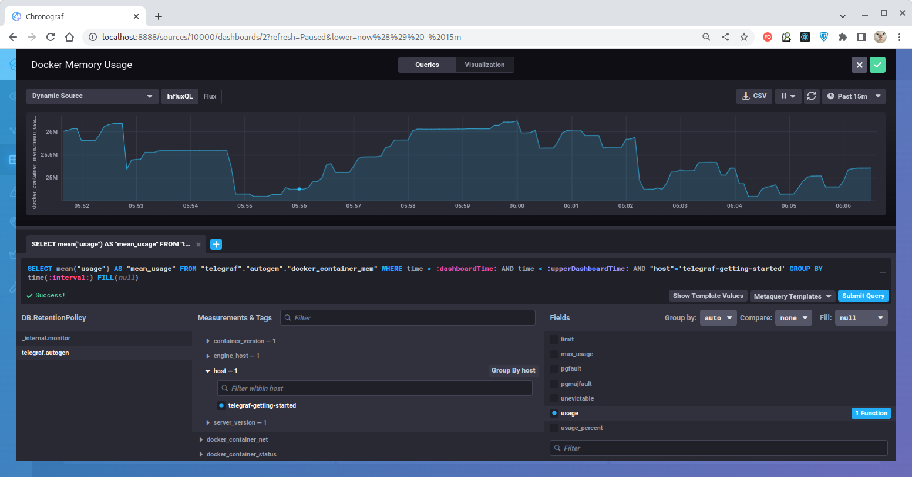

# Домашнее задание к занятию "10.02. Системы мониторинга"

## Обязательные задания

1. Опишите основные плюсы и минусы pull и push систем мониторинга.

### Ответ

PUSH-модель ("активные проверки") характеризуется тем, что агенты сами отправляют данные в систему мониторинга.

**Преимущества PUSH-модели:**
1. Простая репликация данных в разные системы мониторинга или их резервные копии за счет того, что
точка назначения настраивается на клиенте;
2. Гибкость настройки отправки пакетов данных с метриками за счет того, что на клиенте задается
набор данных и частота отправки;
3. Высокая скорость сбора метрик за счет использования UDP-протокола (но TCP-протокол также возможен
к использованию);
4. Нетребовательность к качеству соединения.

**Недостатки PUSH-модели:**
1. Относительно высокая трудоёмкость настройки за счет того, что соединение необходимо настроить
для каждого агента (впрочем, поддаётся автоматизации);
2. Потенциальная возможность появления в системе неверифицированного агента, который может нагружать
систему нерелевантными данными;
3. Потребность в выделенном proxy-сервере во избежание перегрузки сервера мониторинга поступающими
данными, влекущей блокирование всей системы.

PULL-модель ("пассивные проверки") характеризуется тем, что агенты предоставляют данные только по
запросу системы мониторинга.

**Преимущества PULL-модели:**
1. Легкое конфигурирование запрашиваемых у агентов данных;
2. Легкий контроль подлинности данных - опрашиваются только определённые агенты и появление
неверифицированного агента практически исключено;
3. Возможность использования единого proxy-сервера без риска перегрузки всей системы;
4. Простая отладка получения данных с агентов за счет использования HTTP-соединений, которые
можно устанавливать любыми удобными способами.

**Недостатки PULL-модели:**
1. Повышенные требования к качеству соединения.

---


2. Какие из ниже перечисленных систем относятся к push модели, а какие к pull? А может есть гибридные?

    - Prometheus 
    - TICK
    - Zabbix
    - VictoriaMetrics
    - Nagios

### Ответ

| Система         |   Push-модель    |   Pull-модель    |
|:----------------|:----------------:|:----------------:|
| Prometheus      |    Допустима     | **Используется** |
| TICK            | **Используется** |    Допустима     |
| Zabbix          | **Используется** | **Используется** |
| VictoriaMetrics |    Допустима     | **Используется** |
| Nagios          |    Допустима     | **Используется** |

Здесь только Zabbix использует сразу обе модели, т.е. является гибридной системой в чистом виде
но, однако, любая из указанных систем при желании тоже м.б. настроена на использование как pull-,
так и push-модели и поэтому при определенных условиях тоже может выступать как гибридная. 

---


3. Склонируйте себе [репозиторий](https://github.com/influxdata/sandbox/tree/master) и запустите TICK-стэк, 
используя технологии docker и docker-compose.

В виде решения на это упражнение приведите выводы команд с вашего компьютера (виртуальной машины):

    - curl http://localhost:8086/ping
    - curl http://localhost:8888
    - curl http://localhost:9092/kapacitor/v1/ping

А также скриншот веб-интерфейса ПО chronograf (`http://localhost:8888`). 

P.S.: если при запуске некоторые контейнеры будут падать с ошибкой - проставьте им режим `Z`, например
`./data:/var/lib:Z`

### Решение

> Внимание! Для запуска исполняемого файла [sandbox](./sandbox/sandbox) потребуется
> изменение переменных окружения `TELEGRAF_TAG`, `INFLUXDB_TAG`, `CHRONOGRAF_TAG` и `KAPACITOR_TAG`,
> заданных в файле [.env](./sandbox/.env), по аналогии с тем, как они
> заданы в файле [.env-latest](./sandbox/.env-latest).
> 
> Дело в том, что в файле .[env](./sandbox/.env) значения
> этих переменных заданы некорректно, а этот файл перегружает содержимое файла
> [.env-latest](./sandbox/.env-latest) устанавливая тем самым некорректные значения.


> Внимание! Telegraf [не рекомендуется запускать под root-пользователем](https://www.influxdata.com/blog/docker-run-telegraf-as-non-root/), поэтому в файле
> [docker-compose](./sandbox/docker-compose.yml) следует указать, что сервис должен запускаться под
> пользователем `telegraf`, входящим в группу, имеющую соответствующие полномочия доступа к
> `docker.socket`!
> 
> Ещё один нюанс состоит в том, что нужно указывать именно код группы, потому что при указании её
> по имени `docker-compose` выдаст ошибку об отсутствии таковой группы в контейнере.
> При указании же кода группы ошибка не возникает.
>
> Код группы можно выяснить, например, командой:
> ````
> $ echo $(stat -c '%g' /var/run/docker.sock)
> 964
> ````

Укажем, что сервис "Telegraf" должен запускаться от имени пользователя `telegraf`
(пользователь `telegraf` изначально уже присутствует в контейнере "Telegraf"), принадлежащего
группе `docker` (код группы здесь оказался 964):
````
  telegraf:
    ...
    user: telegraf:964
    ...
````

> Внимание! Для работы в "Telegraf" метрик `mem` и `disk` их следует указать в конфигурационном
> файле [telegraf.conf](./sandbox/telegraf/telegraf.conf):
> ````
> # Read metrics about memory usage
> [[inputs.mem]]
>
> # Read metrics about disk usage by mount point
> [[inputs.disk]]
> ````
> Полный набор метрик, поддерживаемых "Telegraf" с указанием их параметров перечислен в
> [Telegraf Inputs](https://github.com/influxdata/telegraf/tree/master/plugins/inputs).


Находясь в папке [sandbox](./sandbox) выполняем команду `./sandbox up`:

````bash
$ ./sandbox up  
Using latest, stable releases
Spinning up Docker Images...
If this is your first time starting sandbox this might take a minute...
[+] Building 1.9s (30/30) FINISHED                                                                                                                                                                                                       
 => [chrono_config internal] load build definition from Dockerfile                                                                                                                                                                  0.0s
 => => transferring dockerfile: 32B                                                                                                                                                                                                 0.0s
 => [telegraf internal] load build definition from Dockerfile                                                                                                                                                                       0.0s
 => => transferring dockerfile: 31B                                                                                                                                                                                                 0.0s
 => [sandbox-documentation internal] load build definition from Dockerfile                                                                                                                                                          0.0s
 => => transferring dockerfile: 32B                                                                                                                                                                                                 0.0s
 => [influxdb internal] load build definition from Dockerfile                                                                                                                                                                       0.0s
 => => transferring dockerfile: 31B                                                                                                                                                                                                 0.0s
 => [kapacitor internal] load build definition from Dockerfile                                                                                                                                                                      0.0s
 => => transferring dockerfile: 31B                                                                                                                                                                                                 0.0s
 => [chrono_config internal] load .dockerignore                                                                                                                                                                                     0.0s
 => => transferring context: 2B                                                                                                                                                                                                     0.0s
 => [telegraf internal] load .dockerignore                                                                                                                                                                                          0.0s
 => => transferring context: 2B                                                                                                                                                                                                     0.0s
 => [sandbox-documentation internal] load .dockerignore                                                                                                                                                                             0.0s
 => => transferring context: 2B                                                                                                                                                                                                     0.0s
 => [influxdb internal] load .dockerignore                                                                                                                                                                                          0.0s
 => => transferring context: 2B                                                                                                                                                                                                     0.0s
 => [kapacitor internal] load .dockerignore                                                                                                                                                                                         0.0s
 => => transferring context: 2B                                                                                                                                                                                                     0.0s
 => [chrono_config internal] load metadata for docker.io/library/chronograf:latest                                                                                                                                                  1.7s
 => [auth] library/chronograf:pull token for registry-1.docker.io                                                                                                                                                                   0.0s
 => [telegraf internal] load metadata for docker.io/library/telegraf:latest                                                                                                                                                         0.0s
 => CACHED [telegraf 1/1] FROM docker.io/library/telegraf:latest                                                                                                                                                                    0.0s
 => [chrono_config] exporting to image                                                                                                                                                                                              0.1s
 => => exporting layers                                                                                                                                                                                                             0.0s
 => => writing image sha256:be0faeedbe74bcfdb1fc451ddcac9c2fe2bdc026c134ebfbab5230cadaed6180                                                                                                                                        0.0s
 => => naming to docker.io/library/telegraf                                                                                                                                                                                         0.0s
 => => writing image sha256:8ac8726c99743d4f66874416ef56a2a829d528487d5271717f6166b619a02f37                                                                                                                                        0.0s
 => => naming to docker.io/library/sandbox-documentation                                                                                                                                                                            0.0s
 => => writing image sha256:e0c025a5fd95f101a64add46ec5593ea7f1b714d72dad57aa5d9d42e04ba3d05                                                                                                                                        0.0s
 => => naming to docker.io/library/kapacitor                                                                                                                                                                                        0.0s
 => => writing image sha256:b3c4f671078e5112436918ae3928e591231659e9659eb16e45a03c0b6f68bc74                                                                                                                                        0.0s
 => => naming to docker.io/library/influxdb                                                                                                                                                                                         0.0s
 => => writing image sha256:7a1b572652b040afa3dfd729b94c5f32c95c697dfe8be7c404cbb704dc5e72e7                                                                                                                                        0.0s
 => => naming to docker.io/library/chrono_config                                                                                                                                                                                    0.0s
 => [sandbox-documentation internal] load metadata for docker.io/library/alpine:3.12                                                                                                                                                0.0s
 => [sandbox-documentation internal] load build context                                                                                                                                                                             0.0s
 => => transferring context: 2.51kB                                                                                                                                                                                                 0.0s
 => [sandbox-documentation 1/4] FROM docker.io/library/alpine:3.12                                                                                                                                                                  0.0s
 => CACHED [sandbox-documentation 2/4] RUN mkdir -p /documentation                                                                                                                                                                  0.0s
 => CACHED [sandbox-documentation 3/4] COPY builds/documentation /documentation/                                                                                                                                                    0.0s
 => CACHED [sandbox-documentation 4/4] COPY static/ /documentation/static                                                                                                                                                           0.0s
 => [influxdb internal] load metadata for docker.io/library/influxdb:1.8                                                                                                                                                            1.6s
 => [auth] library/influxdb:pull token for registry-1.docker.io                                                                                                                                                                     0.0s
 => [kapacitor internal] load metadata for docker.io/library/kapacitor:latest                                                                                                                                                       0.0s
 => CACHED [kapacitor 1/1] FROM docker.io/library/kapacitor:latest                                                                                                                                                                  0.0s
 => CACHED [influxdb 1/1] FROM docker.io/library/influxdb:1.8@sha256:ab2afa118fec0dc14f2c40fb1b6b76fbaec61bbb0d81a3049146ffaa29e4a6da                                                                                               0.0s
 => [chrono_config internal] load build context                                                                                                                                                                                     0.0s
 => => transferring context: 69B                                                                                                                                                                                                    0.0s
 => [chrono_config 1/3] FROM docker.io/library/chronograf:latest@sha256:4d4f645349b61c6a8de0310a62b065fc599c6cc10b4a8b8144fcb2d16f0d797f                                                                                            0.0s
 => CACHED [chrono_config 2/3] ADD ./sandbox.src ./usr/share/chronograf/resources/                                                                                                                                                  0.0s
 => CACHED [chrono_config 3/3] ADD ./sandbox-kapa.kap ./usr/share/chronograf/resources/                                                                                                                                             0.0s
[+] Running 6/6
 ⠿ Network sandbox_default            Created                                                                                                                                                                                       0.1s
 ⠿ Container sandbox-influxdb-1       Started                                                                                                                                                                                       0.7s
 ⠿ Container sandbox-documentation-1  Started                                                                                                                                                                                       0.7s
 ⠿ Container sandbox-kapacitor-1      Started                                                                                                                                                                                       1.2s
 ⠿ Container sandbox-telegraf-1       Started                                                                                                                                                                                       1.1s
 ⠿ Container sandbox-chronograf-1     Started                                                                                                                                                                                       1.5s
Opening tabs in browser...
Opening in existing browser session.                                                                                                                                                                                                     
Opening in existing browser session.
````

Скрипт скачает необходимые docker-образы InfluxDB, Telegraf, Kapacitor и Chronograf и запустит их:


Проверим доступность через `curl`:


Теперь имеем доступный веб-интерфейс приложения для визуализации и настройки данных TSDB
"Chronograf":


---


4. Перейдите в веб-интерфейс Chronograf (`http://localhost:8888`) и откройте вкладку `Data explorer`.

    - Нажмите на кнопку `Add a query`
    - Изучите вывод интерфейса и выберите БД `telegraf.autogen`
    - В `measurments` выберите mem->host->telegraf_container_id , а в `fields` выберите used_percent. 
    Внизу появится график утилизации оперативной памяти в контейнере telegraf.
    - Вверху вы можете увидеть запрос, аналогичный SQL-синтаксису. 
    Поэкспериментируйте с запросом, попробуйте изменить группировку и интервал наблюдений.

Для выполнения задания приведите скриншот с отображением метрик утилизации места на диске 
(disk->host->telegraf_container_id) из веб-интерфейса.

### Решение

Переходим на вкладку "Explore" и нажимаем кнопку "Add a Query":


На панели "DB.RetentioinPolicy" выбираем `telegraf.autogen`,
далее на панели "Measurements & Tags" - `mem` -> `host` -> `telegraf-getting-started`,
а на панели "Fields" -  `used_percent`. Как результат, получим SQL-подобный текст запроса и таблицу
с полученными значениями метрики:



Параметры запроса можно менять как через графический интерфейс, так и непосредственно в тексте запроса.

Можно получить параметры использования дискового пространства. Для этого на панели
"Measurements & Tags" выбираем `disk` -> `host` -> `telegraf-getting-started`,
а на панели "Fields" выберем интересующие нас показатели, например - `total`, `used` и
`used_percent`. Аналогично предыдущей метрике получим SQL-подобный текст запроса и таблицу
с полученными значениями: 


Параметры `Group by`, `Compare` и `Fill` позволяют через интерфейс , соответственно, задавать запрос
с группировкой по интервалу времени, сравнивать с предыдущими значениями показателей и заполнять
пустые поля некоторыми значениями.

Внешний вид отображаемого показателя может быть настроен на закладке "Visualization".
Мы продемонстрируем этот функционал позже.

---


5. Изучите список [telegraf inputs](https://github.com/influxdata/telegraf/tree/master/plugins/inputs). 
Добавьте в конфигурацию telegraf следующий плагин - [docker](https://github.com/influxdata/telegraf/tree/master/plugins/inputs/docker):
```
[[inputs.docker]]
  endpoint = "unix:///var/run/docker.sock"
```

Дополнительно вам может потребоваться донастройка контейнера telegraf в `docker-compose.yml` дополнительного volume и 
режима privileged:
```
  telegraf:
    image: telegraf:1.4.0
    privileged: true
    volumes:
      - ./etc/telegraf.conf:/etc/telegraf/telegraf.conf:Z
      - /var/run/docker.sock:/var/run/docker.sock:Z
    links:
      - influxdb
    ports:
      - "8092:8092/udp"
      - "8094:8094"
      - "8125:8125/udp"
```

После настройке перезапустите telegraf, обновите веб интерфейс и приведите скриншотом список `measurments` в 
веб-интерфейсе базы telegraf.autogen . Там должны появиться метрики, связанные с docker.

Факультативно можете изучить какие метрики собирает telegraf после выполнения данного задания.


### Решение

Доступ к `docker.socket` и запуск docker-контейнера "Telegraf" под пользователем `telegraf` 
мы уже настроили в задании №3. Настройка привелегированного режима для контейнера в этом
случае не требуется.

> Внимание! Для работы в "Telegraf" метрики `docker` её следует указать в конфигурационном
> файле [telegraf.conf](./sandbox/telegraf/telegraf.conf):
> ````
> # Read metrics about docker containers
> [[inputs.docker]]
> endpoint = "unix:///var/run/docker.sock"
> container_names = []
> timeout = "5s"
> perdevice = true
> total = false
> ````
> Полный набор метрик, поддерживаемых "Telegraf" с указанием их параметров перечислен в
> [Telegraf Inputs](https://github.com/influxdata/telegraf/tree/master/plugins/inputs).

> Внимание! Следует убедиться, что Docker присутствует среди отслеживаемых через Telegraf метрик.
> Для этого на вкладке "Host List" обращаем внимание на наличие `docker` среди списка приложений:
>
> 
>

Если доступ к `docker.socket` настроен правильно и метрики "Docker" собираются через "Telegraf",
то в интерфейсе "Chronograf" мы обнаружим набор доступных метрик, получаемых от демона Docker:


Выберем, например, метрику использования памяти docker-контейнером "Telegraf" -
`telegraf.autogen` -> `docker_container_mem` -> `container_name` -> `sandbox-telegraf` -> `usage_percent`: 


Аналогично предыдущим экспериментам мы получили доступный к изменению SQL-подобный текст запроса
и таблицу с полученными значениями показателя.

---

## Дополнительное задание (со звездочкой*) - необязательно к выполнению

В веб-интерфейсе откройте вкладку `Dashboards`. Попробуйте создать свой dashboard с отображением:

    - утилизации ЦПУ
    - количества использованного RAM
    - утилизации пространства на дисках
    - количество поднятых контейнеров
    - аптайм
    - ...
    - фантазируйте)

---

### Решение

Создание графических панелей (Dashboard) отличается от создания запросов только тем, что нужно
дополнительно выбрать виджет для отображения показателя.

На закладке Dashboards жмем кнопку Create Dashboard:



И нажатием кнопки "Add Data":


добавляем данные:

| Показатель                         | Настройка `telegraf.autogen`       |               Скриншот               |
|:-----------------------------------|:-----------------------------------|:------------------------------------:|
| Загрузка ЦПУ                       | cpu->host->usage_user              |                    |
| Используемая RAM                   | mem->host->used_percent            |             |
| Используемое дисковое пространство | disk->host->used_percent           |            |
| Количество активных контейнеров    | docker->host->n_containers_running |    |
| RAM, используемая контейнерами     | docker_container_mem->host->usage  |  |
| Время работы системы (аптайм)      | system->host->uptime               |                |

Внешний вид виджетов настраивается на закладке "Visualisation" как, например, для количества работающих docker-контейнеров:


Как результат, имеем следующий набор виджетов, отображаемых на контрольной панели:


Таким образом можно создать произвольное количество контрольных панелей с любым набором отображаемых показателей.

---

