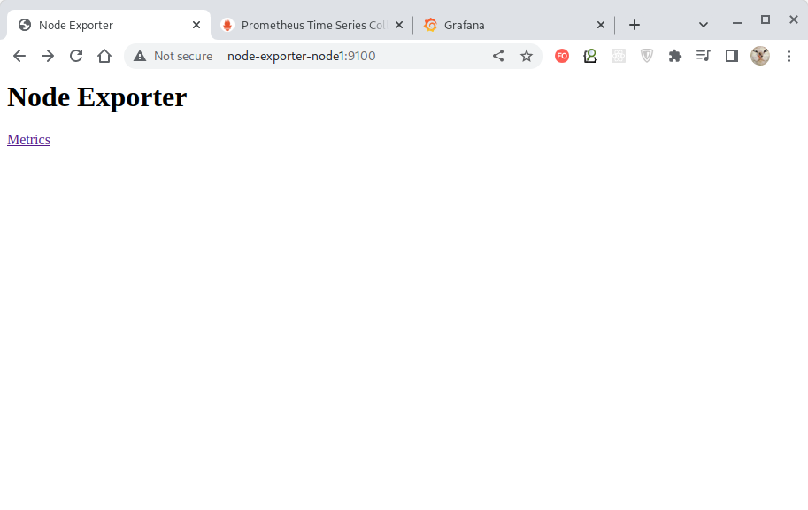
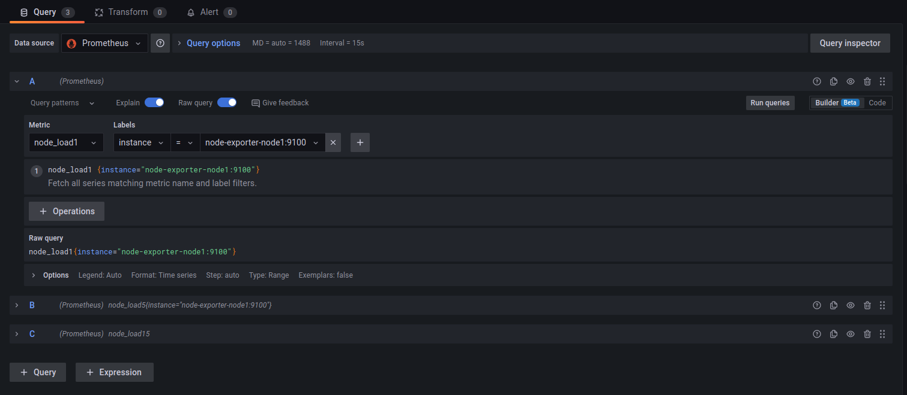
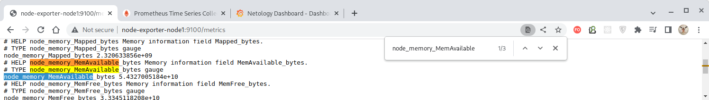
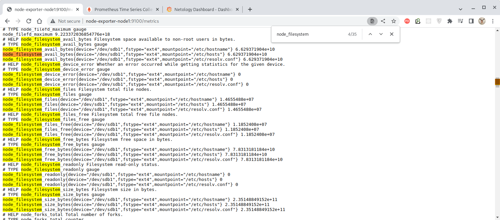
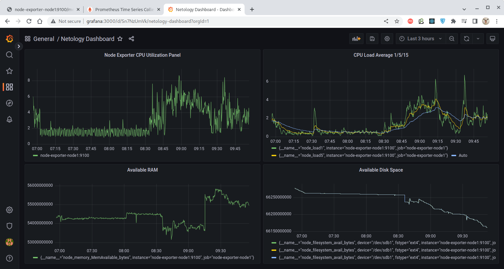

# Домашнее задание к занятию "10.03. Grafana"

## Задание повышенной сложности

**В части задания 1** не используйте директорию [help](./help) для сборки проекта, самостоятельно разверните grafana, где в 
роли источника данных будет выступать prometheus, а сборщиком данных node-exporter:
- grafana
- prometheus-server
- prometheus node-exporter

За дополнительными материалами, вы можете обратиться в официальную документацию grafana и prometheus.

В решении к домашнему заданию приведите также все конфигурации/скрипты/манифесты, которые вы 
использовали в процессе решения задания.

**В части задания 3** вы должны самостоятельно завести удобный для вас канал нотификации, например Telegram или Email
и отправить туда тестовые события.

В решении приведите скриншоты тестовых событий из каналов нотификаций.

## Обязательные задания

### Задание 1
Используя директорию [help](./help) внутри данного домашнего задания - запустите связку prometheus-grafana.

Зайдите в веб-интерфейс графана, используя авторизационные данные, указанные в манифесте docker-compose.

Подключите поднятый вами prometheus как источник данных.

Решение домашнего задания - скриншот веб-интерфейса grafana со списком подключенных Datasource.


### Решение

Не будем использовать предоставленный [docker-compose.yml](./help/docker-compose.yml), а
**создадим и настроим инфраструктуру полностью самостоятельно**. Будем использовать
контейнеризированные версии приложений.

Создадим docker-сеть под `именем node-exporter-network`:
````bash
docker network create node-exporter-network --driver bridge
````

Запустим контейнер `node-exporter`:
````bash
docker run -d --name node-exporter-node1 --network node-exporter-network prom/node-exporter:latest
````

> Образ "Node Exporter" будет скачан автоматически, но его можно скачать и отдельно:
> ````bash
> docker pull prom/node-exporter
> ````

Создадим простейший [конфигурационный файл для Prometheus](configs/prometheus.yml), указав в нем
адрес, по которому запущенный контейнер `node-exporter` экспонирует получаемые метрики:
````yaml
global:
scrape_interval:     5s
evaluation_interval: 5s

scrape_configs:
- job_name: 'node-exporter-node1'
  scrape_interval: 5s
  static_configs:
    - targets: ['node-exporter-node1:9100']
````

Запустим контейнер `prometheus`, монтируя в него созданный конфигурационный файл
[prometheus.yml](configs/prometheus.yml):
````bash
docker run -d --name prometheus-node1 --network node-exporter-network -p 9090:9090 -v /home/oleg/mnt-homeworks/10-monitoring-03-grafana/configs/prometheus.yml:/etc/prometheus/prometheus.yml prom/prometheus
````

> Образ "Prometheus" будет скачан автоматически, но его можно скачать и отдельно:
> ````bash
> docker pull prom/prometheus
> ````

Создадим [конфигурационный файл для Grafana](configs/grafana.ini), сконфигурировав в нём доступ
к smtp-серверу, который позже нам понадобится для рассылки уведомлений по e-mail:
````ini
[smtp]
enabled = true
skip_verify = true
host = smtp.mail.ru:25
user = 9231204521@mail.ru
from_address = 9231204521@mail.ru
password = XXXXXXXXXXXXXXXXXXXXXX
````

Запустим контейнер `grafana`, монтируя в него созданный конфигурационный файл
[grafana.ini](configs/grafana.ini):
````bash
docker run -d --name=grafana --network node-exporter-network -p 3000:3000 -v /home/oleg/mnt-homeworks/10-monitoring-03-grafana/configs/grafana.ini:/etc/grafana/grafana.ini grafana/grafana
````

> Образ "Grafana" будет скачан автоматически, но его можно скачать и отдельно:
> ````bash
> docker pull grafana/grafana
> ````

Контейнеры работают и доступны по соответствующим портам:


Находясь в bridge-сети, запущенные на хосте контейнеры доступны по своим именам и предоставляют
веб-интерфейсы сервисов:

|          Node Exporter          |          Prometheus          |       Grafana       |
|:-------------------------------:|:----------------------------:|:-------------------:|
| http://node-exporter-node1:9100 | http://prometheus-node1:9090 | http://grafana:3000 |
|           |           |     |

Настроим получение данных в "Grafana". Для этого залогинимся в сервис через веб-интерфейс
(дефолтные учётные данные - **admin/admin**, менять их не будем):


Перейдем на закладку "Data sources":


И нажмём кнопку "Add data source":


В предлагаемых вариантах источников данных выберем "Prometheus":


И укажем в качестве URL источника данных адрес, по которому запущенный нами контейнер "Prometheus"
экспонирует собираемые данные:


После нажатия кнопки "Save & test" (находится в самом низу) будет проведено пробное получение данных
и, в случае успеха, будет выведено соответствующее сообщение:


Добавленный источник данных теперь отображается на панели конфигурации на закладке "Data sources":


Таким образом мы настроили "Grafana" на отображение данных, ретранслируемых через "Prometheus".

---


## Задание 2
Изучите самостоятельно ресурсы:
- [promql-for-humans](https://timber.io/blog/promql-for-humans/#cpu-usage-by-instance)
- [understanding prometheus cpu metrics](https://www.robustperception.io/understanding-machine-cpu-usage)

Создайте Dashboard и в ней создайте следующие Panels:
- Утилизация CPU для nodeexporter (в процентах, 100-idle)
- CPULA 1/5/15
- Количество свободной оперативной памяти
- Количество места на файловой системе

Для решения данного ДЗ приведите promql запросы для выдачи этих метрик, а также скриншот получившейся Dashboard.


### Решение

Воспользуемся полученными знаниями и создадим панель мониторинга (Dashboard), отображающую:

- утилизацию CPU для Node Exporter в процентах (Node Exporter CPU Utilization);
- CPU Load Average 1/5/15;
- количество свободной RAM (Available RAM);
- количество свободного места на диске (Available Disk Space).


#### Добавление параметра "CPU Usage" для Node Exporter

Параметр "CPU Usage By Instance", будучи написанным на языке запросов "Prometheus" (PromQL),
пугает своей формулой:
````bash
100 * (1 - avg by(instance)(irate(node_cpu{mode='idle'}[5m])))
````

Но по сути представляет собой усредненный за последние 5 минут показатель, характеризующий
**отсутствие простоя** условного ядра процессора.

> Функция `irate(v range-vector)` вычисляет мгновенную скорость увеличения временного ряда в
> векторе диапазона за секунду.
>
> `node_cpu` - это группа метрик, предоставляемых "Node Exporter" и характеризующих занятость
> процессора различными типами работ.
>
> Перечень экспонируемых экземпляром "Node Exporter" метрик можно получить, нажав ссылку "Metrics"
> веб-интерфейса:
>
> 
> 
> Среди которых можно найти параметры `node_cpu`: 
> 
> 

Нажатием кнопки "New Dashboard" создаем новую панель мониторинга:


Добавляем новую панель:


Отрывается меню настроек панели. Назовем нашу панель "Node Exporter CPU Utilization Panel":


Формула расчета использования процессора в нашем случае принимает вид:

````bash
100 * (avg by(instance)(irate(node_cpu_seconds_total{instance="node-exporter-node1:9100", mode!="idle"}[$__interval])))
````
где:
- `node_cpu_seconds_total` - показатель в секундах, указывающий, сколько времени процессор провел в указанном режиме;
- `instance="node-exporter-node1:9100"` - указание источника метрик;
- `mode!="idle"` - указание, что нас интересуют все режимы процессора, кроме простоя (в оригинальной формуле это достигалось вычитанием режима простоя из единицы);
- `$__interval` - параметр интервала, задаваемый через интерфейс Grafana (можно было указать и конкретное значение);
- `irate` - посекундная динамика возрастания значений временного ряда;
- `(avg by(instance)` - среднее значение для указанного источника метрик.

Зададим эту формулу в виде запроса Grafana, используя конструктор запросов:


Результат получим в виде графика:


#### Добавление параметра "CPU Load Average 1/5/15"

> **Load Average** - это показатель загрузки системы, вычисляемый, как длина очереди выполнения.
> Как правило, отображается в виде трех значений - за последние 1, 5 и 15 минут. В UNIX-подобных
> системах вычисление средней загрузки производится внутри ядра ОС и м.б. получено из файла
> `/proc/loadavg` или командами `uptime`, `w` или `top`.
>
> `node_load` - это группа метрик, предоставляемых "Node Exporter" и характеризующих среднюю
> загрузку процессора за интервал времени.
>
> Перечень экспонируемых экземпляром "Node Exporter" метрик можно получить, нажав ссылку "Metrics"
> веб-интерфейса:
>
> 
>
> Среди которых можно найти параметры `node_load` для соответствующих интервалов времени:
>
> 

Нажатием кнопки "Add panel" добавляем новую панель показателя на существующую панель мониторинга:


В созданной панели сконструируем запросы для получения показателей для интервалов в 1, 5 и 15 минут:

| Интервал |        Конструктор запроса         |
|:---------|:----------------------------------:|
| 1 минута |   |
| 5 минут  |   |
| 15 минут |  |

Результат получим в виде графика:


#### Добавление параметра "Available RAM"

> Находим среди метрик "Node Exporter" соответствующую метрику `node_memory_MemAvailable`:
>
> 

Нажатием кнопки "Add panel" добавляем новую панель показателя на существующую панель мониторинга,
и в новой панели конструируем запрос для получения показателя доступной RAM:


Результат получим в виде графика:


#### Добавление параметра "Available Disk Space"

> Находим среди метрик "Node Exporter" соответствующую метрику `node_filesystem_avail`:
> 
> 

Нажатием кнопки "Add panel" добавляем новую панель показателя на существующую панель мониторинга,
и в новой панели конструируем запрос для получения показателя доступного дискового пространства:


Результат получим в виде графика:


Как результат, наша панель мониторинга выглядит следующим образом:



Настройки графического интерфейса позволяют легко менять временные интервалы, масштабы осей
диаграмм, подписи и пр. В данном случае нам это неважно, поэтому этап приведения диаграмм к
логически завершённому виду мы пропустим.

---


## Задание 3
Создайте для каждой Dashboard подходящее правило alert (можно обратиться к первой лекции в блоке "Мониторинг").

Для решения ДЗ - приведите скриншот вашей итоговой Dashboard.


### Решение

Настроим уведомления для каждого из сконфигурированных показателей.

> В демонстрационных целях значения показателей, вызывающие срабатывание уведомлений, не будут
> соответствовать реальным критическим значениям, а просто будут достаточными для срабатывания
> уведомления.

Для работы уведомлений сначала в меню "Contact Points" следует задать получателей для них: 


> В нашем случае мы будем использовать уведомления по e-mail и именно для этого в самом начале
> работы в конфигурационном файле [grafana.ini](./configs/grafana.ini) мы задали параметры
> доступа к **smtp-серверу mail.ru**.

Зададим следующие параметры уведомления по e-mail:


В результате все уведомления будут приходить на указанный почтовый адрес (в демонстрационных целях
получатель один и мы просто отправляем письмо сами себе).

Далее, переходим в панели соответствующих показателей и на закладке "Alerts" этих панелей зададим
пороговые значения, при достижении которых уведомление (Alert) будет срабатывать:

| Показатель           | Пороговое значение |               Настройки                |
|:---------------------|:------------------:|:--------------------------------------:|
| CPU Usage            |         >8         |         |
| CPU Load Average 1   |         >5         |            |
| Available RAM        |    <54000000000    |         |
| Available Disk Space |    <67700000000    |  |

> Внимание! Конкретные пороговые значения носят **условный характер** и заданы в исключительно
> демонстрационных целях!

Состояние уведомлений можно наблюдать на закладке "Alerting":


где:
- `Normal` - условие срабатывания уведомления не достигнуто;
- `Pending` - условие достигнуто, ожидается отправка уведомления;
- `Firing` - уведомление отправлено.

После наступления соответствующих событий, адресат обнаружит в своем почтовом ящике соответствующие
уведомления:

| Показатель              |               Настройки                |
|:------------------------|:--------------------------------------:|
| CPU Usage               |         |
| CPU Load Average 1/5/15 |            |
| Available RAM           |         |
| Available Disk Space    |  |

Для уведомлений доступна настройка ярлыков (labels), сообщений, дополнительной информации.

В итоге контрольная панель (Dashboard) выглядит следующим образом:


Обращаем внимание, что рядом с названием панелей появились цветные сердечки, означающие текущее 
состояние показателей в соответствии с alert-правилами.

---


## Задание 4
Сохраните ваш Dashboard.

Для этого перейдите в настройки Dashboard, выберите в боковом меню "JSON MODEL".

Далее скопируйте отображаемое json-содержимое в отдельный файл и сохраните его.

В решении задания - приведите листинг этого файла.


### Решение

Конфигурация контрольной панели сохранена в файле
[netology_dashboard.json](./configs/netology_dashboard.json).

---
