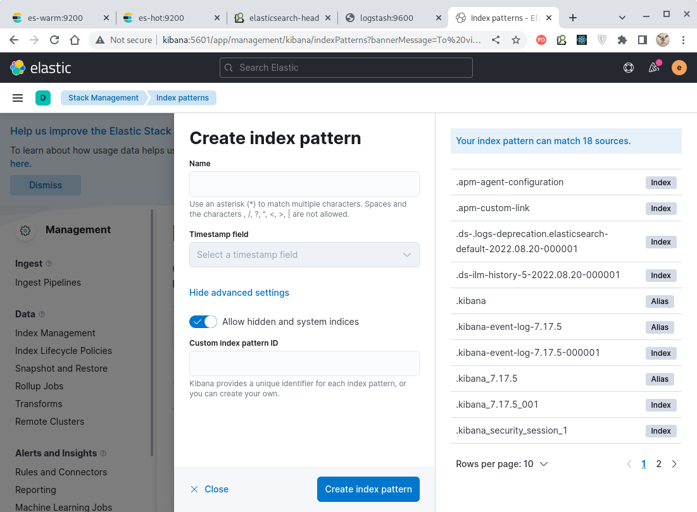

# Домашнее задание к занятию "10.04. ELK"

## Дополнительные ссылки

При выполнении задания пользуйтесь вспомогательными ресурсами:

- [поднимаем elk в докер](https://www.elastic.co/guide/en/elastic-stack-get-started/current/get-started-docker.html)
- [поднимаем elk в докер с filebeat и докер логами](https://www.sarulabs.com/post/5/2019-08-12/sending-docker-logs-to-elasticsearch-and-kibana-with-filebeat.html)
- [конфигурируем logstash](https://www.elastic.co/guide/en/logstash/current/configuration.html)
- [плагины filter для logstash](https://www.elastic.co/guide/en/logstash/current/filter-plugins.html)
- [конфигурируем filebeat](https://www.elastic.co/guide/en/beats/libbeat/5.3/config-file-format.html)
- [привязываем индексы из elastic в kibana](https://www.elastic.co/guide/en/kibana/current/index-patterns.html)
- [как просматривать логи в kibana](https://www.elastic.co/guide/en/kibana/current/discover.html)
- [решение ошибки increase vm.max_map_count elasticsearch](https://stackoverflow.com/questions/42889241/how-to-increase-vm-max-map-count)

В процессе выполнения задания могут возникнуть также не указанные тут проблемы в зависимости от системы.

Используйте output stdout filebeat/kibana и api elasticsearch для изучения корня проблемы и ее устранения.

## Задание повышенной сложности

Не используйте директорию [help](./help) при выполнении домашнего задания.

---

## Задание 1

Вам необходимо поднять в докере:
- elasticsearch(hot и warm ноды)
- logstash
- kibana
- filebeat

и связать их между собой.

Logstash следует сконфигурировать для приёма по tcp json сообщений.

Filebeat следует сконфигурировать для отправки логов docker вашей системы в logstash.

В директории [help](./help) находится манифест docker-compose и конфигурации filebeat/logstash для быстрого 
выполнения данного задания.

Результатом выполнения данного задания должны быть:
- скриншот `docker ps` через 5 минут после старта всех контейнеров (их должно быть 5)
- скриншот интерфейса kibana
- docker-compose манифест (если вы не использовали директорию help)
- ваши yml конфигурации для стека (если вы не использовали директорию help)


### Решение

Директорией [help](./help) пользоваться не будем, особенно учитывая, что образы контейнеров,
указанные в ней, более недоступны, а в директории [configs](./configs) создадим свои настройки
приложений.

Рассмотрим их поочередно.

#### Настройки [Filebeat](configs/filebeat)

Источник, откуда брать логи, указан следующим образом:
````yaml
filebeat.inputs:
  - type: container
    paths:
      - '/var/lib/docker/containers/*/*.log'
    include_lines: ['MY_LOG']
    fields:
      service: my_python_app
````

Здесь мы указываем из всех лог-файлов docker-контейнеров извлекать строки, но только те, которые
содержат подстроку "MY_LOG". Это сделано с целью ограничить набор извлекаемых сообщений логами
только нашего приложения, которое выводит свои логи с такой пометкой.

Т.к. "Filebeat" у нас запущен в контейнеризированном виде, то нужно передать в его контейнер ссылку
на сокет демона "Docker":
````yaml
processors:
  - add_docker_metadata:
      host: "unix:///var/run/docker.sock"
````

Там же мы указываем, как нужно декодировать входную строку лога, имеющую JSON-формат:
````yaml
  - decode_json_fields:
      fields: ["message"]
      target: "json"
      overwrite_keys: true
````
Здесь поле "message" содержит сообщение лога, выдаваемого контейнеризированным приложением. 

Указание, что результат нужно отправлять в "Logstash", производится следующей настройкой:
````yaml
output.logstash:
  hosts: ["logstash:5044"]
````

Также укажем, что "Filebeat" не должен генерировать внутренние метрики:
````yaml
logging.metrics.enabled: false
````

> Примечание:
> В целях отладки можно выводить эспортируемый "Filebeat" результат в консоль:
> ````yaml
> output.console:
>   enabled: true
> ````
>
> ВНИМАНИЕ! Если Filebeat сам запускается в контейнере, то здесь возникает ситуация **зацикливания
> логов** - контейнеризированное приложение выводит сообщение в лог, Filebeat получает это сообщение
> из файла лога контейнера приложения и выводит его в свою консоль, консоль ретранслируется в лог
> Filebeat после чего Filebeat сам у себя его считывает и опять выводит его в свою консоль и всё
> повторяется сначала.


#### Настройки [Logstash](configs/logstash)

В файле [config.yml](configs/logstash/config.yml) указываем, с какого хоста следует принимать
данные. Здесь - с любого:
````yaml
http.host: "0.0.0.0"
````

В файле [pipelines.yml](configs/logstash/pipelines.yml) задаются параметры потока обработки
сообщений:
````yaml
- pipeline.id: my_pipeline
  path.config: "/usr/share/logstash/config/pipelines/my_pipeline.conf"
  pipeline.workers: 1
  pipeline.batch.size: 1
````

Поток имеет идентификатор `my_pipeline`, используется один обработчик, а параметры потока заданы в
файле [my_pipeline.conf](configs/logstash/pipelines/my_pipeline.conf):
````yaml
input {
  beats {
    port => 5044
    codec => json
    ssl => false
  }
}

filter {
  json { source => "message" }
}

output {
  elasticsearch {
    hosts => "es-hot:9200"
    index => "logstash-%{+YYYY.MM.dd}"
    user => "elastic"
    password => "elastic"
  }
  stdout { codec => rubydebug }
}
````

Здесь задано использование плагина
[Beats](https://www.elastic.co/guide/en/logstash/7.17/plugins-inputs-beats.html) для получения сообщений на порт `5044` в виде
`json`-данных без использования `ssl`-шифрования.
Данные извлекаются из поля `message` и без какой-либо обработки отправляются в "ElasticSearch",
доступный на хосте `es-hot` и слушающий порт `9200`. В "ElasticSearch" данные размещаются в индексе
`logstash-%{+YYYY.MM.dd}`.
Также заданы учётные данные, которые следует использовать для подключения к "ElasticSearch".

Обращаем внимание, что здесь источником данных указан тот самый порт, что указан в качестве
получателя данных в настройках [Filebeat](configs/filebeat.yml) - `5044`!

> ВНИМАНИЕ! Следует быть осторожным с идентификатором создаваемого в ElasticSearch индекса -
> он должен удовлетворять определенным
> [критериям](https://www.elastic.co/guide/en/elasticsearch/reference/7.17/indices-create-index.html),
> например, содержать только прописные символы. Однако шаблоны, используемые в имени индекса
> (например, `logstash-%{[@metadata][indexDate]}`),
> могут возвращать значения не соответствующие этим критериям и тогда индекс создан не будет!
 
> ВНИМАНИЕ! По какой-то причине "Logstash" версии 7.17.5 из официального образа
> **всегда прослушивает входные данные на порту 5044**, какой бы порт мы не указывали в настройках!

Кроме того, в стандартный поток будут выводится сообщения, генерируемые Logstash.
При этом `codec => rubydebug` указывает, что эти сообщения
следует форматировать в удобочитаемом виде с использованием библиотеки
[awesome_print](https://rubygems.org/gems/awesome_print).


#### Настройки [ElasticSearch](configs/elasticsearch)

В файле [config.yml](configs/elasticsearch/config.yml) устанавливаем имя кластера, параметры
безопасности и тип используемой лицензии "ElasticSearch":
````yaml
cluster.name: "my_es_cluster"
network.host: 0.0.0.0 # Для корректной работы внутри контейнера.

xpack.security.enabled: true # Поддержка функционала, обеспечивающего безопасность кластера.
xpack.license.self_generated.type: basic # Тип лицензии, задающий функционал "ElasticSearch".
````


#### Настройки [Kibana](configs/kibana)

В файле [config.yml](configs/kibana/config.yml) указываем параметры хоста "Kibana" и связанного
с ним "ElasticSearch":
````yaml
server.name: kibana
server.host: 0.0.0.0
server.publicBaseUrl: "http://kibana:5601"
monitoring.ui.container.elasticsearch.enabled: true # Для корректного сбора метрик с elastic search, запущенного в контейнере.

elasticsearch.hosts: [ "http://es-hot:9200" ]
elasticsearch.username: elastic
elasticsearch.password: elastic
````

Применив [docker-compose](./docker-compose.yml) (образы контейнеров д.б. доступны для России!)
получаем 6 запущенных контейнеров - 2 ноды ES, Logstash, Filebeat, Kibana и
[python-приложение](./pinger.py),
генерирующее некий случайный лог:


Можно воспользоваться браузерным плагином и увидеть, что индексы находятся в "зеленом"
состоянии, включая созданный нами индекс `logstash-*` (крайний справа):


Также нам доступен веб-интерфейс Kibana:


Который после логина (elastic/elastic) сразу же предлагает нам создать шаблон индекса:


На этом настройка связки `log-файл` -> `Filebeat` -> `Logstash` -> `ElasticSearch` -> `Kibana` завершается.

---

## Задание 2

Перейдите в меню [создания index-patterns  в kibana](http://localhost:5601/app/management/kibana/indexPatterns/create)
и создайте несколько index-patterns из имеющихся.

Перейдите в меню просмотра логов в kibana (Discover) и самостоятельно изучите как отображаются логи и как производить 
поиск по логам.

В манифесте директории help также приведено dummy приложение, которое генерирует рандомные события в stdout контейнера.
Данные логи должны порождать индекс logstash-* в elasticsearch. Если данного индекса нет - воспользуйтесь советами 
и источниками из раздела "Дополнительные ссылки" данного ДЗ.


### Решение

Создадим несколько индексных шаблонов. 

Для жмем кнопку "Create index pattern":


В данный момент на панели справа отображается только созданный нами индекс `logstash-*`:


Но если включить галку "Allow hidden and system indices", то можно увидеть и набор служебных
индексов:



Далее, в поле "Name" можно ввести шаблон для поиска индекса по его имени (допускается
использовать символы-заменители, например `'*'`):


Выберем поле, используемое в качестве метки времени (`@timestamp`) и нажатием кнопки
"Create index pattern" набор индексов, удовлетворяющих условию, будет добавлен в отображаемые:


Аналогично повторим процедуру для созданного нами индекса `logstash-`, хранящего логи нашего
приложения:


И сохраним его:


В результате имеем два шаблона для извлечения данных из ElasticSearch - `.kibana*` `logstash-*`:


Отобразим содержимое индекса с идентификатором `logstash-*`, соответствующий логам, генерируемым
нашим [python-приложением](./pinger.py). Для этого переходим в меню "Discover":


И на открывшейся странице в выпадающем списке "Change index pattern" выбираем ранее созданный
шаблон, соответствующий нашему индексу - `logstach-*`:


Сейчас выводится всё содержимое индекса - все колонки и все строки. Но можно упростить
представление данных, выбрав на панели справа только те поля, которые интересуют
в данный момент. Выберем, например, для индекса, соответствующего шаблону `logstash-*`, только поля
`message` и `field.service`.

> Поле `field.service` было объявлено нами в файле конфигурации
> [Filebeat](./configs/filebeat/config.yml) для удобства идентификации логов нашего приложения
> среди прочих и содержит константное значение "my_python_app".

Кроме выбора отображаемых столбцов можно отфильтровывать и отображаемые строки. В верхней части страницы
в поле "Search" можно вводить условие фильтрации записей. Здесь, например, мы записи, содержащие
строку "MY_LOG":


Как видим, результатом является вывод лога, генерируемого нашим тестовым python-приложением.

Кроме прочего, функционал меню позволяет менять порядок следования колонок, формат отображаемых
диаграмм и т.д.

---
