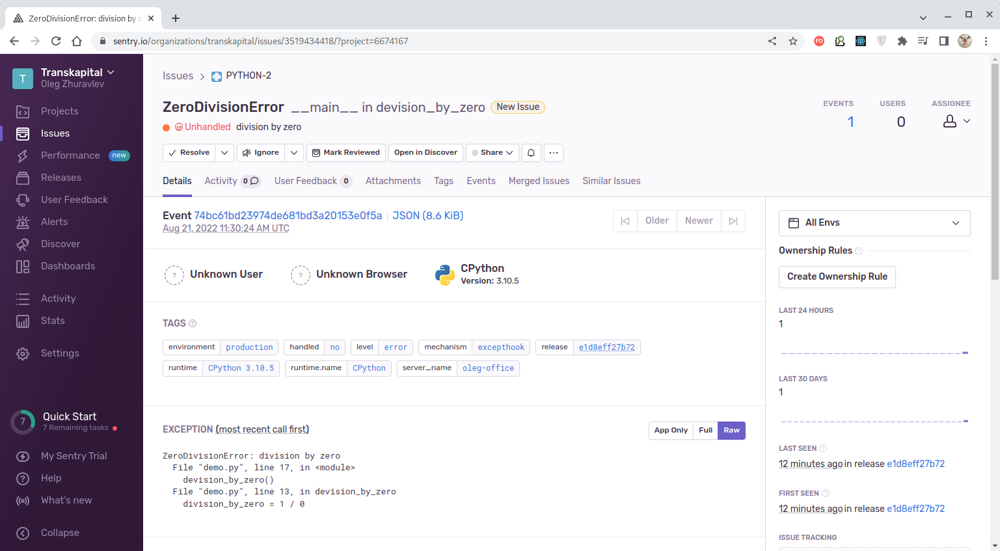

# Домашнее задание к занятию "10.05. Sentry"

## Задание 1

Так как self-hosted Sentry довольно требовательная к ресурсам система, мы будем использовать Free cloud аккаунт.

Free cloud account имеет следующие ограничения:
- 5 000 errors
- 10 000 transactions
- 1 GB attachments

Для подключения Free cloud account:
- зайдите на sentry.io
- нажмите "Try for free"
- используйте авторизацию через ваш github-account
- далее следуйте инструкциям

Для выполнения задания - пришлите скриншот меню Projects.


### Решение 

Создали проект для языка Python:


---


## Задание 2

Создайте python проект и нажмите `Generate sample event` для генерации тестового события.

Изучите информацию, представленную в событии.

Перейдите в список событий проекта, выберите созданное вами и нажмите `Resolved`.

Для выполнения задание предоставьте скриншот `Stack trace` из этого события и список событий проекта, 
после нажатия `Resolved`.


### Решение

Установим библиотеку `sentry-sdk`:

````bash
$ pip install --upgrade sentry-sdk
Defaulting to user installation because normal site-packages is not writeable
Collecting sentry-sdk
Downloading sentry_sdk-1.9.5-py2.py3-none-any.whl (157 kB)
━━━━━━━━━━━━━━━━━━━━━━━━━━━━━━━━━━━━━━━━ 157.6/157.6 kB 728.6 kB/s eta 0:00:00
Requirement already satisfied: certifi in /usr/lib/python3.10/site-packages (from sentry-sdk) (2022.6.15)
Requirement already satisfied: urllib3>=1.26.9 in /usr/lib/python3.10/site-packages (from sentry-sdk) (1.26.11)
Installing collected packages: sentry-sdk
Successfully installed sentry-sdk-1.9.5
````

Создадим простейшую [python-программу](./centry_demo/demo.py) с функцией, выбрасывающей неперехваченное исключение
`ZeroDivisionError`:
````python
import sentry_sdk

sentry_sdk.init(
    dsn="https://b83f1a55fb2e487db0926c10a833a85c@o1370314.ingest.sentry.io/6674167",

    # Set traces_sample_rate to 1.0 to capture 100%
    # of transactions for performance monitoring.
    # We recommend adjusting this value in production.
    traces_sample_rate=1.0
)


def devision_by_zero():
  division_by_zero = 1 / 0


if __name__ == '__main__':
  devision_by_zero()
````

Запуск этой программы из консоли приведет к выбрасыванию исключения:
````bash
$ python demo.py
Traceback (most recent call last):
  File "/home/oleg/mnt-homeworks/10-monitoring-05-sentry/centry_demo/demo.py", line 17, in <module>
    devision_by_zero()
  File "/home/oleg/mnt-homeworks/10-monitoring-05-sentry/centry_demo/demo.py", line 13, in devision_by_zero
    division_by_zero = 1 / 0
ZeroDivisionError: division by zero
Sentry is attempting to send 2 pending error messages
Waiting up to 2 seconds
Press Ctrl-C to quit
````

Выброшенную ошибку можно наблюдать в веб-интерфейсе "Centry":


После клика на ошибке откроется страница с детальным описанием стека вызовов:



И строки в коде программы, вызвавшей ошибку:


Если пометить ошибку как исправленную ("Resolved"), то она помечается соответствующим образом и м.б.
скрыта:


Список исправленных ошибок, впрочем, можно отобразить:


---


## Задание 3

Перейдите в создание правил алёртинга.

Выберите проект и создайте дефолтное правило алёртинга, без настройки полей.

Снова сгенерируйте событие `Generate sample event`.

Если всё было выполнено правильно - через некоторое время, вам на почту, привязанную к github аккаунту придёт
оповещение о произошедшем событии.

Если сообщение не пришло - проверьте настройки аккаунта Sentry (например привязанную почту), что у вас не было 
`sample issue` до того как вы его сгенерировали и то, что правило алёртинга выставлено по дефолту (во всех полях all).
Также проверьте проект в котором вы создаёте событие, возможно алёрт привязан к другому.

Для выполнения задания - пришлите скриншот тела сообщения из оповещения на почте.

Дополнительно поэкспериментируйте с правилами алёртинга. 
Выбирайте разные условия отправки и создавайте sample events. 


### Решение

Для создания оповещения (Alert) переходим на закладку "Alerts" и жмём кнопку "Create Alert":


Указываем, что нужно оповещать обо всех ошибках:


Свойства оповещения примем предлагаемые по умолчанию:


Снова вызовем нашу программу, генерирующие ошибку `ZeroDivisionError`. В меню "Alerts" появится
указание, что ошибка возникла и отобразится диаграмма, указывающая время появления ошибок:


На почту, привязанную к Github-аккаунту, придёт соответствующее оповещение о возникшей ошибке:


Таким образом, мы продемонстрировали работу оповещений в "Sentry" в их простейшей реализации. 

---


## Задание повышенной сложности

Создайте проект на ЯП python или GO (небольшой, буквально 10-20 строк), подключите к нему sentry SDK и отправьте несколько тестовых событий.
Поэкспериментируйте с различными передаваемыми параметрами, но помните об ограничениях free учетной записи cloud Sentry.

Для выполнения задания пришлите скриншот меню issues вашего проекта и 
пример кода подключения sentry sdk/отсылки событий.


### Решение


Добавим в наш python-файл простейшую [функцию](./centry_demo/demo.py), последовательно отправляющую
в "Sentry" сообщения с каждым из уровней - `off`, `error`, `info`, `debug` и `trace`:

````python
import sentry_sdk
from sentry_sdk import capture_message, set_user, set_tag, add_breadcrumb, set_context

sentry_sdk.init(
    dsn="https://b83f1a55fb2e487db0926c10a833a85c@o1370314.ingest.sentry.io/6674167",
    traces_sample_rate=1.0
)

def test_events():
  set_context("My_Context", {
    "project": "Netology",
    "info": "test",
  })

  set_user({"email": "jane.doe@example.com"})
  set_tag("Netology-Tag", "Centry Python Project")

  for event_level in ["off", "error", "info", "debug", "trace"]:
    print(event_level)

    add_breadcrumb(
        category='My Breadcrumb Category',
        message='My Breadcrumb Message',
        level=event_level,
        type='My Breadcrumb Type',
    )

    with sentry_sdk.push_scope() as scope:
      scope.set_extra('debug', False)
      capture_message('Event: Captured Message of level [' + event_level + ']',
                      event_level)

    time.sleep(1)
````

Сообщения могут дополняться различной информацией, устанавливаемой функциями `set_context`,
`set_user`, `set_tag` и `add_breadcrumb`.

После выполнения программы в меню "Issues" мы увидим созданные сообщения:


Зайдя в любое из сообщений мы увидим дополнительную информацию, которую мы установили через
`set_user` и `set_tag`:


А также через `set_context`:


И через `add_breadcrumb`:


Таким образом, мы продемонстрировали пример создания пользовательских сообщений в "Sentry".

---
